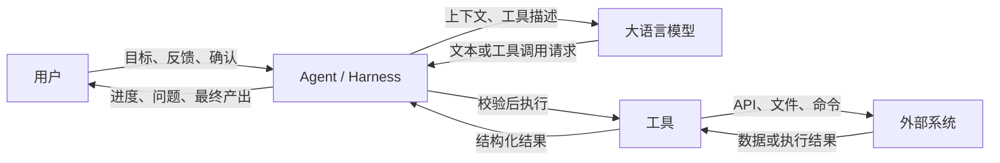

# 第 1 课：AI 应用工程的完整技术栈

> 主题：从“调用一次大模型”走向“构建一个可完成任务的 AI 系统”  
> 建议用时：2～3 小时  
> 本课性质：概念建模 + 项目定位 + 架构表达  
> 最终产出：一页 DeerFlow 项目定位说明 + 一张 Agent 关系图

>  **==本节课的核心是理解什么是 Agent、什么是 Harness==**。
>
> Agent 以 LLM 提供语义理解、推理和决策能力；Harness 负责组织上下文、执行模型请求的工具调用、管理状态和运行过程，并通过权限、预算、校验、恢复和观测机制控制风险，约束、验证、纠正、观测模型的行为；Eval 判断最终任务是否真正完成。==它不会让模型变得完全确定，而是把模型的不确定性限制在可管理范围内==。

## 1. 为什么第一课不急着写 Agent

第一次接触 AI 应用开发时，人们很容易把注意力全部放在模型上：选哪个模型、Prompt 怎么写、temperature 设多少、一次请求能返回什么。模型当然重要，但==一个能够稳定完成真实任务的 AI 应用==，远不只是一次模型调用。

设想下面这个任务：

> 阅读一个代码仓库最近一周的变更，判断哪些模块可能受影响，运行必要的测试，并生成一份带证据的 Markdown 报告。

大模型可以帮助理解代码、提出假设和组织语言，但仅靠模型本身不能可靠地完成整个任务。系统还必须解决很多确定性的工程问题：

- 如何找到仓库和变更记录；
- 如何读取文件，但不越过允许访问的目录；
- 如何执行 Git 和测试命令；
- 如何记录已经完成的步骤；
- 如何在上下文过长时保留关键信息；
- 如何处理命令失败、模型超时或工具返回异常；
- 如何让用户看到中间进度；
- 如何判断最终报告是否真的引用了代码证据；
- 如何保存最终文件，并让用户能够下载或继续修改。

这些问题共同构成了 **AI 应用工程**。本课的目标不是记住一批新名词，而是建立一张完整地图：模型位于系统的什么位置，模型周围还需要哪些组件，以及 DeerFlow 为什么把自己称为 Agent Harness。

---

## 2. 本课学习目标

完成本课后，你应该能够：

1. 区分传统后端、模型算法和 AI 应用工程各自解决的问题；
2. 用自己的话解释“概率模型 + 确定性工程外壳”；
3. 说明 Prompt、Tool、Memory、Workflow、Runtime、Eval 的职责和边界；
4. 画出“用户—Agent—模型—工具—外部系统”的基本关系图；
5. 解释 DeerFlow 为什么不是一个简单聊天机器人，也不只是一个模型调用库；
6. 写出一页有事实依据的 DeerFlow 项目定位说明。

如果最后只能复述定义，却无法把这些组件放进一次真实任务中，说明本课还没有完成。

---

## 3. 建议学习安排

| 环节 | 建议时间 | 要完成的事情 |
| --- | ---: | --- |
| 概念学习 | 35 分钟 | 理解三类工程工作的区别和“概率模型 + 确定性外壳” |
| 技术栈拆解 | 40 分钟 | 理解六个核心组件及其协作关系 |
| 项目阅读 | 35 分钟 | 阅读 `README_zh.md` 的指定章节并提取事实 |
| 绘图实践 | 25 分钟 | 画出 Agent 关系图，并标出控制流与数据流 |
| 定位说明 | 30 分钟 | 完成一页 DeerFlow 项目定位说明 |
| 自测复盘 | 15 分钟 | 回答检查题，对照验收标准修订产出 |

时间有限时，可以先完成概念学习、项目阅读和课程产出；不要只读完正文就把课程标记为完成。

---

## 4. 什么是 AI 应用工程

### 4.1 三类相邻但不同的工作

AI 应用工程与传统后端工程、模型算法工程有明显交集，但三者的主要对象不同。

| 维度 | 传统后端工程 | 模型算法工程 | AI 应用工程 |
| --- | --- | --- | --- |
| 核心对象 | API、数据库、业务规则、分布式系统 | 数据、训练方法、模型结构、推理性能 | 模型驱动的任务系统 |
| 典型输入 | 结构化且可验证的请求 | 训练数据、特征、张量 | 自然语言、文件、工具结果、历史上下文 |
| 典型输出 | 确定的数据或状态变更 | 权重、预测结果、指标 | 回答、决策、工具调用、文件或外部操作 |
| 主要不确定性 | 网络、并发、依赖故障、非法输入 | 数据分布、优化过程、泛化误差 | ==模型输出不稳定 + 传统系统故障== |
| 正确性判断 | 断言、事务约束、接口契约 | 离线指标、线上实验 | 规则检查、任务成功率、人工判断、LLM Judge |
| 常见失败 | 超时、脏写、重复请求、服务不可用 | 欠拟合、过拟合、偏差、漂移 | 幻觉、错误工具选择、循环、上下文污染、越权 |

这张表不是在划分互不相干的岗位。真实项目中，AI 应用工程师仍然需要写 API、设计状态、处理并发，也需要理解 Token、上下文窗口和模型能力边界。区别在于：**==AI 应用工程的中心问题，是如何把不完全可靠的模型能力组织成可用、可控、可评估的产品能力==。**

> AI 应用工程，也是 Agent 的中心问题，就是把**不完全**可靠的模型能力组织成可用、可控、可观测的产品能力。

### 4.2 一个重要判断：自然语言不等于可靠接口

传统函数的调用方通常知道参数类型。例如：

```python
calculate_shipping_fee(weight_kg=2.5, destination="Shanghai")
```

如果参数不合法，程序可以立即拒绝请求。==模型则可能返回一段看起来合理、实际不满足约束的文本(比如说给 ID xxx 订单办理退款，但是可能不满足条件)，也可能请求一个不存在的工具，或者为工具提供格式正确但语义错误的参数==。

因此，在 AI 应用中要同时保留两种视角：

- 把模型当作==擅长理解、生成、归纳和规划==的能力组件；
- 把==模型的每次输出当作需要验证的不可信输入==。

如果只保留第一种视角，系统容易变成“演示时惊艳，实际运行不稳定”；如果只保留第二种视角，又会把模型限制成价值很低的文本模板器。工程的关键是让两者取得平衡。

---

## 5. 核心思想：概率模型 + 确定性工程外壳

### 5.1 什么是概率模型

==大语言模型根据当前上下文预测接下来最可能出现的内容==。即使输入完全相同，模型也不天然承诺：

- 每次给出完全相同的答案；
- 每个事实都正确；
- 严格遵守要求的输出格式；
- 总能选中最合适的工具；
- 做过的计划一定会执行到底；
- 知道自己不知道什么。

“概率”不等于“随机乱答”，更不等于“无法用于生产”。它意味着==我们不能把正确性全部寄托在模型的一次生成上==。

> 大模型根据当前上下文预测接下来最可能出现的内容，不完全可靠。

### 5.2 什么是确定性工程外壳

==确定性工程外壳==是围绕模型建立的一组**可编程约束和运行机制**。典型能力包括：

- 使用 Schema 校验模型生成的结构化数据；
- 只向模型暴露经过授权的工具；
- 在真正执行前检查工具名、参数、路径和权限；
- 对超时、限流和临时故障实施有上限的重试；
- 为 Thread、Run、Checkpoint 和事件设置清晰状态；
- 对危险操作增加人工确认；
- 保存日志、Token、延迟和工具调用结果；
- 用测试集持续评估任务成功率；
- 达到预算、循环次数或安全边界时强制终止。

可以把它理解为下面这组分工：

```text
模型负责：理解意图、处理模糊信息、提出方案、生成内容、选择下一步
系统负责：授权、校验、执行、存储、恢复、限制、观测、评估
```

模型可以建议“运行测试”，但 Runtime 决定测试是否允许运行、在哪个环境运行、最多运行多久，并记录退出码。模型可以生成一份报告，但 Eval 应检查报告是否包含必要章节、引用是否存在、结论是否被证据支持。

>  模型负责提出建议，确定性工程外壳负责控制执行.
>
> 把确定性工程外壳记成五句话：
>
> 1. **能不能做？**
>    权限检查、参数校验、路径限制。
> 2. **在哪里做？**
>    Sandbox、文件范围、运行环境。
> 3. **做到什么时候停？**
>    超时、Token 预算、循环次数、取消。
> 4. **中间发生了什么？**
>    状态、日志、事件、Checkpoint。
> 5. **最后真的做好了吗？**
>    测试、Schema 检查、Eval、人工确认。

### 5.3 外壳不是越厚越好

==如果每一步都能提前穷举，就没有必要让模型自由规划==，可以直接使用普通程序或固定 Workflow。使用 ==Agent 的价值==通常来自任务中存在下面一种或多种情况：

- 用户==目标使用自然语言表达，信息不完整==；
- 输入==内容和任务路径难以预先穷举==；
- ==需要根据中间结果动态选择下一步==；
- 需要跨多种工具综合信息；
- ==结果质量包含语义判断，无法只靠简单规则衡量==。

所以，工程目标不是消灭所有不确定性，而是：

1. ==把不确定性留在确实需要模型判断的地方==；
2. ==把权限、数据完整性和系统状态交给确定性代码==；
3. ==让剩余的不确定性能够被观察、评估和改进==。

---

## 6. AI 应用技术栈的六个核心组件

本课程用六个词建立技术栈地图：**Prompt、Tool、Memory、Workflow、Runtime、Eval**。它们不是六个互斥的软件包，而是六类职责。

### 6.1 Prompt：定义当前角色、目标与决策边界

Prompt 不只是用户在输入框里写的一句话。一次模型调用的上下文可能包含：

- 系统角色和行为约束；
- 当前用户请求；
- 可用工具的名称、说明和参数 Schema；
- 已加载的 Skill；
- 历史消息或历史摘要；
- 当前任务状态；
- 工具执行结果；
- 输出格式和完成条件。

**Prompt 的职责是给模型足够的信息，让它在当前一步作出合适判断**。它不适合承担以下职责：

- 真正执行权限检查；
- 保证数据库事务；
- 保存长期状态；
- 证明输出一定正确。

写一句“禁止读取敏感文件”属于提示层约束；在文件工具中检查规范化路径并拒绝越界，才是工程层约束。两者可以同时存在，但不能用前者代替后者。

> Context 上下文的职责是给模型足够的信息，让它在当前一步做出下一步决策。它不适合承担工程上的约束、验证和纠正。

### 6.2 Tool：把语言决策连接到真实能力

Tool 是模型可以==请求调用、由程序实际执行==的能力，例如：

- 搜索网页；
- 读取或编辑文件；
- 执行命令；
- 查询数据库；
- 调用企业 API；
- 创建图像或报告；
- 把任务委派给 Sub-agent。

一个可靠的 Tool 至少应当考虑：

- 清晰、无歧义的名称与描述；
- 尽可能小而明确的参数 Schema；
- 输入验证、权限检查和超时处理；
- 对外部副作用的控制；
- 对模型有用、但不过度泄露内部信息的错误结果；
- 幂等性或重复调用策略。

Tool 的关键价值不是“让模型知道更多”，而是“让模型能够在受控条件下改变或读取外部世界”。

### 6.3 Memory：让有价值的信息==跨步骤或跨会话==保留

Memory 解决的是==信息持续性==问题，但“记忆”这个词常被混用。至少要区分：

- **当前上下文**：本次模型调用直接看到的消息和资料；
- **任务状态**：当前步骤、待办项、已生成 Artifact 等结构化状态；
- **对话历史**：一个 Thread 中发生过的交互；
- **长期记忆**：跨 Thread 保存的用户偏好或稳定事实；
- **外部知识库**：通过检索按需取回的文档，不等同于用户记忆。

Memory 的难点不是“存下来”，而是决定==存什么、何时取回、如何更新和删除，以及错误信息进入记忆后如何纠正==。

### 6.4 Workflow：规定任务如何推进

Workflow ==描述步骤、分支、循环和中断关系==。它可以是完全固定的，也可以把部分决策交给模型。

```text
固定 Workflow：上传发票 → OCR → 字段校验 → 人工复核 → 入库

Agentic Workflow：理解目标 → 选择工具 → 观察结果 → 动态决定下一步 → 完成
```

真实系统经常采用混合形式：外围流程是确定的，局部节点由 Agent 决定。例如支付、审批和数据写入使用固定状态机，资料分析和报告生成允许 Agent 自主选择步骤。

Workflow 回答的是“==任务接下来怎么走==”，而 Tool 回答的是“某一步实际能做什么”。

### 6.5 Runtime：让任务真的运行起来

Runtime 是最容易在 Demo 中被忽略、在生产环境中最难补齐的部分。它负责==承载执行过程==，例如：

- 创建和管理一次 Run；
- 组装模型、工具、Prompt、Skill 和中间件；
- 执行模型—工具循环；
- 管理 Sandbox 和文件；
- 处理并发、取消、超时、重试和恢复；
- 保存 Checkpoint 和事件；
- 流式传输进度与结果；
- 实施 Token、步骤数和权限限制；
- 管理 Sub-agent 的生命周期。

没有 Runtime，Agent 往往只是一个只能在理想路径下运行的循环脚本。Harness 的主要价值就集中在这一层以及它与其他组件的连接处。

### 6.6 Eval：判断系统是不是真的完成了任务

Eval 不是上线前做一次的模型考试，而是 AI 应用的持续质量体系。常见评价方式包括：

- **确定性检查**：文件是否生成、JSON 是否符合 Schema、命令退出码是否为 0；
- **任务级评分**：要求的步骤是否完成、最终状态是否正确；
- **参考答案对比**：关键事实、分类或计算结果是否匹配；
- **LLM Judge**：表达质量、相关性、完整性等语义指标；
- **人工评审**：高风险或主观任务的最终判断；
- **运行指标**：成功率、延迟、Token 成本、工具错误率、重试次数。

只评估最终文案是否“看起来不错”是不够的。Agent 可能得出正确结论，却读取了不该读取的数据；也可能报告写得流畅，但测试实际失败。Eval 应覆盖最终结果和执行过程中的关键约束。

### 6.7 六个组件如何协作

以“生成代码变更影响报告”为例：

| 组件 | 在任务中的作用 |
| --- | --- |
| Prompt | 告诉模型目标、可用能力、报告要求和安全边界 |
| Tool | 读取 Git diff、搜索引用、运行测试、写入 Markdown |
| Memory | 保留用户关注模块、已检查文件和阶段性结论 |
| Workflow | 组织“理解变更→定位影响→验证假设→生成报告” |
| Runtime | 管理执行环境、工具循环、流式事件、超时和结果文件 |
| Eval | 检查报告结构、引用证据、测试结果和任务完成度 |

任何一个组件都不能独立代表完整的 Agent 系统。Prompt 再好也不会自动获得文件权限；工具再多也不会自动形成正确流程；流程成功结束也不代表结果质量合格。

---

## 7. ==用户、Agent、模型、工具和外部系统的关系==

先看一张最小关系图：



这张图中最容易忽视的一点是：**模型通常不直接执行工具。** 模型生成的是调用请求，Agent Runtime 校验并执行请求，再把结果作为新上下文交还给模型。


1. 哪个位置是权限边界；
2. 哪些内容需要持久化；
3. Eval 在哪里读取结果；
4. 哪一段可能循环多次。


一次典型循环如下：

1. 用户向 Agent 提交目标；
2. Agent 组装当前上下文、可用工具和约束；
3. 模型判断应该回答还是请求工具；
4. 如果模型请求工具，Runtime 校验工具名、参数和权限；
5. Tool 访问文件、命令、网页或其他外部系统；
6. Tool 返回结构化结果，Runtime ==记录事件==并更新状态；
7. Agent 把必要结果交回模型；
8. 模型继续推理或生成最终答复；
9. Runtime ==保存状态、Artifact 和运行指标==；
10. Eval 或业务规则判断任务是否达到完成标准。

这个循环可能执行零次、一次或多次工具调用。系统必须限制最大循环次数、Token 预算和运行时间，否则一个错误判断可能持续消耗资源。

>状态 State = Agent 当前执行到哪里、知道什么、拥有些什么。
>Artifact（产物）就是 Agent 在执行任务过程中产生的“可保存、可展示、可复用的结果文件或中间结果”。
>运行指标 Metrics = 衡量 Agent 跑得怎么样的数据。

### 控制流与数据流不要混为一谈

画图时建议使用不同标注：

- **控制流**：谁决定下一步、谁授权执行；
- **数据流**：Prompt、工具参数、工具结果、文件和事件如何传递。

例如，模型提出工具调用属于决策数据；Runtime 批准或拒绝并启动 Tool 属于控制流。区分二者有助于发现安全边界到底落在哪里。

---

## 8. 什么是 Agent Harness

### 8.1 ==从几个相近概念开始区分==

| 概念 | 主要回答的问题 |
| --- | --- |
| 模型 | 如何==理解和生成内容==？ |
| SDK / API 客户端 | 如何==向模型发送请求==？ |
| Agent Loop | 如何==让模型观察结果并反复选择下一步==？ |
| Agent Framework | 如何==用抽象和组件构建 Agent 或 Workflow==？ |
| Agent Harness | 如何为 Agent 提供==完整、可运行、可治理的执行环境==？ |
| AI 应用 | 用户==最终使用的具体产品==是什么？ |

这些概念没有绝对统一的行业边界。判断一个项目属于哪一类时，不要只看宣传名称，要看它实际负责什么。

“Harness”原意有装备、套具和约束系统的含义。在 Agent 语境下，可以把它理解为：**把模型、工具、上下文和运行基础设施装配在一起，同时约束行为边界、验证结果、纠正行为的一层系统。**

### 8.2 DeerFlow 为什么定位为 Super Agent Harness

根据本仓库 `README_zh.md` 的当前描述，DeerFlow 最初是 Deep Research 框架，但社区将它用于数据流水线、演示文稿、Dashboard 和内容自动化等更广泛任务。项目因此转向一个可直接使用、也可扩展和重组的 Super Agent Harness。

它的定位由能力组合体现，而不是由名称决定：

- 基于 LangGraph 和 LangChain 组织 Agent；
- 为 Agent 提供文件系统和 Sandbox 执行环境；
- 通过 Tools 连接搜索、文件、命令及外部服务；
- 通过 Skills 以渐进方式加载领域工作流和知识；
- 提供 Memory 和上下文管理；
- 支持复杂任务规划与 Sub-agent 委派；
- 通过 Gateway 和前端承载真实的会话与运行过程；
- 允许开发者替换、扩展和组合已有能力。

因此，DeerFlow 的核心价值不是“内置了一个永远正确的 Agent”，而是==提供一套让不同 Agent 能够被组装、执行、观察和扩展的**基础设施**==。

### 8.3 “Super Agent”不表示全知全能

这里的 “Super” 应理解为通用、多能力、能够处理复杂任务，而不是：

- 不会产生幻觉；
- 可以绕过权限；
- 不需要用户确认；
- 工具越多效果一定越好；
- 任何任务都应该交给自主 Agent。

能力越广，越需要明确工具权限、Sandbox 边界、运行预算、状态恢复和评测机制。这也是 Harness 与一个简单 ReAct 循环之间的重要差别。

---

## 9. 案例拆解：从一句请求到一个可交付文件

用户请求：

> 分析这个仓库的最近一次提交，找出可能受影响的模块，运行相关测试，并把结论保存为 `impact-report.md`。

### 9.1 只调用模型会发生什么

如果只把请求发送给模型，模型可能根据有限上下文猜测，也可能给出一套建议步骤。但它看不到完整仓库、无法确认最近提交、不能真的运行测试，也不能证明报告文件已经保存。

这类回答更接近“关于如何完成任务的文本”，而不是“任务已经完成”。

### 9.2 完整 AI 应用如何处理

| 阶段 | 模型擅长的工作 | 确定性系统必须负责的工作 |
| --- | --- | --- |
| 理解目标 | 识别“最近提交”“影响模块”“相关测试”“保存文件” | 确认仓库范围和用户权限 |
| 制定计划 | 提出查看 diff、搜索引用、选择测试的步骤 | 设置步骤、时间和 Token 上限 |
| 获取证据 | 判断哪些文件值得继续查看 | 安全执行 Git 和文件读取工具 |
| 验证影响 | 根据代码关系选择相关测试 | 执行命令、捕获退出码、限制超时 |
| 生成报告 | 归纳证据，解释风险 | 校验文件路径、写入并保存 Artifact |
| 判断完成 | 总结已完成内容 | 检查文件存在、章节齐全、测试结果已记录 |

### 9.3 可能的失败与对应机制

| 失败 | 不能只靠什么解决 | 更可靠的机制 |
| --- | --- | --- |
| 模型虚构文件名 | 提示“不要幻觉” | 文件工具返回真实目录，引用必须可验证 |
| 重复运行昂贵测试 | 提示“不要重复” | 状态记录 + 调用去重 + 执行预算 |
| 命令无限等待 | 模型自行判断 | Runtime 超时和进程取消 |
| 写到仓库外部 | Prompt 路径规则 | 规范化路径 + Sandbox / 权限校验 |
| 报告遗漏测试结果 | 更长的 Prompt | 输出 Schema 或确定性验收检查 |
| 上下文过长 | 把全部文件继续塞入 | 摘要、检索、分段分析或 Sub-agent 隔离 |

这张表体现了本课最重要的工程思维：Prompt 可以降低失败概率，但关键边界要由代码和运行机制兜底。

> Prompt 可以降低失败概率，但关键边界要由代码和运行机制兜底

---

## 10. 实践一：基于 README 提取项目定位事实

### 任务目标

阅读仓库根目录 `README_zh.md` 中以下内容：

1. “从 Deep Research 到 Super Agent Harness”；
2. “核心特性”；
3. 核心特性下与 Skills、Tools、Session Goals、上下文压缩、Sub-agents、Sandbox 相关的内容。

不要一边阅读一边复制原文。先使用下面的表格记录“项目声称什么”以及“这项能力解决什么工程问题”。

| README 中的事实 | 对应的工程问题 | 属于哪个组件 |
| --- | --- | --- |
|                 |                |              |
|                 |                |              |
|                 |                |              |
|                 |                |              |
|                 |                |              |
|                 |                |  |

### 阅读要求

- 至少记录 6 条事实；
- 必须覆盖至少 4 个不同组件；
- 区分“README 明确写出的事实”和“自己根据事实得出的判断”；
- 不要把尚未阅读代码验证的实现细节写成确定事实。

最后一条要求很重要。技术项目定位既不能只是复制宣传语，也不能在没有证据时自行补全实现。

---

## 11. 实践二：绘制 Agent 关系图

### 任务要求

画出一张包含以下五类节点的图：

- 用户；
- Agent / Runtime；
- 模型；
- 工具；
- 外部系统。

图中至少包含下面这些连线：

- 用户提交目标；
- Agent 向模型提供上下文和工具描述；
- 模型返回文本或工具调用请求；
- Agent 校验并执行工具；
- 工具访问外部系统；
- 工具结果回到 Agent；
- Agent 向用户输出进度或结果。

可以使用 Mermaid、Excalidraw、draw.io 或纸笔。使用 Mermaid 时，可以从本课第 7 节的图开始，但必须自行增加以下标注：

1. 哪个位置是权限边界；
2. 哪些内容需要持久化；
3. Eval 在哪里读取结果；
4. 哪一段可能循环多次。


### 参考回答

1. Runtime 位于模型工具请求与实际执行之间，是主要权限边界。  

2. 会话状态、Checkpoint 和 Artifact 用于恢复及交付；事件、日志和 Trace 用于观测，但不必全部永久保存。  

3. Eval 可以同时检查最终回答、外部实际结果和 Runtime 执行轨迹，它不是固定属于某个节点。  

4. “模型请求工具—Runtime 执行—结果返回模型”可以循环多次，直到完成、失败、中断或达到预算限制。

#### 1. 权限边界

> LLM 不直接调用工具，而是生成工具调用请求。Runtime 在“请求 → 实际执行”之间校验工具是否可用、参数是否合法、当前用户或 Agent 是否有权限。

模型可能：

- 请求未授权工具；
- 对合法工具提供越权参数；
- 使用危险路径；
- 重复执行有副作用的操作。

所以权限检查不能只靠 Prompt 中写“禁止越权”，必须由 Runtime 和 Tool 的执行代码强制实施。

#### 2. 哪些内容需要持久化

不一定所有信息都要永久保存，最好分成三类：

| 类型           | 典型内容                                                   | 主要目的           |
| -------------- | ---------------------------------------------------------- | ------------------ |
| 会话与任务状态 | User/AI Message、必要的 Tool Call/Result、Checkpoint、Todo | 多轮对话和中断恢复 |
| 业务产出       | 文件、Artifact、外部系统中的变更                           | 交付任务结果       |
| 可观测数据     | Run Event、错误、耗时、Token、调用链                       | 调试、审计和评测   |

普通运行日志和 Trace 可能只保留一段时间；工具结果也可能包含密钥或大量内容，不能不加选择地永久保存。

因此，更准确的说法是：

> 对恢复任务和交付结果有用的状态需要持久化；日志、Trace 和指标按观测及审计策略保存；敏感数据要过滤或避免落盘。

#### 3. Eval 从哪里读取结果

这里需要纠正一个关键点：**Eval 不是外部系统的一部分，也没有唯一固定位置。**

Eval 可以读取三个层面的证据：

1. **最终输出**
   例如回答是否完整、事实是否正确、格式是否符合要求。
2. **实际结果**
   例如文件是否生成、测试退出码是否为 0、数据库是否真的发生预期变化。
3. **执行过程**
   例如是否调用了禁止工具、是否重复执行、Token 是否超限、是否产生异常。

Eval 本身可能是：

- Runtime 结束时执行的规则检查；
- 独立的离线评测程序；
- CI 中的回归测试；
- 另一个 LLM Judge；
- 人工评审。

所以关系图中可以把 Eval 画成一个横跨最终输出、Runtime 轨迹和外部结果的旁路检查者，而不是放进“外部系统”节点。

#### 4. 模型与工具循环

这一点正确。完整形式是：

```
LLM 生成工具调用请求
        ↓
Runtime 校验并执行 Tool
        ↓
Tool 返回结果
        ↓
Runtime 更新状态并把结果交给 LLM
        ↓
LLM 决定继续调用工具或生成最终回答
```

循环需要明确的终止条件：

- 模型给出最终回答；
- 达到任务完成条件；
- 工具或模型发生不可恢复错误；
- 用户取消或需要用户确认；
- 达到时间、Token 或最大循环次数限制。

### 自检问题

- 你的图是否错误地画成“模型直接操作外部系统”？
- 你的图是否只表达了数据流，没有表达谁控制执行？
- 如果模型请求删除文件，你的图能否说明谁负责拒绝？
- 如果进程中断，你的图能否说明恢复所需状态在哪里？

---

## 12. 实践三：完成一页 DeerFlow 项目定位说明

### 写作对象

假设读者是一位熟悉普通 Web 开发、但不熟悉 Agent 的工程师。目标是让他在 3 分钟内理解：DeerFlow 是什么、为什么需要它、它不是什么，以及它如何支撑一个真实任务。

### 建议结构

将下面模板复制到你自己的学习记录中并完成。最终正文建议控制在 600～1000 字。

[项目定位](./outputs/lesson-01-deerflow-positioning.md)

```markdown
# DeerFlow 项目定位说明

## 一句话定位

用一句话说明 DeerFlow 服务谁、解决什么问题、属于哪类系统。

## 它解决的问题

说明只调用大模型还缺少哪些完成真实任务所需的能力。

## 核心能力

从 Prompt、Tool、Memory、Workflow、Runtime、Eval 中选择最相关的维度，
结合 README 中的事实说明 DeerFlow 提供了什么。

## 一次任务如何运行

选择一个具体任务，用 5～8 步说明用户请求如何经过 Agent、模型和工具，
最终形成可验证产出。

## 它不是什么

至少澄清两个边界，例如：不是模型本身，不保证回答永远正确，
也不是所有任务都必须使用自主 Agent。

## 为什么适合作为 AI 应用工程学习项目

说明可以从中学习哪些模型之外的工程能力。
```

### 写作约束

- 不使用“无所不能”“完全可靠”“自动解决任何问题”等无法验证的表达；
- 至少引用 3 项 `README_zh.md` 中明确存在的能力；
- 必须出现“概率模型 + 确定性工程外壳”的具体解释，不能只出现口号；
- 必须用一个真实任务说明各组件如何协作；
- 明确区分项目已有能力与自己的推断。

---

## 13. 常见误区

### 误区一：Agent 就是大模型加一个很长的 Prompt

长 Prompt 可以提供更多说明，却不能代替工具执行、权限校验、状态保存、失败恢复和评测。一个完整 Agent 至少还需要行动能力和承载行动的 Runtime。

### 误区二：工具越多，Agent 越强

工具过多会增加选择难度、上下文消耗和权限风险。工具描述相似时，模型还可能选错。更==合理的设计是按任务暴露最少且边界清晰的能力==。

### 误区三：有历史消息就等于有 Memory

把全部聊天记录塞回上下文只是最简单的历史回放。真正的 Memory 还涉及作用域、提取、召回、更新、删除和冲突处理。

### 误区四：Workflow 和 Agent 只能二选一

固定流程适合确定步骤，Agent 适合无法提前穷举的判断。生产系统通常将两者组合，在确定性状态机中嵌入有限的模型决策。

### 误区五：最终回答流畅就说明任务成功

语言质量只是一个维度。还要检查事实、工具执行、文件产出、权限边界、成本和延迟。很多 Agent 失败会被流畅表达掩盖。

### 误区六：Sandbox 意味着绝对安全

Sandbox 是重要的隔离和治理手段，但安全性取决于 Provider、配置、挂载、网络策略和部署方式。不能因为存在名为 Sandbox 的组件，就跳过威胁建模。

---

## 14. 课后自测

先独立回答，再展开参考答案。

### 问题 1

为什么传统后端测试方法不足以覆盖 AI 应用质量？

<details>
<summary>参考答案</summary>

传统断言仍然必要，可以检查 Schema、状态、权限和副作用；但模型输出包含概率性和语义质量，往往不存在唯一字符串答案，还需要任务级数据集、语义评分、人工评审或 LLM Judge。另一方面，不能因为需要语义评估，就放弃可以确定性检查的部分。

</details>

### 问题 2

模型决定调用工具后，为什么不应该直接访问外部系统？

<details>
<summary>参考答案</summary>

模型输出是不可信输入。Runtime 需要验证工具是否被授权、参数是否有效、调用是否危险，并负责超时、审计、重试和结果转换。==外部访问必须经过这层确定性控制==。

</details>

### 问题 3

Tool 与 Workflow 的区别是什么？

<details>
<summary>参考答案</summary>

Tool 提供一个可执行动作，回答“能做什么”；Workflow 组织步骤、分支和循环，回答“任务如何推进”。同一个 Tool 可以出现在多个 Workflow 中，一个 Workflow 也可以协调多个 Tool。

</details>

### 问题 4

为什么说 Eval 不是开发完成后的附加步骤？

<details>
<summary>参考答案</summary>
==没有 Eval，就无法知道 Prompt、模型、工具或流程变更是否让系统变好==，也无法建立回归标准。任务成功定义会反过来影响状态、日志、工具返回值和 Artifact 的设计，因此 Eval 应从开发早期进入系统设计。

</details>

### 问题 5

DeerFlow 被称为 Harness 的依据是什么？

<details>
<summary>参考答案</summary>

依据不是名称本身，而是它把模型、Tools、Skills、Memory、Sandbox、文件系统、任务规划和 Sub-agents 等能力装配到一个可运行、可扩展的系统中。它关心 ==Agent 如何真正执行任务==，而不只关心如何发出一次模型请求。

</details>

### 问题 6

什么情况下应该优先使用固定程序，而不是 Agent？

<details>
<summary>参考答案</summary>

当输入结构稳定、步骤能够穷举、规则明确、错误代价高且不需要语义判断时，固定程序通常更简单、更便宜、更容易验证。也可以只在局部需要模糊理解或内容生成的位置使用模型。

</details>

---

## 15. 本课验收标准

完成课程产出后，按下面的 Rubric 自评。总分 10 分，达到 8 分才建议进入下一课。

| 维度 | 分值 | 达标表现 |
| --- | ---: | --- |
| 定位准确 | 2 | 说明 DeerFlow 是 Agent Harness，不把它误写成模型或单一聊天应用 |
| 技术栈完整 | 2 | 能解释六个核心组件，且职责没有明显混淆 |
| 工程思维 | 2 | 用具体机制解释概率模型如何被确定性外壳约束 |
| 事实依据 | 2 | 至少提取 6 条 README 事实，并区分事实与推断 |
| 表达与图示 | 2 | 关系图方向正确，定位说明能被非 Agent 开发者理解 |

以下任一情况出现时，即使总字数很多，也不应视为完成：

- 把模型、Agent 和 DeerFlow 当成同一个概念；
- 只列功能名称，没有说明解决的问题；
- 图中由模型绕过 Runtime 直接执行外部操作；
- 没有实际完成定位说明；
- 项目能力全部来自猜测，没有对照仓库文档。

---

## 16. 建议保存的学习证据

建议在自己的学习分支保留以下内容：

```text
learn/
├── lesson-01-ai-application-engineering-stack.md  # 本课正文
├── outputs/
│   ├── lesson-01-deerflow-positioning.md           # 你的定位说明
│   └── lesson-01-agent-relationship.*              # Mermaid、PNG 或源文件
└── notes/
    └── lesson-01-reading-notes.md                  # README 事实提取表
```

推荐提交信息：

```text
docs(learn): complete lesson 1 on AI application engineering
```

是否使用这个目录结构和提交信息并不影响验收；真正重要的是产出可以被再次查看、讨论和修订。

---

## 17. 本课总结

本课需要带走四个结论：

1. **模型是 AI 应用的核心能力组件，但不是完整系统。**
2. **AI 应用工程的主要工作，是把概率模型放进==可授权、可执行、可恢复、可观测、可评估==的确定性工程外壳。**
3. **Prompt、Tool、Memory、Workflow、Runtime、Eval 分别解决不同问题，不能相互替代。**
4. **DeerFlow 的 Harness 定位来自它提供的完整运行基础设施和扩展能力，而不只是一个 Agent Loop。**

下一课将进入 DeerFlow 的系统架构，具体识别 Nginx、Frontend、Gateway、Harness 和 Sandbox 的职责，并追踪它们之间的依赖方向。届时要把本课的概念地图映射到真实目录、进程和代码入口。

