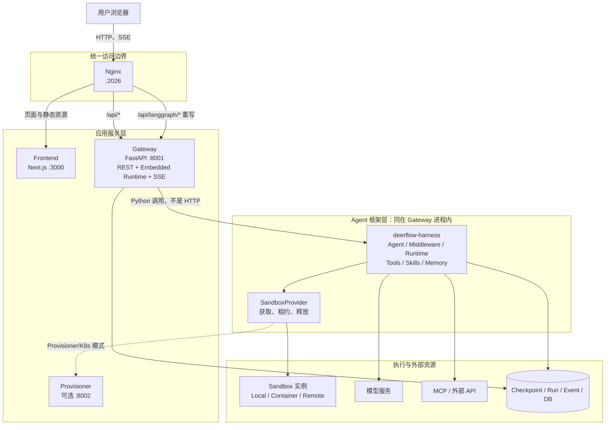
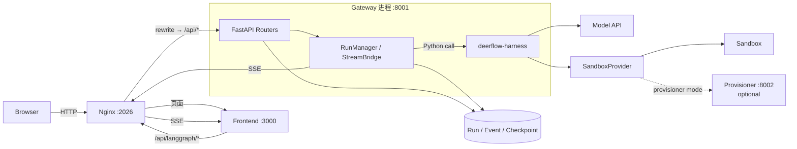

# 第 2 课：DeerFlow 系统架构

> 主题：从“看到一堆目录和端口”走向“理解服务边界、代码边界与依赖方向”  
> 建议用时：2～3 小时  
> 本课性质：架构阅读 + 代码定位 + 架构表达  
> 最终产出：一张 DeerFlow 分层架构图 + 一份启动入口与依赖方向证据表

> **本节课的核心不是记住目录名，而是建立三张彼此对应的地图：**
>
> 1. **部署地图**：哪些组件是进程或服务，它们监听什么端口；
> 2. **代码地图**：Frontend、Gateway、Harness、Sandbox 分别由哪些目录负责；
> 3. **请求地图**：一个用户请求如何穿过这些边界，又如何把结果流回浏览器。
>
> 只有同时看清这三张地图，才能准确解释 DeerFlow 的系统架构。

---

## 1. 为什么第二课先学系统架构

DeerFlow 是一个完整的 AI 应用系统，而不是一个只有 `agent.py` 的示例项目。直接从某个函数开始阅读，很容易出现下面几种误判：

- 把 Nginx 当作只负责“转发网页”的附属组件；
- 把 Gateway 当作普通 CRUD API，不知道 Agent Runtime 也嵌在其中；
- 把 Harness 当作单独部署的后端服务；
- 把 Sandbox 当作一个固定容器，而忽略它首先是一组抽象接口和生命周期；
- 看到 `langgraph.json` 就认为默认部署还会启动独立的 LangGraph Server；
- 在业务 API 层实现本应属于 Agent 框架的能力，或者反过来让框架依赖具体 Web 应用。

这些误判不会只影响“能否读懂代码”。它们还会直接影响修改位置、测试范围和故障定位。

例如，“聊天页能打开，但发送消息返回 502”至少可能对应三种完全不同的问题：

1. Frontend 页面已经由 3000 端口正常提供；
2. Nginx 的静态页面代理正常，但 `/api/langgraph/*` 到 Gateway 的代理失败；
3. Gateway 进程存在，但 Agent Runtime 初始化没有就绪。

如果没有架构地图，排查时只能在整个仓库里盲目搜索。架构地图的价值，就是先把问题缩小到正确的边界。

---

## 2. 本课学习目标

完成本课后，你应该能够：

1. 说清 Nginx、Frontend、Gateway、Harness、Sandbox 和可选 Provisioner 的职责；
2. 区分“可部署服务”“代码包”“运行时资源”三种不同类型的组件；
3. 解释为什么 Gateway 同时包含 REST API 和嵌入式 Agent Runtime；
4. 说明 `backend/app` 与 `backend/packages/harness` 的依赖方向；
5. 找到本地开发和 Docker 部署下各组件的启动入口；
6. 解释公网入口 2026、内部端口 3000/8001，以及可选端口 8002 的关系；
7. 用一张图表达请求方向、依赖方向和 Sandbox 边界；
8. 根据故障现象判断优先检查哪个组件。

如果只能画出几个方框，却不能说明每条箭头代表 HTTP 调用、Python 包依赖还是工具执行，那么本课还没有完成。

---

## 3. 建议学习安排

| 环节 | 建议时间 | 要完成的事情 |
| --- | ---: | --- |
| 建立三张地图 | 25 分钟 | 区分部署、代码与请求视角 |
| 组件职责拆解 | 35 分钟 | 理解 Nginx、Frontend、Gateway、Harness、Sandbox |
| 依赖边界分析 | 30 分钟 | 验证 `app → harness` 的依赖方向 |
| 启动入口追踪 | 30 分钟 | 找到端口、命令、入口文件和配置 |
| 绘图实践 | 35 分钟 | 完成分层架构图和证据表 |
| 故障推演与自测 | 20 分钟 | 用架构图解释常见故障 |

时间有限时，至少完成第 4～8 节和实践任务。不要把复制参考图当作完成；你必须能从仓库文件中为图上的关键结论找到证据。

---

## 4. 先区分三种架构视角

同一个系统可以画出很多张“都正确”的架构图。问题在于，每张图回答的问题不同。如果把不同视角混在一张图里，图会看似完整，实际无法用于判断。

### 4.1 部署视角：什么东西会作为进程或服务运行

“部署视角”就是暂时不看代码内部，而是从“系统运行起来以后，操作系统或 Docker 中究竟有哪些东西在运行”的角度观察 DeerFlow。

部署视角关心：

- 有哪些进程或容器；
- 谁监听端口；
- 谁调用谁；
- 哪个入口对用户暴露；
- 哪些组件是可选的。

DeerFlow 默认完整栈中的主要服务是：

| 组件 | 默认端口 | 类型 | 是否是默认公开入口 | 主要职责 |
| --- | ---: | --- | --- | --- |
| Nginx | 2026 | 反向代理服务 | 是 | 统一入口、路由请求、代理 SSE 和前端资源 |
| Frontend | 3000 | Next.js 服务 | 否，由 Nginx 代理 | 页面、交互、前端状态和流式事件消费 |
| Gateway | 8001 | FastAPI 服务 | 否，由 Nginx 代理 | REST API、线程与 Run 管理、嵌入式 Agent Runtime、SSE |
| Provisioner | 8002 | 可选 FastAPI 服务 | 否 | 在 Provisioner/Kubernetes 模式下管理 Sandbox 资源 |

浏览器
  │
  ▼
Nginx :2026
  ├── 页面请求 ──▶ Frontend :3000
  └── API 请求  ──▶ Gateway :8001
                         │
                         └── 在进程内部调用 Harness

这里没有单独列出一个“Harness 服务”，因为 **Harness 是 Python 包，不是默认独立进程**。它的运行时代码由 Gateway 进程加载和调用。

Sandbox 也不能简单等同于端口 8002：

- `Sandbox` / `SandboxProvider` 是 Harness 中的抽象能力；
- Local、容器或远程环境是不同实现；
- Provisioner 只是特定部署模式下负责创建和管理隔离环境的可选服务。

>**部署视角关注的是进程、容器、端口和网络调用。**
>
>**Nginx、Frontend 和 Gateway 是独立服务，Harness 是 Gateway 内部加载的代码包。**
>
>**用户通常只访问 2026，Nginx 再将页面和 API 分别转发到 3000 和 8001。**

==**Nginx**==

Nginx 是 DeerFlow 的统一入口和“交通指挥员”。用户只需要访问 http://localhost:2026,Nginx 根据请求路径，决定转发给前端还是后端。

| 请求路径             | 转发目标               |
| -------------------- | ---------------------- |
| `/`                  | Frontend               |
| `/workspace/...`     | Frontend               |
| `/_next/...`         | Frontend 静态资源      |
| `/api/models`        | Gateway                |
| `/api/skills`        | Gateway                |
| `/api/langgraph/...` | 重写路径后转给 Gateway |

```
浏览器请求：
/api/langgraph/threads/123/runs

Nginx 重写为：
/api/threads/123/runs

然后转发给：
Gateway :8001
```

**Provisioner** 

Provisioner 是一个“Sandbox 资源管理员”。

当 Agent 需要在 Kubernetes 中执行命令或操作文件时，Provisioner 负责：

- Agent 请求一个隔离环境时，创建隔离的 Sandbox Pod 环境；
- 检查 Sandbox 是否就绪；
- 返回 Sandbox 的连接信息；
- 任务结束后回收 Sandbox。

Provisioner 是可选服务。本地开发通常直接使用 Local Sandbox，不需要启动 Provisioner。

**K8s**

Docker/容器负责把程序装进独立运行环境，K8s 负责批量安排、监控和管理这些运行环境。

学习 DeerFlow 当前课程时，先记住“K8s 可以按需创建并回收隔离的 Sandbox Pod”就足够了。

```
Pod ≈ 一个由 K8s 管理的容器运行单元
```

### 4.2 代码视角：职责由哪些目录和包拥有

代码视角关心模块所有权，而不是端口。

```text
deer-flow/
├── frontend/                         # Next.js 用户界面
├── backend/
│   ├── app/                          # 可部署应用层
│   │   ├── gateway/                  # FastAPI Gateway
│   │   ├── channels/                 # 外部 IM 渠道接入
│   │   ├── scheduler/                # 应用侧调度服务
│   │   ├── mcp_tasks/                # 应用侧持久化 MCP 任务服务
│   │   └── subagent_batches/         # 应用侧批量 Sub-agent 服务
│   └── packages/
│       ├── harness/deerflow/         # 可复用 Agent Harness
│       └── extension-api/            # 稳定的扩展契约
├── docker/                           # Compose、Nginx、Provisioner
├── scripts/                          # 本地编排与运维脚本
├── skills/                           # Agent Skills
└── config*.yaml / extensions*.json   # 根目录运行配置模板或本地配置
```

最关键的代码依赖可以先记成：

```text
backend/app  ───────▶  deerflow-harness  ───────▶  LangGraph / 模型 / 工具等基础依赖
     │                       │
     └──────────────▶  deerflow-extension-api  ◀──────────────┘
```

箭头表示“左侧在代码中依赖右侧”。正常情况下，Harness 不应该反向导入 `app.*`，否则可复用框架就会被绑定到 DeerFlow 当前这套 FastAPI 应用。

> 代码视角的核心，是看 DeerFlow 的各项职责分别由哪些目录和代码包承担，以及它们之间的依赖方向：`frontend/` 负责页面与交互，`backend/app/` 负责 Gateway、HTTP API 和具体业务接入，`backend/packages/harness/` 提供 Agent、工具、运行时和 Sandbox 等通用框架能力；其中应用层 `app` 可以调用 Harness，但 Harness 不应反向依赖具体的 `app`，这样才能保持职责清晰并让 Agent 框架可以独立复用和测试。

### 4.3 请求视角：一次交互如何穿过系统

请求视角关心运行时控制流：

```text
浏览器
  │
  │ HTTP / SSE
  ▼
Nginx :2026
  ├── /*                  ─────▶ Frontend :3000
  ├── /api/*              ─────▶ Gateway :8001
  └── /api/langgraph/*    ─────▶ 重写为 /api/* 后交给 Gateway :8001
                                      │
                                      ▼
                              Gateway 内嵌 Runtime
                                      │
                                      ▼
                               Harness Agent Graph
                                      │
                              Tool / 文件 / 命令调用
                                      ▼
                                  Sandbox
```

结果会沿反方向返回：工具结果进入 Agent 状态，模型生成的消息和运行事件由 Gateway 转成流，Nginx 保持流式代理，Frontend 消费事件并更新页面。

### 4.4 三种视角不能互相替代

下面三个说法分别属于不同视角：

- “Gateway 监听 8001”——部署视角；
- “`app.gateway.services` 导入 `deerflow.runtime`”——代码依赖视角；
- “创建 Run 后由后台任务执行 Agent 并通过 SSE 返回事件”——请求视角。

画图时应使用不同的线型、颜色或文字标签区分它们。否则一条从 Gateway 指向 Harness 的箭头，读者无法判断它是 HTTP 请求，还是同一进程内的函数调用。

---

## 5. DeerFlow 的总体架构

下面先给出一张全局图。后续章节会逐个解释其中的边界。



阅读这张图时要注意四点：

1. 用户的标准访问入口是 Nginx 的 2026 端口；
2. Frontend 和 Gateway 是两个服务，但浏览器通常通过同一个 Origin 访问它们；
3. Harness 位于 Gateway 进程内部，不经过网络调用；
4. Sandbox 是 Agent 执行动作的边界，不等于 Gateway 本身，也不必等于 Provisioner。

---

## 6. 逐层理解每个组件

### 6.1 Nginx：统一入口与路由边界

Nginx 在标准部署中监听 2026，是用户应当打开的入口。它解决的不是 Agent 推理问题，而是 Web 系统的入口问题。

主要职责包括：

- 将页面请求转发到 Frontend；
- 将普通 `/api/*` 请求转发到 Gateway；
- 将公开的 `/api/langgraph/*` 路径重写为 Gateway 原生的 `/api/*` 路径；
- 为流式请求配置合适的代理行为；
- 将 Frontend 和 Gateway 放在同一个浏览器 Origin 下，简化 CORS、Cookie 和 CSRF 边界；
- 在 Docker 部署中成为唯一默认发布到宿主机的入口。

可以把关键路由简化为：

| 浏览器请求 | Nginx 行为 | 实际接收者 |
| --- | --- | --- |
| `/`、`/workspace/...`、`/_next/...` | 代理页面与资源 | Frontend:3000 |
| `/api/models`、`/api/skills` 等 | 保留 `/api/*` | Gateway:8001 |
| `/api/langgraph/threads/.../runs` | 去掉 `langgraph/` 这一层 | Gateway:8001 的 `/api/threads/.../runs` |

为什么要保留 `/api/langgraph/*` 这个公开前缀？因为前端可以把它当作 LangGraph 兼容 API 的入口，而 Gateway 内部仍使用自己的 `/api/*` 路由。兼容性边界由代理层提供，不要求再启动一个独立的 LangGraph Server。

需要避免的误解：

- Nginx 不创建 Thread，也不执行 Agent；
- 2026 是默认对外入口，不代表应用逻辑运行在 Nginx 中；
- 本地服务监听 8001/3000，不表示生产部署也应直接把这些端口暴露给公网；
- 根目录 `PORT` 控制的是 Nginx 发布入口，不应被理解成 Next.js 的运行端口。

证据位置：

- `docker/nginx/nginx.conf`：Docker 路由；
- `docker/nginx/nginx.local.conf`：本地开发路由；
- `docker/docker-compose.yaml`：默认发布端口；
- `scripts/serve.sh`：本地服务端口与启动顺序。

### 6.2 Frontend：交互层，而不是 Agent 决策层

Frontend 是 Next.js 应用，默认运行在 3000。它的主要职责是把 Agent 系统变成可操作、可观察的用户体验。

它负责：

- 登录、工作区、会话和 Agent 配置等页面；
- 创建或选择 Thread；
- 发送用户输入和附件；
- 订阅并消费 Gateway 的 SSE 流；
- 将消息、Todo、Artifact、Sub-agent 状态等渲染为 UI；
- 管理乐观更新、加载状态、错误提示和重连后的前端状态；
- 调用模型、Skills、MCP、文件等管理 API。

它不应负责：

- 决定模型实际能调用哪些工具；
- 把前端隐藏按钮当作权限控制；
- 执行 Shell 命令或直接读写 Sandbox；
- 保存权威的 Run 状态；
- 仅靠前端状态判断一次 Agent Run 是否真正完成。

换句话说，Frontend 可以表达“用户希望开始运行”，但是否允许、如何运行、当前处于什么权威状态，必须由 Gateway 和 Runtime 决定。

代码入口与主要目录：

- `frontend/package.json`：`dev`、`start`、`preview` 等脚本；
- `frontend/src/app/`：Next.js App Router；
- `frontend/src/core/threads/`：Thread 与流式交互核心逻辑；
- `frontend/src/components/workspace/`：工作区 UI。

### 6.3 Gateway：应用 API 与 Agent Runtime 的宿主

Gateway 是 FastAPI 应用，默认监听 8001。它是 DeerFlow 后端的可部署入口，也是默认 Agent Runtime 的宿主进程。

它的职责可以分成两组。

**第一组：应用 API 职责**

- 身份认证、授权、CSRF 与请求边界；
- Models、Skills、MCP、Memory、Uploads、Artifacts 等 REST API；
- Thread 与 Run 的创建、查询、取消和清理；
- 自定义 Agent、项目、渠道和定时任务等业务接口；
- 健康检查和应用生命周期管理。

**第二组：Runtime 接入职责**

- 在应用启动时初始化 Checkpointer、Store、StreamBridge 和 RunManager；
- 接收 LangGraph 兼容的 Thread/Run 请求；
- 把一次运行交给 Harness 的 `run_agent()`；
- 将执行事件发布为 SSE；
- 协调 HTTP 生命周期与后台 Agent 生命周期；
- 在结束、失败、取消等情况下完成持久化与清理。

Gateway 之所以不只是一个“转发到 Agent Server 的薄代理”，是因为默认架构已经把 Runtime 嵌入 FastAPI 进程。这样可以共享：

- 身份与权限上下文；
- RunManager 和 StreamBridge；
- 配置、持久化与生命周期；
- 上传文件、Artifact、Thread 数据和业务 API；
- 同一个进程中的 Harness 代码。

入口位置：

- `backend/app/gateway/app.py` 中的 `create_app()` 和模块级 `app`；
- Uvicorn 启动目标为 `app.gateway.app:app`；
- `backend/app/gateway/routers/thread_runs.py` 提供 Thread 级 Run 路由；
- `backend/app/gateway/services.py` 负责运行编排，并调用 Harness Runtime。

### 6.4 Harness：可复用 Agent 框架层

`deerflow-harness` 位于 `backend/packages/harness/`，Python 导入名是 `deerflow.*`。它不是页面，也不是对外 REST API；它提供构造和运行 Agent 所需的框架能力。

主要职责包括：

- Lead Agent 与 Custom Agent 的组装；
- LangGraph 状态与 Graph；
- Middleware 链；
- 模型工厂与模型能力适配；
- Tool Catalog、内置工具与工具执行；
- Skills 发现和加载；
- MCP 客户端与外部工具接入；
- Sandbox Provider、租约和文件路径抽象；
- Run、Event、Checkpoint、Memory 等 Runtime/Persistence 能力；
- Sub-agent 委派；
- Guardrail、Token 预算、循环检测和追踪。

可以用一个问题判断功能是否倾向于放进 Harness：

> 如果没有 DeerFlow 当前这套网页和 FastAPI Router，这个能力是否仍然是构建 Agent 所需要的通用能力？

如果答案是“是”，例如 Tool Schema、Middleware、Agent 状态、Sandbox 抽象，它通常更接近 Harness。

但这不是机械规则。身份验证、HTTP 错误码、Cookie、具体 Router 等明显属于应用边界，不应因为它们会影响 Agent 就全部塞进 Harness。

关键位置：

- `backend/packages/harness/deerflow/agents/`：Agent、状态和 Middleware；
- `backend/packages/harness/deerflow/runtime/`：Run、Stream 与执行；
- `backend/packages/harness/deerflow/tools/`：工具系统；
- `backend/packages/harness/deerflow/sandbox/`：Sandbox 抽象与实现；
- `backend/packages/harness/deerflow/skills/`：Skills；
- `backend/packages/harness/deerflow/mcp/`：MCP；
- `backend/packages/harness/deerflow/persistence/`：持久化能力。

### 6.5 Sandbox：动作执行边界

Agent 能生成文本，但读取文件、写文件和执行命令需要真实环境。Sandbox 把这些动作放进一个具有明确生命周期和路径规则的执行边界中。

抽象上可以分成两层：

```text
SandboxProvider
  ├── acquire：为 Thread/Run 获取可用环境
  ├── get：查找已有环境
  └── release：释放租约或资源

Sandbox
  ├── execute_command
  ├── read_file
  ├── write_file
  └── list_dir
```

不同 Provider 可以把这些操作映射到：

- 开发机本地目录与进程；
- 容器；
- 远程 Sandbox 服务；
- 由 Provisioner 管理的 Kubernetes Pod。

这里必须区分两个概念：

1. **接口统一**：Agent 调用的是一致的文件和命令能力；
2. **安全隔离**：实际实现能提供多强的隔离。

Local Sandbox 便于开发，但它不是强安全边界。拥有统一 API 不代表所有实现具有同等隔离级别。

Thread 的典型虚拟路径包括：

| 虚拟路径 | 含义 |
| --- | --- |
| `/mnt/user-data/uploads` | 用户上传文件 |
| `/mnt/user-data/workspace` | Agent 工作目录 |
| `/mnt/user-data/outputs` | 面向用户的输出文件 |
| `/mnt/skills` | 可供 Agent 读取的 Skills |

虚拟路径让 Agent 和工具不必知道宿主机的真实目录结构，也让不同 Sandbox 实现可以保持相同契约。

### 6.6 Provisioner：特定隔离模式下的资源控制面

Provisioner 默认不是每次本地开发都必须运行的核心服务。它在配置为 Provisioner/Kubernetes Sandbox 模式时，负责动态创建、检查和销毁 Sandbox 资源。

它更接近“资源控制面”，而不是 Agent 本身：

```text
Harness / SandboxProvider
          │ 请求获取隔离环境
          ▼
Provisioner :8002
          │ 创建或管理
          ▼
Kubernetes Sandbox Pod
```

因此，看到 8002 不应得出“Agent 调用都经过 8002”的结论。是否使用 Provisioner 取决于 Sandbox 配置和部署模式。

证据位置：

- `docker/provisioner/app.py`：Provisioner FastAPI 应用；
- `docker/provisioner/Dockerfile`：8002 启动命令；
- Compose 文件中的可选服务配置；
- Harness 的 Sandbox Provider 配置与实现。

---

## 7. `app` 与 `deerflow-harness` 的依赖边界

### 7.1 先看事实，而不是凭目录名猜

`backend/pyproject.toml` 把 `deerflow-harness` 声明为应用依赖。Gateway 的代码也大量从 `deerflow.*` 导入 Agent、Runtime、Persistence 和 Sandbox 能力。

反过来，在正常架构中，`backend/packages/harness/deerflow/` 不应导入 `app.*`。

因此主要依赖方向是：

```text
应用层 app
    │
    │ 调用公开或内部框架能力
    ▼
框架层 deerflow-harness
    │
    ├── LangGraph / LangChain
    ├── Model Providers
    ├── MCP
    ├── Sandbox SDK
    └── Persistence Drivers
```

这里的“上层”和“下层”描述依赖方向，不代表重要性。==应用层负责把框架能力变成实际产品；框架层负责提供可复用机制==。

### 7.2 哪些代码放在 `app`

下面这些需求通常属于应用层：

- 新增一个 FastAPI Router；
- 处理 Cookie、CSRF、CORS、HTTP Header；
- 把领域错误映射成 HTTP 409、404 或 503；
- 管理登录用户与管理员权限；
- 接入 Slack、飞书等具体消息渠道的收发生命周期；
- 在 Gateway 启动和关闭时装配进程级单例；
- 把 Harness 事件编码成对外 SSE 协议。

### 7.3 哪些代码放在 Harness

下面这些需求通常属于框架层：

- 增加一种 Agent Middleware；
- 定义 ThreadState 字段和 Reducer；
- 增加通用 Tool 或 Tool 执行规则；
- 增加模型工厂能力；
- 定义 Sandbox Provider；
- 管理 Run 状态、事件或执行逻辑；
- 提供 Skill、MCP、Sub-agent 等通用机制；
- 实现与具体 HTTP 框架无关的持久化接口。

### 7.4 边界问题的判断表

| 问题 | 更接近 `app` | 更接近 Harness |
| --- | --- | --- |
| 输入是否是 HTTP Request/Response | 是 | 否 |
| 是否依赖 FastAPI Router 或 Middleware | 是 | 否 |
| 不运行 DeerFlow Web UI 时是否仍有价值 | 不一定 | 通常是 |
| 是否描述 Agent 状态、工具、模型或执行机制 | 少量适配 | 是 |
| 是否负责认证用户、Cookie、CSRF | 是 | 否 |
| 是否应被其他 Agent 宿主复用 | 否 | 是 |

### 7.5 为什么不能让 Harness 反向依赖 `app`

假设 Harness 为了读取当前用户，直接导入 `app.gateway.auth`：

1. Harness 将无法在 TUI、测试或其他宿主中独立使用；
2. 框架测试必须连带初始化 FastAPI 应用；
3. 容易出现循环导入：`app → harness → app`；
4. 具体认证实现会泄漏到通用 Runtime；
5. 扩展作者无法依赖稳定、较小的接口。

更合理的方法通常是依赖注入、Context、抽象接口或稳定的 `extension-api` 契约。上层在组装时把实现传给下层，而不是让下层主动寻找上层。

### 7.6 `extension-api` 为什么单独存在

`backend/packages/extension-api/` 提供扩展与宿主之间较稳定、较中性的契约。Gateway 和 Harness 都可以依赖它，但扩展不必导入大量内部实现。

这体现了另一个重要原则：

> 跨边界共享的应该是小而稳定的契约，而不是任意一侧的内部对象。

本课不深入扩展系统，但在架构图中应知道它承担的是“契约边界”，而不是另一个运行服务。

---

## 8. 为什么要分成 Agent 框架与业务 API

### 8.1 变化速度不同

Web API 可能因为页面、认证、业务功能而变化；Agent Runtime 可能因为模型、工具、状态和执行策略而变化。分层后，两类变化不必同时扩散到整个系统。

### 8.2 测试方式不同

- Router 更适合使用 HTTP/ASGI 测试，验证状态码、权限和序列化；
- Harness 更适合使用单元测试、状态测试和 Runtime 测试；
- Sandbox Provider 需要契约测试和不同实现的集成测试；
- Frontend 需要组件、Hook 与 E2E 测试。

清晰边界能让测试只加载必要部分，减少脆弱的全栈依赖。

### 8.3 复用范围不同

Harness 可以被 Gateway、TUI、测试 Harness 或其他宿主调用。若所有能力都写在 FastAPI Router 里，离开 HTTP 请求后就很难复用。

### 8.4 安全边界不同

- Gateway 决定谁可以发起请求；
- Harness 决定一次 Agent 运行如何组织；
- Tool 和 Sandbox 决定某个动作能否以及在哪里执行；
- Nginx 决定外部请求能到达哪个内部服务。

这些约束相互补充。任何一层都不能单独代表完整安全体系。

### 8.5 故障隔离与可观测性不同

分层使故障可以被分类：

| 现象 | 优先边界 | 可能的下一步证据 |
| --- | --- | --- |
| 2026 无法连接 | Nginx/编排 | Nginx 是否启动、端口是否监听 |
| 页面正常但所有 API 502 | Nginx → Gateway | Gateway 健康检查、代理上游 |
| API 正常但页面资源失败 | Nginx → Frontend | Frontend 3000、`/_next/*` 请求 |
| Run 创建成功但无流式事件 | Runtime/StreamBridge/SSE | Run 状态、SSE 响应、Gateway 日志 |
| 模型能回答但文件工具失败 | Tool/Sandbox | Sandbox 租约、虚拟路径、工具错误 |
| 只有容器隔离模式失败 | Sandbox Provider/Provisioner | Provider 配置、8002、Pod 状态 |

---

## 9. 启动模式与真实入口

### 9.1 本地开发：`make dev`

根目录 `make dev` 最终由本地编排脚本按顺序启动：

1. Gateway；
2. Frontend；
3. Nginx。

关键命令可以概括为：

```text
Gateway:
cd backend
uvicorn app.gateway.app:app --host 0.0.0.0 --port 8001

Frontend:
cd frontend
pnpm run dev
PORT 固定为 3000

Nginx:
使用 docker/nginx/nginx.local.conf
监听 2026
```

启动顺序很重要：Nginx 启动成功不代表其上游一定已就绪，所以编排脚本会等待各端口可用，再启动下一层。

### 9.2 Docker 生产栈

Docker Compose 中仍然是相同的三层关系：

```text
宿主机 127.0.0.1:${PORT:-2026}
              │
              ▼
       nginx 容器 :2026
          ├────────▶ frontend 容器 :3000
          └────────▶ gateway 容器 :8001
```

默认发布地址使用 `BIND_HOST`，缺省为 `127.0.0.1`。容器内部监听 `0.0.0.0` 不等于宿主机把服务暴露给所有网络接口；真正的外部暴露面由 Compose 的端口发布规则决定。

### 9.3 Gateway 的 Python 入口

Uvicorn 目标 `app.gateway.app:app` 可以拆成：

- `app.gateway.app`：Python 模块；
- 最后的 `app`：模块级 FastAPI 实例；
- 该实例由 `create_app()` 创建；
- FastAPI lifespan 初始化和关闭 Runtime 依赖。

看到入口后还应继续回答：

- Router 在哪里注册？
- RunManager 和 StreamBridge 在哪里放入 `app.state`？
- 运行请求在哪里转交给 `run_agent()`？

本课只要求定位，完整执行链留到第 6 课。

### 9.4 Frontend 的入口

Frontend 的脚本入口在 `frontend/package.json`。开发脚本进一步运行项目自己的 `scripts/dev.mjs`，生产模式由 Next.js 启动。

Next.js App Router 的页面入口位于 `frontend/src/app/`。这与 Gateway 的 FastAPI `app` 不是同一个概念：前者是前端路由目录，后者是 Python 应用包和 FastAPI 实例。

### 9.5 `langgraph.json` 不是默认服务入口

仓库保留 `backend/langgraph.json`，可用于 LangGraph 工具、Studio 或直接兼容运行方式。但当前标准的 `make dev` 和 Docker 部署启动的是 Gateway 内嵌 Runtime。

判断“系统实际怎么启动”时，应优先看：

1. Makefile 调用了什么脚本；
2. 脚本执行了什么命令；
3. Compose 的 `command`/`entrypoint` 是什么；
4. 进程入口模块如何构造应用。

不要只因为仓库存在某个配置文件，就推断它一定参与默认部署。

---

## 10. 一次请求如何跨越各层

本节只建立骨架，不展开 RunManager 和 StreamBridge 的所有内部细节。

### 10.1 页面加载

```text
1. 浏览器请求 http://localhost:2026/workspace/...
2. Nginx 将普通页面路由交给 Frontend:3000
3. Next.js 返回 HTML、JavaScript 和样式资源
4. 浏览器运行 React 应用
```

### 10.2 创建一次 Agent Run

```text
1. Frontend 使用 LangGraph 客户端或 REST 请求发送用户消息
2. 请求到达 Nginx 的 /api/langgraph/*
3. Nginx 将路径重写为 Gateway 的 /api/*
4. Gateway 校验用户、Thread、请求体和并发规则
5. Gateway 创建 Run，并交给后台 Runtime 执行
6. Runtime 调用 Harness 构造/执行 Agent Graph
```

### 10.3 Agent 调用工具

```text
1. 模型根据上下文请求调用工具
2. Harness 校验并执行工具
3. 文件或命令类工具通过 Sandbox 接口行动
4. 工具结果成为 ToolMessage/状态更新
5. Agent 根据新状态决定继续调用工具还是生成最终回答
```

### 10.4 流式返回

```text
1. Agent 产生消息增量、状态快照或自定义事件
2. Runtime/StreamBridge 发布运行事件
3. Gateway 将事件编码为 SSE
4. Nginx 保持流式代理，不把它当普通短响应缓存
5. Frontend 消费事件并更新消息、Todo、Artifact 等 UI
```

### 10.5 为什么 HTTP 生命周期与 Agent 生命周期要分开

一次 Agent 运行可能持续很久，用户也可能刷新页面或暂时断网。如果 Agent 生命周期完全绑定到最初的 HTTP 连接：

- 浏览器断开就可能让任务意外终止；
- 无法可靠重连；
- 很难查询或取消后台 Run；
- Run 的权威状态会和某一个前端连接混在一起。

因此 Gateway 使用 Run 对象、后台任务、持久化状态和流桥接机制，把“任务是否继续执行”与“当前是否有浏览器连接”分开。第 21～23 课会继续展开这一点。

---

## 11. 控制流、数据流和依赖流

一张高质量架构图应说明箭头含义。

### 11.1 控制流

控制流表示谁触发谁：

```text
用户点击发送
→ Frontend 发请求
→ Gateway 创建 Run
→ Runtime 执行 Agent
→ Agent 请求工具
→ Sandbox 执行动作
```

### 11.2 数据流

数据流表示数据在哪里移动：

```text
用户消息 → Thread 输入
工具输出 → ToolMessage
模型增量 → SSE Event
生成文件 → outputs → Artifact URL
Checkpoint → Persistence
```

### 11.3 代码依赖流

代码依赖流表示编译或运行时导入：

```text
app.gateway.services
→ deerflow.runtime
→ LangGraph / Persistence / Sandbox 等
```

代码依赖箭头与请求箭头可能方向相同，但含义完全不同。例如 Gateway 指向 Harness 不是 HTTP 调用，而是 Python 包导入和函数调用。

### 11.4 推荐的图例

你可以在最终架构图中使用：

```text
实线箭头  ─────▶  网络请求或运行控制流
虚线箭头  - - -▶  可选路径
点线箭头  ·····▶  代码依赖
圆柱体              持久化存储
虚线边框            可选服务或运行环境
```

如果使用 Mermaid，也应在连线上写 `HTTP`、`Python call`、`SSE`、`optional` 等标签。

---

## 12. 实践一：建立架构证据表

### 任务目标

不要先抄参考答案。你需要从仓库中找到证据，完成下面的表格。

| 结论 | 证据文件 | 关键内容 | 你的解释 |
| --- | --- | --- | --- |
| 标准入口是 2026 |  |  |  |
| Frontend 运行在 3000 |  |  |  |
| Gateway 运行在 8001 |  |  |  |
| `/api/langgraph/*` 被重写 |  |  |  |
| Agent Runtime 嵌在 Gateway |  |  |  |
| `app` 依赖 Harness |  |  |  |
| Harness 不应依赖 `app` |  |  |  |
| Provisioner 是可选的 |  |  |  |

### 推荐阅读顺序

1. `backend/docs/ARCHITECTURE.md`
2. `scripts/serve.sh`
3. `docker/nginx/nginx.local.conf`
4. `docker/nginx/nginx.conf`
5. `docker/docker-compose.yaml`
6. `backend/app/gateway/app.py`
7. `backend/app/gateway/deps.py`
8. `backend/app/gateway/services.py`
9. `backend/pyproject.toml`
10. `backend/packages/harness/pyproject.toml`

### 可使用的 PowerShell 命令

```powershell
# 找端口与代理规则
rg -n "2026|3000|8001|8002|proxy_pass|rewrite" docker scripts

# 找本地启动入口
rg -n "uvicorn|pnpm|nginx" Makefile scripts/serve.sh docker

# 验证应用层导入 Harness
rg -n "^(from|import) deerflow" backend/app

# 检查 Harness 是否反向导入应用层
rg -n "^(from|import) app(\.|\s|$)" backend/packages/harness/deerflow

# 找 FastAPI 应用与 Runtime 初始化
rg -n "create_app|FastAPI|langgraph_runtime|RunManager|StreamBridge" backend/app/gateway
```

最后一个 Harness 反向导入命令在架构健康时可能没有输出。**没有输出也是证据，但要记录你搜索的范围和表达式。**

---

## 13. 实践二：找到每个组件的启动入口

完成下表。入口不一定都是一个 `main()` 函数。

| 组件 | 本地开发入口 | Docker/生产入口 | 默认端口 | 如何确认已就绪 |
| --- | --- | --- | ---: | --- |
| Nginx |  |  | 2026 | 访问统一入口或检查端口 |
| Frontend |  |  | 3000 | 页面/端口可用 |
| Gateway |  |  | 8001 | `GET /health` 与 `GET /health/ready` |
| Provisioner |  |  | 8002 | 仅在启用对应模式时检查 |
| Harness | 不单独启动 | 不单独启动 | 无 | 由 Gateway Runtime 加载 |

### 参考定位结果

| 组件 | 关键入口 |
| --- | --- |
| Nginx | `scripts/serve.sh` + `docker/nginx/nginx.local.conf`；Docker 使用 `docker/nginx/nginx.conf` |
| Frontend | `frontend/package.json` 中脚本；页面路由从 `frontend/src/app/` 开始 |
| Gateway | Uvicorn 目标 `backend/app/gateway/app.py` 的模块级 `app` |
| Provisioner | `docker/provisioner/app.py`，镜像命令监听 8002 |
| Harness | `deerflow.*` 包被 Gateway 导入；Lead Agent 入口为 `make_lead_agent` |

### 进阶问题

解释下面两句话为什么可以同时成立：

1. Gateway 在容器内绑定 `0.0.0.0:8001`；
2. 默认部署仍然只把 `127.0.0.1:2026` 发布到宿主机。

参考要点：第一句话描述容器内部进程监听，第二句话描述宿主机端口发布。网络命名空间和代理边界不同，不能只看 Uvicorn 的 `--host` 判断公网暴露面。

---

## 14. 实践三：绘制分层架构图

### 必须包含的节点

- User/Browser；
- Nginx；
- Frontend；
- Gateway；
- `deerflow-harness`；
- SandboxProvider 与 Sandbox；
- 模型或外部工具；
- Persistence；
- 可选 Provisioner。

### 必须表达的关系

1. 用户通过 2026 访问；
2. 页面流量去 Frontend，API 流量去 Gateway；
3. `/api/langgraph/*` 在 Nginx 被重写；
4. Gateway 通过同进程 Python 调用使用 Harness；
5. Harness 使用 Sandbox 执行文件和命令动作；
6. SSE 从 Gateway 返回 Frontend；
7. `app → harness` 的代码依赖方向；
8. Provisioner 是可选路径。

### 图旁边必须写出的三条说明

```text
1. Harness 是代码包，不是默认独立网络服务。
2. Sandbox 是执行抽象与运行环境；Provisioner 只是可选资源管理服务。
3. 2026 是统一公开入口，3000/8001 是上游服务端口。
```

### 参考图



不要只评价图“好不好看”。用下面四个问题检查它：

1. 能否看出哪些节点是独立进程？
2. 能否看出哪些调用发生在同一进程？
3. 能否看出公开入口和内部端口？
4. 能否看出可选路径与默认路径？

---

## 15. 实践四：用故障反推组件边界

架构图应该能帮助排错。针对每个场景，写出“第一检查点”和“至少两个证据来源”。

### 场景 A：访问 2026 直接连接失败

优先检查：

- Nginx 是否启动；
- 2026 是否被其他进程占用；
- 本地编排是否在启动上游前失败；
- Docker 是否正确发布端口。

不应优先修改 Prompt 或 Agent 代码，因为请求尚未进入这些层。

### 场景 B：页面能加载，发送消息得到 502

优先检查：

- Gateway 8001 是否存活；
- Nginx 的 Gateway upstream；
- `/health` 和 `/health/ready`；
- Gateway 启动日志中是否有配置或持久化初始化失败。

### 场景 C：模型正常回复，但读写文件失败

优先检查：

- 工具是否被当前 Agent 暴露；
- Sandbox 是否成功 acquire；
- 虚拟路径是否正确；
- Thread workspace/uploads/outputs 是否初始化；
- Local/远程 Provider 的能力差异。

### 场景 D：只有刷新页面后看不到进行中的输出

优先检查：

- Run 是否仍在后台执行；
- SSE 重连与 `Last-Event-ID`；
- StreamBridge 是否保留所需事件；
- 前端是否恢复 Thread/Run 状态。

这不是简单的“模型没返回”。它跨越 Runtime、Gateway SSE 与 Frontend 状态恢复三个边界。

### 场景 E：Local Sandbox 正常，Kubernetes 模式失败

优先检查：

- Sandbox Provider 选择是否正确；
- Provisioner 服务和 8002 是否可达；
- Provisioner 是否能访问集群；
- Pod 创建、镜像、挂载和就绪状态。

---

## 16. 常见误区

### 误区一：Harness 是监听某个端口的 Agent 服务

当前默认架构中，Harness 是被 Gateway 导入的 Python 包。调用 Harness 主要是同进程函数调用，不是一次 HTTP 请求。

### 误区二：`langgraph.json` 存在，所以默认还有独立 LangGraph Server

配置文件存在不等于默认启动链使用它。应以 Makefile、启动脚本和 Compose 命令为准。当前标准部署使用 Gateway 内嵌 Runtime。

### 误区三：Sandbox 就是 Docker 容器

Sandbox 是抽象接口和运行边界，可以有 Local、容器或远程实现。不同实现的隔离强度不同。

### 误区四：Provisioner 是所有运行都必须经过的服务

Provisioner 只在特定 Sandbox 模式下参与资源管理。普通本地开发不应无条件依赖它。

### 误区五：Frontend 不显示某个按钮，就等于用户没有权限

前端隐藏只是用户体验。真正的认证、授权和动作限制必须由 Gateway、Tool 和 Sandbox 等服务端边界执行。

### 误区六：只要 Gateway `/health` 返回 200，Agent 就一定可用

存活检查只能说明进程能响应。持久化或 Runtime 依赖是否就绪，应继续检查 `/health/ready` 和实际 Run 行为。

### 误区七：容器内监听 `0.0.0.0` 就一定暴露到公网

容器内部监听地址和宿主机端口发布是两个层次。默认外部入口由 Compose 的 `BIND_HOST` 与 Nginx 端口规则决定。

### 误区八：所有 Agent 相关代码都应放进 Harness

Agent 功能会跨层。HTTP 权限、Run 路由和 SSE 编码属于应用宿主；状态、工具和 Middleware 更接近框架。应根据职责和依赖方向判断，而不是根据功能名称判断。

---

## 17. 课后自测

### 问题 1

为什么说 Nginx 2026 是“统一入口”，而不是 DeerFlow 的业务执行层？

<details>
<summary>参考答案</summary>

Nginx 根据路径把页面请求代理给 Frontend，把 API 请求代理给 Gateway，并处理公开路径兼容。Thread、Run、Agent 和工具逻辑都不在 Nginx 中执行，所以它是网络入口与路由边界，不是业务执行层。

</details>

### 问题 2

Gateway 和 Harness 是什么关系？

<details>
<summary>参考答案</summary>

Gateway 是可部署的 FastAPI 应用和 Runtime 宿主；Harness 是可复用 Python 框架包。Gateway 负责 HTTP、认证、业务 Router、生命周期和 SSE 接入，并在同一进程中调用 Harness 的 Agent、Runtime、Tool、Sandbox 等能力。主要代码依赖方向是 `app → deerflow-harness`。

</details>

### 问题 3

为什么 Harness 不应该直接导入 `app.gateway.*`？

<details>
<summary>参考答案</summary>

这样会让框架绑定具体 FastAPI 宿主，破坏 TUI、测试和其他宿主的复用，并可能形成循环依赖。应通过抽象、Context、依赖注入或稳定契约传入宿主能力。

</details>

### 问题 4

Sandbox 和 Provisioner 有什么区别？

<details>
<summary>参考答案</summary>

Sandbox 是 Agent 执行文件、命令等动作的抽象与实际环境；SandboxProvider 管理它的获取、租约和释放。Provisioner 是可选的资源控制服务，在特定 Kubernetes/Provisioner 模式下创建和管理 Sandbox 资源，并非所有运行都参与。

</details>

### 问题 5

浏览器请求 `/api/langgraph/threads/123/runs` 时，标准部署中的路径如何变化？

<details>
<summary>参考答案</summary>

请求先到 Nginx:2026，Nginx 将 `/api/langgraph/*` 重写为 Gateway 原生 `/api/*`，再把请求转发到 Gateway:8001，因此 Gateway 接收类似 `/api/threads/123/runs` 的路径。

</details>

### 问题 6

为什么 Frontend 3000 和 Gateway 8001 通常不需要直接暴露给用户？

<details>
<summary>参考答案</summary>

Nginx 2026 已提供统一 Origin 和路由边界。让浏览器统一经过 Nginx 可以减少跨域、Cookie、CSRF 和部署配置复杂度，并缩小默认外部暴露面。

</details>

### 问题 7

`GET /health` 成功与 `GET /health/ready` 成功分别说明什么？

<details>
<summary>参考答案</summary>

`/health` 主要表示 Gateway 进程存活并能响应；`/health/ready` 还检查关键持久化/Checkpoint 等启动依赖是否可用，更接近“是否能接收真实工作”。具体检查项仍应以当前代码为准。

</details>

### 问题 8

一条从 Gateway 指向 Harness 的箭头为什么必须标注含义？

<details>
<summary>参考答案</summary>

它代表同一进程内的 Python 包依赖和函数调用，而不是 HTTP 网络请求。若不标注，读者可能错误地把 Harness 当成独立服务，进而误判部署、延迟和故障边界。

</details>

### 问题 9

如果页面能打开，但所有 API 请求失败，为什么不能立刻判断 Frontend 有 Bug？

<details>
<summary>参考答案</summary>

页面流量和 API 流量在 Nginx 后分向不同上游。Frontend 能提供页面，只能证明到 3000 的路径大致正常；API 失败可能来自 Nginx 的 Gateway 路由、Gateway 8001、认证或 Runtime 初始化。

</details>

### 问题 10

如何用仓库证据证明某个组件是“默认启动”的，而不是“仓库支持但默认不启动”的？

<details>
<summary>参考答案</summary>

沿真实编排链检查根 Makefile、它调用的脚本、Compose service、`command`/`entrypoint` 和进程入口。仅有源码、Dockerfile 或配置文件不能证明它进入默认启动链。

</details>

---

## 18. 本课产出模板

建议在 `learn/outputs/` 下保存自己的作业，例如：

```text
learn/outputs/lesson-02-architecture.md
```

可使用下面的模板：

````markdown
# DeerFlow 分层架构说明

## 1. 一句话概括

DeerFlow 通过 Nginx 提供统一入口，Frontend 提供交互，Gateway 承载业务 API 和嵌入式 Agent Runtime，Gateway 内部调用 deerflow-harness，并通过 Sandbox 执行真实动作。

## 2. 部署组件

| 组件 | 端口 | 职责 | 是否默认公开 |
| --- | ---: | --- | --- |
| Nginx | 2026 |  |  |
| Frontend | 3000 |  |  |
| Gateway | 8001 |  |  |
| Provisioner | 8002 |  |  |

## 3. 分层架构图

```mermaid
flowchart TB
    %% 在这里完成自己的图
```

## 4. 依赖方向

- `backend/app` → `deerflow-harness`：
- Harness 不反向依赖 `app` 的原因：
- `extension-api` 的作用：

## 5. 请求路径

1. 页面加载：
2. 创建 Run：
3. 工具执行：
4. SSE 返回：

## 6. 启动入口与证据

| 结论 | 文件 | 证据摘要 |
| --- | --- | --- |
|  |  |  |

## 7. 三个最容易混淆的边界

1. 
2. 
3. 

## 8. 一个故障定位示例

- 现象：
- 第一检查层：
- 推理依据：
- 证据：
````

---

## 19. 本课验收标准

完成产出后，逐项检查：

- [ ] 架构图包含 Browser、Nginx、Frontend、Gateway、Harness 和 Sandbox；
- [ ] 标出了 2026、3000、8001，以及 8002 的可选性质；
- [ ] 明确写出 Harness 不是默认独立服务；
- [ ] 明确写出 Gateway 包含嵌入式 Agent Runtime；
- [ ] 区分了 Sandbox、SandboxProvider 和 Provisioner；
- [ ] 图中区分了 HTTP/SSE、同进程调用和代码依赖；
- [ ] 说明了 `app → harness` 的依赖方向；
- [ ] 为每个启动入口提供了仓库文件证据；
- [ ] 能解释 `/api/langgraph/*` 的重写；
- [ ] 能根据至少两个故障现象定位优先检查层；
- [ ] 没有把 `langgraph.json` 误写成标准部署必启服务；
- [ ] 架构说明由自己的语言写成，而不是只有参考图截图。

满足前六项说明你建立了基本架构地图；全部满足才算完成本课。

---

## 20. 建议保存的学习证据

为了让学习结果以后能用于复盘、面试或项目展示，建议保留：

1. 一份 Mermaid 或 draw.io 架构图源文件；
2. 一份带文件路径的证据表；
3. `rg` 搜索命令和关键输出摘要；
4. 一段 2～3 分钟的口头讲解录音或文字稿；
5. 一次故障推演记录；
6. 如果发现文档与代码不一致，记录“文档说法、代码证据、最终判断”。

口头讲解应能不看正文回答：

```text
用户从哪里进入？
页面和 API 分别去哪里？
Agent Runtime 在哪个进程？
app 和 Harness 谁依赖谁？
工具在哪里真正执行？
隔离模式变化时，哪一层发生变化？
```

1. **用户从哪里进入？**
   用户统一从 **Nginx** 进入，默认访问 `http://localhost:2026`。Nginx 是整个 DeerFlow 对外的统一入口。

2. **页面和 API 分别去哪里？**
   页面请求转发到 **Frontend（Next.js，3000 端口）**；`/api/*` 请求转发到 **Gateway（FastAPI，8001 端口）**。

   ```
   浏览器 → Nginx
              ├─ 页面请求 → Frontend
              └─ /api/*  → Gateway
   ```

3. **Agent Runtime 在哪个进程？**
   Agent Runtime 不单独启动一个服务，它嵌在 **Gateway 进程**中。Gateway 既接收 API，也通过 `RunManager`、`run_agent()` 和 `StreamBridge` 执行 Agent。

4. **app 和 Harness 谁依赖谁？**
   **app 依赖 Harness**，方向不能反过来。

   ```
   app → deerflow Harness
   ```

   `backend/app/` 负责 Gateway、Router、Service 和外部入口；`backend/packages/harness/` 提供 Agent、工具、模型、沙箱等核心能力。Harness 不允许导入 `app`。

5. **工具在哪里真正执行？**
   要分工具类型：

   - Agent 的工具调度逻辑主要运行在 Gateway 里的 Harness。
   - `bash`、文件读写等沙箱工具，真正操作发生在 **Sandbox** 中。
   - MCP 工具通常由相应的外部 MCP 服务执行。
   - 普通内置 Python 工具可能直接在 Gateway 进程中执行。

   所以不能简单认为所有工具都在 Sandbox 中执行，但危险的命令和文件操作通常会被放进 Sandbox。

6. **隔离模式变化时，哪一层发生变化？**
   主要变化的是 **Sandbox 基础设施层**。

   ```
   Agent → 统一的 Sandbox 接口
                  ├─ Local Sandbox
                  └─ Provisioner / K8s Sandbox
   ```

   Router、Service、RunManager 和 Agent 的主要调用流程基本不变，只是底层 Sandbox 实现发生替换。使用 K8s 隔离时，还会多出 Provisioner 负责创建和回收沙箱。

一句话串起来：

> 用户从 Nginx 进入，页面交给 Frontend，API 交给 Gateway；Gateway 内嵌 Agent Runtime，app 单向调用 Harness，Harness 调度工具，命令和文件类工具通常在 Sandbox 中执行，而切换隔离模式主要替换 Sandbox 层。


---

## 21. 本课总结

DeerFlow 的架构可以浓缩成下面几句话：

1. **Nginx 是统一入口**：默认从 2026 接收浏览器请求，把页面交给 Frontend，把 API 交给 Gateway；
2. **Frontend 是交互层**：负责页面、用户操作和流式事件呈现，不拥有权威执行状态；
3. **Gateway 是应用与 Runtime 宿主**：FastAPI 既提供业务 API，也承载默认的嵌入式 Agent Runtime；
4. **Harness 是框架包**：它提供 Agent、Middleware、Tool、Skill、Runtime、Persistence 和 Sandbox 等通用能力，不是默认独立服务；
5. **Sandbox 是动作边界**：Provider 管理环境生命周期，不同实现具有不同隔离强度；
6. **Provisioner 是可选控制面**：只在特定隔离部署模式下管理 Sandbox 资源；
7. **主要依赖方向是 `app → harness`**：应用调用框架，框架不应反向绑定具体 Web 应用；
8. **架构判断必须有启动脚本和代码证据**：目录名与配置文件只能提供线索，不能代替真实执行链。

下一课将基于这张地图进入环境、配置与运行模式，观察同一套架构如何因配置选择不同的模型、工具和 Sandbox 实现。

## 重要概念

==**后端**==

**Request / Response**：请求与响应。浏览器向后端提出要求叫 **Request**，后端返回结果叫 **Response**。

**API** 是前端与后端约定好的通信方式。程序之间的接口

**Endpoint** 是一个确定的“请求方法 + 路径”，也就是具体接口地址。可以把一个 Endpoint 理解成 Spring Controller 中的一个具体方法。

**Router** 负责声明“哪个地址由哪个函数处理”，大致相当于 Spring Boot 的 Controller。Router 接收和校验请求，**Service** 负责真正组织业务逻辑。也就是 Controller → Service → 核心业务代码

**Gateway** 是 DeerFlow 对外提供 API 的后端服务。前端发送的请求通常先到 Gateway，然后由它转交给对应的 Router、Service 或 Agent Runtime。

***

==**Agent 执行**==

**LLM**：大语言模型。Model 是真正生成文字、理解问题的模型，例如 GPT、Claude 等。模型本身更像“大脑”，但它不会自动管理对话、执行工具、保存状态。

**Agent** 是以模型为核心，加入工具、记忆、任务规划和执行循环之后形成的程序。LLM 负责思考和生成，Agent 负责组织模型完成任务。

**Harness** 原意是“马具”或“控制装置”。在软件中，可以理解为包裹和控制核心程序的一套框架。让 Agent 真正能够稳定运行起来的“发动机舱”。

**Thread**：对话线程。一段持续的对话，保存上下文和历史消息。它类似聊天软件中的一个聊天窗口。

**Run**：一次执行。用户发送一条消息 → 后端结合 Thread 的历史上下文创建一次 Run → Agent 在这次 Run 中反复调用模型和工具 → 得到最终回复或异常结束。一次 Run 里面可以包含多次模型调用和多次工具调用。

**Message**：用户或 Agent 在 Thread 中产生的一条消息。

**RunManager** 运行管理器，负责管理 Run。创建和调度 Run、记录运行状态、防止冲突、取消 Run、管理后台执行任务

**Lifecycle** 生命周期。表示一个对象从创建到结束经历的阶段。

**Runtime** 运行时环境。程序运行起来以后，真正负责执行任务的那一组对象、资源和环境。代码没启动时，它们只是硬盘上的类定义。Spring Boot 启动后（这里类比理解），会创建 `RunManager` 对象、建立数据库连接、创建线程池等。这些已经创建好、可以真正工作的对象和资源，就构成了程序的 **Runtime（运行时）**。他们是 把 Agent 真正跑起来的运行环境和基础设施集合。

```
Agent Runtime
├── RunManager       管理每一次 Run
├── StreamBridge     传递流式事件
├── Checkpointer     保存 Agent 状态快照
├── Store            保存数据
├── Sandbox          提供隔离执行环境
└── Agent Factory    创建 Agent
```

***

**==流式传输==**

**Stream**：流式传输。普通响应需要等后端全部处理完成后一次性返回。流式响应则是产生一点，就返回一点，聊天界面逐字出现内容，就是流式输出。

**SSE**：Server-Sent Events，服务器推送事件。服务器向浏览器持续推送事件，比如说通过 SSE 推送Agent 生成的文本、工具调用状态、子 Agent 状态、Run 开始或结束、错误信息。SSE 主要是后端持续推给前端，通常不是双向通信。

**Event** 事件。是运行过程中发生的一件事。前端收到这些事件后，更新聊天页面。

**StreamBridge**：流事件桥梁。它接收 Agent 运行时产生的事件，再交给 SSE 接口发送给前端。

***

==**基础设施**==

**Nginx**：统一入口和反向代理。Nginx 接收浏览器请求，再根据地址转发，不需要记前端、后端的具体接口。

**Reverse Proxy**：反向代理。就是“替用户找到后面的服务”。浏览器只认识 Nginx，由 Nginx 判断请求应该交给前端还是后端

**Sandbox** 沙箱。是隔离出来的执行环境。Agent 执行命令或操作文件时，不直接影响宿主机器的重要环境。可以把它理解成给 Agent 准备的一间“独立工作室”。

**Provisioner**：沙箱资源管理器。Provisioner 负责创建、分配、检查和回收沙箱。它主要用于 K8s 沙箱模式，普通本地阅读代码时可以暂时忽略。

**K8s** 容器管理平台。用于在服务器集群中自动创建、运行和管理容器。DeerFlow 可以让 Provisioner 通过 K8s 为不同任务创建独立的沙箱。生产环境中批量管理容器和沙箱的系统，当前不需要深入学习。

***

**==Agent 能力==**

**MCP**：工具接入协议。全称 **Model Context Protocol**，用于用相对统一的方式把外部工具和数据源接入 Agent。USB 是硬件设备的通用接口，MCP 是 Agent 外部能力的通用接口。

**Middleware**：中间件。插在 Agent 执行流程中的附加处理层，可以在执行前后做一些事情，包括修改提示词、注入上下文、记录日志、限制工具、处理异常。也就是 Spring 里面的 AOP 面向切面编程类似的思想。

**State**：状态。Agent 当前执行过程中需要保存的数据，比如历史消息、当前任务、工具执行结果、已生成的内容、Run 配置。

**Checkpoint**：检查点。Checkpoint 是某个时刻的状态快照。Agent 执行中断后，可以利用检查点恢复，而不必全部重新执行。可以类比游戏存档。

**LangGraph**：Agent 工作流框架。用“图”描述 Agent 的执行过程。DeerFlow 基于 LangGraph，但增加了自己的 Harness、工具、沙箱、记忆、子 Agent 和前后端系统。

- 节点：模型调用、工具调用等执行步骤

- 边：下一步应该走到哪里

- State：步骤之间传递的数据

## 重要目录和文件

- [Makefile](D:\\develop\\code\\deer-flow\\Makefile) 是项目的统一操作入口，定义了 `make config`、`make install`、`make dev` 等命令；它本身不实现业务，而是调用 `scripts/` 中的安装和启动脚本。
- [scripts/serve.sh](D:\\develop\\code\\deer-flow\\scripts\\serve.sh) 负责本地编排，依次启动 Gateway、Frontend 和 Nginx，并等待 8001、3000、2026 端口就绪。要确认“系统实际启动了什么”，优先看这里，而不是只看某个配置文件。
- [docker/nginx/nginx.local.conf](D:\\develop\\code\\deer-flow\\docker\\nginx\\nginx.local.conf) 定义本地 Nginx 路由：页面请求转发到 Frontend:3000，普通 `/api/*` 转发到 Gateway:8001，`/api/langgraph/*` 去掉 `langgraph/` 后再交给 Gateway。
- [frontend/src/app](D:\\develop\\code\\deer-flow\\frontend\\src\\app) 是 Next.js 页面路由目录，决定 `/workspace/...`、登录页、文档页等 URL 对应哪个页面。它负责页面结构，不负责 Agent 的实际执行。
- [frontend/src/core/threads](D:\\develop\\code\\deer-flow\\frontend\\src\\core\\threads) 是前端会话核心，负责创建 Thread、发送消息、订阅 SSE、接收 Run 状态并更新前端。以后学习前端流式交互时再深入，目前知道“请求从这里发出，事件也回到这里”即可。
- [backend/app/gateway/app.py (line 586)](D:\\develop\\code\\deer-flow\\backend\\app\\gateway\\app.py:586) 是 Gateway 的总入口。`create_app()` 创建 FastAPI 应用，注册所有 Router、认证中间件和健康检查；`lifespan()` 管理 Gateway 启动与关闭过程。
- [backend/app/gateway/routers](D:\\develop\\code\\deer-flow\\backend\\app\\gateway\\routers) 存放 HTTP 接口入口，例如 Models、Skills、Uploads、Artifacts、Threads 和 Runs。Router 的主要工作是接收请求、验证参数和权限，然后调用服务层，不应该承载完整 Agent 执行逻辑。
- [thread_runs.py (line 923)](D:\\develop\\code\\deer-flow\\backend\\app\\gateway\\routers\\thread_runs.py:923) 是最值得先看的 Router。`create_run()` 创建后台 Run，`stream_run()` 创建 Run 并返回 SSE；两者都会调用 `services.py` 中的 `start_run()`。
- [backend/app/gateway/services.py (line 1444)](D:\\develop\\code\\deer-flow\\backend\\app\\gateway\\services.py:1444) 是 Gateway 的运行编排层。`start_run()` 校验 Thread、模型、权限和配置，创建 RunRecord，然后用 `asyncio.create_task()` 启动后台 Agent；它是 HTTP Router 与 Harness Runtime 之间的桥梁。
- [backend/app/gateway/deps.py (line 369)](D:\\develop\\code\\deer-flow\\backend\\app\\gateway\\deps.py:369) 负责初始化 Gateway 进程中的 Runtime 基础设施。`langgraph_runtime()` 创建 Checkpointer、Store、RunManager 和 StreamBridge，并把它们放进 `app.state`，供每次 HTTP 请求复用。
- [backend/packages/harness/deerflow/agents/lead_agent/agent.py (line 773)](D:\\develop\\code\\deer-flow\\backend\\packages\\harness\\deerflow\\agents\\lead_agent\\agent.py:773) 负责组装 Lead Agent。`make_lead_agent()` 和 `assemble_lead_agent()` 根据配置选择模型、工具、Skills、Middleware 和 Sub-agent 能力，最后构造 LangGraph Agent。
- [backend/packages/harness/deerflow/runtime/runs/manager.py (line 248)](D:\\develop\\code\\deer-flow\\backend\\packages\\harness\\deerflow\\runtime\\runs\\manager.py:248) 中的 `RunManager` 管理 Run 的状态和并发规则，例如创建、开始、取消、完成和失败。它管理“运行记录”，但不亲自执行 Agent Graph。
- [backend/packages/harness/deerflow/runtime/runs/worker.py (line 780)](D:\\develop\\code\\deer-flow\\backend\\packages\\harness\\deerflow\\runtime\\runs\\worker.py:780) 中的 `run_agent()` 是 Agent 真正执行的核心入口。它构造 Agent，调用 `agent.astream()`，处理流式事件、取消、Checkpoint、状态持久化和最终清理。
- [backend/packages/harness/deerflow/runtime/stream_bridge](D:\\develop\\code\\deer-flow\\backend\\packages\\harness\\deerflow\\runtime\\stream_bridge) 是运行事件与 HTTP SSE 之间的桥梁。`run_agent()` 把消息和状态发布到 StreamBridge，Gateway 的 `sse_consumer()` 再把这些事件发送给浏览器。
- [backend/packages/harness/deerflow/sandbox](D:\\develop\\code\\deer-flow\\backend\\packages\\harness\\deerflow\\sandbox) 定义 Sandbox 和 SandboxProvider，负责为 Agent 提供读写文件、执行命令的环境，并管理 acquire、lease、release 生命周期。
- [config.yaml](D:\\develop\\code\\deer-flow\\config.yaml) 是主要运行配置，控制模型、工具、Sandbox、数据库和 Runtime 行为；[extensions_config.json](D:\\develop\\code\\deer-flow\\extensions_config.json) 主要控制 MCP Server 和 Skills 状态。

## 核心 HTTP 接口

### Thread 与 Run 主流程

```
POST /api/threads
```

创建一个会话 Thread。

```
POST /api/threads/{thread_id}/runs
```

创建后台 Run，立即返回 Run 信息，不持续等待结果。

```
POST /api/threads/{thread_id}/runs/stream
```

创建 Run，并通过 SSE 持续返回消息、状态和工具执行事件。这是理解聊天主流程时最重要的接口。

```
POST /api/threads/{thread_id}/runs/wait
```

创建 Run，并等待运行结束后返回最终结果。

```
GET /api/threads/{thread_id}/runs/{run_id}
```

查询某个 Run 的状态。

```
POST /api/threads/{thread_id}/runs/{run_id}/cancel
```

取消运行中的 Run。

```
GET /api/threads/{thread_id}/runs/{run_id}/events
```

查询 Run 产生的持久化事件。

```
GET /api/threads/{thread_id}/messages
```

查询 Thread 中的消息。

### 文件与状态

```
POST /api/threads/{thread_id}/uploads
GET  /api/threads/{thread_id}/uploads/list
GET  /api/threads/{thread_id}/artifacts/{path}
GET  /api/threads/{thread_id}/state
POST /api/threads/{thread_id}/history
```

这些接口分别处理上传文件、输出 Artifact、当前状态和历史 Checkpoint。

### Agent 能力管理

```
GET  /api/models
GET  /api/skills
GET  /api/mcp/config
GET  /api/memory
GET  /api/agents
POST /api/agents
```

这些接口负责查看或管理模型、Skills、MCP、长期记忆和 Custom Agent。

Gateway 当前生成的 OpenAPI 中共有 135 条路径。以后 Gateway 能启动时可以访问：

```
http://localhost:8001/docs
```

或者经 Nginx 访问：

```
http://localhost:2026/openapi.json
```

OpenAPI 展示的是 Gateway 原生 `/api/*` 路径。Frontend 使用的 `/api/langgraph/*` 是 Nginx 提供的公开兼容路径。

## Agent Harness 关键调用链

启动阶段：

```
create_app()
→ lifespan()
→ langgraph_runtime()
→ 创建 RunManager、StreamBridge、Checkpointer、Store
```

用户发送消息：

```
stream_run()
→ start_run()
→ RunManager.create_or_reject()
→ asyncio.create_task()
→ run_agent()
```

Agent 执行：

```
run_agent()
→ agent_factory
→ assemble_lead_agent()
→ create_agent()
→ agent.astream()
```

流式返回：

```
agent.astream()
→ bridge.publish()
→ sse_consumer()
→ HTTP SSE
→ Frontend
```

把它合在一起就是：

```
HTTP 请求
  ↓
stream_run()             接收流式 Run 请求
  ↓
start_run()              校验并创建 RunRecord
  ↓
RunManager               管理 Run 状态和并发
  ↓
run_agent()              后台执行入口
  ↓
assemble_lead_agent()    组装模型、工具和 Middleware
  ↓
agent.astream()          执行 LangGraph 并产生事件
  ↓
StreamBridge             暂存和转发事件
  ↓
sse_consumer()           编码为 SSE
  ↓
Frontend                 渲染消息和状态
```

第二课建议只打开这四个函数：

1. `stream_run()`
2. `start_run()`
3. `run_agent()`
4. `assemble_lead_agent()`

目前只需要看清“它调用了谁”，函数内部的大量取消、恢复、权限和持久化分支可以先跳过。后续课程会分别拆开这些机制。
