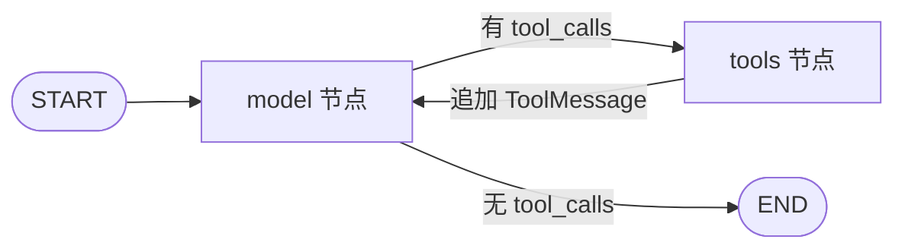
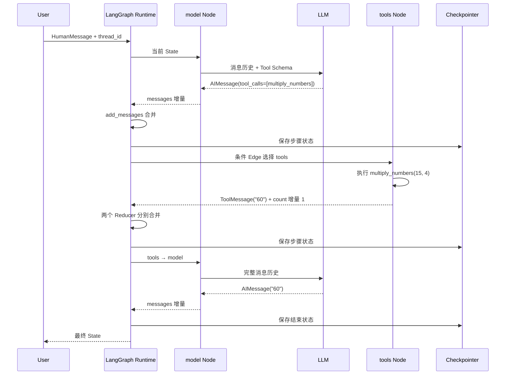
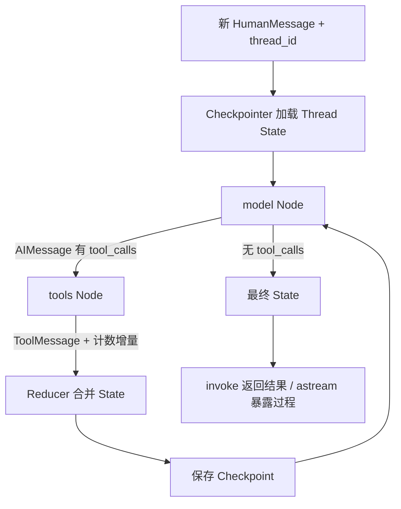

# 第 5 课：LangChain 与 LangGraph 最小 Agent

更合理的第 5 课边界是：完整讲清**一个**手写图的 `model → tools → model`、消息与计数怎样合并、同一 `thread_id` 怎样跨轮、`invoke` 与 `astream` 怎样观察它；DeerFlow 部分只呈现一小段真实 `create_agent(...)` 调用，说明它复用了这个循环。其余源码保留为后续课程或可选核验，不纳入本课阅读负担。

==本课的写作有问题。只需要阅读==：

1. 123节

2. [第 4 节 (line 1039)](D:/develop/code/deer-flow/learn/lesson-05-langchain-and-langgraph-minimal-agent.md:1039)：看主链路图和 4.2，知道本课的 Agent Loop 在 DeerFlow 中处于什么位置。4.1、4.3 的 Gateway/SSE 细节留给第 6、22 课。

   [第 6 节 (line 1201)](D:/develop/code/deer-flow/learn/lesson-05-langchain-and-langgraph-minimal-agent.md:1201)：重点看 6.1～6.3，理解 Edge 与 Reducer 分工、Node 为什么返回增量。

   [第 7.4 节 (line 1275)](D:/develop/code/deer-flow/learn/lesson-05-langchain-and-langgraph-minimal-agent.md:1275)：看手写循环、`create_agent()`、显式 `StateGraph` 各适合什么情况。这直接回答“为什么用框架”。

   [第 8.2 节 (line 1331)](D:/develop/code/deer-flow/learn/lesson-05-langchain-and-langgraph-minimal-agent.md:1331)：看模型持续调用工具时如何用执行上限终止。然后读[第 11 节总结 (line 1462)](D:/develop/code/deer-flow/learn/lesson-05-langchain-and-langgraph-minimal-agent.md:1462)。

> 核心问题：最小 Agent Loop 明明可以手写，DeerFlow 为什么还要用 LangChain 与 LangGraph 来组织模型、工具、状态、持久化和流式过程？
>
> 主线位置：Runtime 组装 Model、Tool 与状态图 → 模型产生文本或 Tool Call → Runtime 执行工具并更新状态 → Checkpointer 保存步骤状态 → `invoke` / `astream` 返回结果与过程。
>
> 前置知识：第 4 课的 `HumanMessage`、`AIMessage.tool_calls`、`ToolMessage.tool_call_id`、Tool Schema 和流式 Chunk。
>
> 本课必须掌握：Model、Tool、Agent Loop；State、Node、Edge、Reducer；Checkpointer 与 `thread_id`；`invoke` 与 `astream` 的差异。
>
> 本课暂时不讲：DeerFlow Gateway 的 Run 生命周期、SSE 协议、复杂 Middleware、Full/Delta Checkpoint、Interrupt/回滚和分布式并发。这些分别在第 6～10 课和第 21～24 课展开。
>
> 面试目标：能画出最小 Agent 状态图，解释一次工具调用怎样形成循环，并说明状态合并、跨轮记忆、流式观察和故障恢复各由谁负责。
>
> 核心阅读预计时间：50～70 分钟；可选验证另需 10～60 分钟。
>
> 版本基线：本课按仓库当前锁定的 LangChain 1.3.14、LangGraph 1.2.9 和 Python 3.12 编写；其他版本的导入路径、流事件形状或 API 可能不同。

---

## 1. 从一个具体问题开始

第 4 课已经手工完成过一次工具调用：应用把消息和 Tool Schema 发给模型，解析 `tool_calls`，执行本地函数，追加 `ToolMessage`，再调用模型得到最终答案。

现在希望把它扩展为可以连续调用多次工具的 Agent。先不要引入任何框架，最小循环可以直接写成：

```python
messages = [user_message]
tool_call_count = 0

while True:
    response = call_model(messages, tool_schemas)
    messages.append(response)

    if not response.tool_calls:
        return {
            "messages": messages,
            "tool_call_count": tool_call_count,
        }

    for tool_call in response.tool_calls:
        result = execute_allowed_tool(tool_call)
        messages.append(
            make_tool_message(
                tool_call_id=tool_call.id,
                result=result,
            )
        )
        tool_call_count += 1
```

这段代码已经能回答一个关键问题：**实现 Agent Loop 并不一定需要 LangChain 或 LangGraph。** `while` 负责循环，`if` 负责分支，Python 列表保存消息，普通函数执行工具。

如果要支持下面的两轮对话，还可以继续手写存储和事件机制：

```text
用户：计算 15 × 4。
Agent：请求 multiply_numbers(15, 4)
工具：60
Agent：结果是 60。

用户：在刚才结果上加 5。
Agent：请求 add_numbers(60, 5)
工具：65
Agent：结果是 65。
```

程序仍然要回答五个工程问题，但每一个问题都有不依赖框架的答案：

| 工程问题 | 可以怎样手写解决 | 框架不是必需品的原因 |
| --- | --- | --- |
| 文本和 Tool Call 分别走向哪里 | `if/else`、`while` 或普通状态机 | Python 控制流已经能表达分支和循环 |
| 局部结果怎样并入历史状态 | 原地修改字典，或为每个字段编写合并函数 | 合并规则可以是普通业务代码 |
| 第二轮怎样找到第一轮状态 | 以会话 ID 为 Key 写入内存、SQLite 或其他数据库 | 持久化不依赖图框架 |
| 中途失败后从哪里恢复 | 保存执行阶段、状态快照、日志和外部操作收据 | 恢复协议可以自行设计 |
| 怎样提前展示 Token 和进度 | Callback、异步生成器、事件队列或 SSE | 流式传输是通用程序能力 |

所以，这五类问题不能直接作为“必须使用 LangChain/LangGraph”的证明。真正需要判断的是：**这些机制是继续由项目自行定义和维护，还是复用一个已经规定了公共协议的框架？**

### 1.1 手写方案什么时候已经足够

如果程序只有一个模型、两个无副作用工具、一个固定循环，并且不要求跨进程恢复，那么上面的手写实现通常更直接。此时引入状态图、Reducer 和 Checkpointer 反而增加了学习与调试成本。

即使需求增加，也仍然可以继续手写。代价是项目需要自行规定并长期维护这些协议：

- 不同模型提供商怎样转换消息、Tool Schema 和流式 Chunk；
- 节点应该返回完整状态还是局部更新；
- 同一字段被多个步骤写入时怎样合并；
- 哪些步骤形成持久化边界，状态 Schema 怎样升级；
- 恢复后哪些步骤可以重放，哪些外部副作用必须去重；
- 事件怎样标识来源、顺序和所属会话；
- 怎样为循环、分支、状态合并和恢复分别编写测试。

“可以手写”与“应该全部手写”是两个不同判断。框架的价值不是让原本不可能的事情变得可能，而是提供一组现成的抽象和约定，减少每个项目都重新设计运行时协议的成本。

### 1.2 LangChain 和 LangGraph 分别减少什么工作

两者解决的不是同一个问题，也不需要总是一起使用：

| 选择 | 主要复用的能力 | 仍由应用负责 |
| --- | --- | --- |
| 只调用模型 SDK | 最接近提供商原始接口 | 消息适配、Tool 抽象、循环、状态、持久化和流式编排 |
| 使用 LangChain | Message、Chat Model、Tool、Schema、提供商适配和预构建 `create_agent()` | 业务权限、状态边界、持久化策略和任务正确性 |
| 使用 LangGraph | State、Node、Edge、Reducer、图执行、Checkpointer 接口和流模式 | 模型/工具的业务语义、安全策略和外部副作用一致性 |
| 使用 DeerFlow | 在上述基础上复用 Agent 装配、Middleware、Sandbox、授权、Run 和事件基础设施 | 具体业务目标、领域工具、部署选择和 Eval |

LangChain 的主要价值在模型与工具的接口层。例如，把不同提供商响应转换成 `AIMessage`，把 Python 函数转换成 Tool Schema。它不是回答状态怎样持久化的必要条件。

LangGraph 的主要价值在运行时层。例如，把循环与分支表示成 Edge，把字段合并规则声明为 Reducer，把状态保存接口统一为 Checkpointer。它不是调用 LLM API 的必要条件。

### 1.3 DeerFlow 为什么选择它们

DeerFlow 面对的不是上面的单文件计算器，而是一个需要动态选择模型和工具、叠加 Middleware、维护多个状态字段、保存 Thread、流式发布过程并处理中断恢复的 Agent Harness。

项目仍然可以从零实现这一切，但当前 DeerFlow 选择了明确的分工：

```text
LangChain
  └─ 统一 Model、Message、Tool，并提供通用 Agent 构造入口

LangGraph
  └─ 执行状态图，管理状态更新、循环、Checkpoint 和内部流事件

DeerFlow
  └─ 决定实际模型、Prompt、工具、Middleware、权限、Sandbox、Run 和 SSE 行为
```

因此，本课学习 LangChain 与 LangGraph 的直接原因不是“Agent 离开它们就无法实现”，而是：

1. DeerFlow 当前确实把它们作为核心依赖；
2. 读懂这些抽象后，才能区分框架自动完成了什么、DeerFlow 自己实现了什么；
3. 理解手写方案与框架方案的对应关系后，才能判断何时值得使用、何时不值得使用。

本课接下来会同时保留两种视角：先把每个框架概念还原成普通 Python 可以完成的工作，再说明 DeerFlow 为什么复用该抽象。

---

## 2. 建立最小概念模型

### 2.1 从手写实现映射到框架概念

==框架没有改变问题本身，而是给手写实现中的职责命名，并规定它们怎样组合==：

| 手写实现中的职责 | LangChain / LangGraph 概念 | 本课要验证的变化 |
| --- | --- | --- |
| `messages` 列表和提供商 JSON | LangChain Message | 得到跨提供商较统一的消息对象 |
| `call_model()` | LangChain Chat Model | 模型配置和协议适配从循环代码中分离 |
| `execute_allowed_tool()` | LangChain Tool | 工具说明、参数 Schema 与执行函数形成统一对象 |
| 共享字典 | LangGraph State | 图中的步骤通过明确 Schema 交换数据 |
| `while` 中的一段处理 | LangGraph Node | 每一步成为可以单独观察和测试的函数 |
| `if/else` 和循环跳转 | LangGraph Edge | 控制流从函数内部跳转变成图结构 |
| 手写字段合并函数 | LangGraph Reducer | 每个字段声明自己的更新语义 |
| 会话状态表和快照逻辑 | LangGraph Checkpointer 接口 | 图运行时按 `thread_id` 读写步骤状态 |
| Callback 或异步事件生成器 | `stream` / `astream` | 用统一流模式观察消息和状态变化 |

这个映射不是说框架实现必然优于手写实现，而是为后续代码提供共同词汇。下面再确认各层的职责边界。

### 2.2 分清 LangChain、LangGraph 和 DeerFlow

| 层次 | 本课关注的职责 | 不应混淆成 |
| --- | --- | --- |
| 模型提供商 | 接收消息和 Tool Schema，返回文本、Tool Call 与 Token Chunk | 工具执行器或状态数据库 |
| LangChain | 统一 Message、Chat Model、Tool 等接口；`create_agent()` 提供预构建 Agent | 独立的模型或数据库 |
| LangGraph | 执行状态图，调度 Node/Edge，调用 Reducer，流式暴露过程并接入 Checkpointer | 业务权限或结果正确性保证 |
| DeerFlow Harness | 选择模型和工具，构造 Prompt，叠加 Middleware、Sandbox、授权、预算等能力 | 对 LangGraph 的简单改名 |
| DeerFlow Gateway Runtime | 管理 Thread/Run、持久化、取消、事件桥接和 API 生命周期 | Agent 内部的单个节点 |

LangChain 1.x 的 `create_agent()` 会构建并返回一个编译后的 LangGraph 图。教学示例仍显式使用 `StateGraph`，不是因为最小 Agent 必须使用图，而是为了把 DeerFlow 所依赖的 State、Node、Edge 和 Reducer 逐一展开。DeerFlow 的真实 Lead Agent 使用 `create_agent()`，复用通用模型—工具循环，把项目代码集中在动态装配和工程约束上。

### 2.3 Model：只负责当前一步的模型决策

> ==Model = 对大模型 API 的统一封装 + 当前一步的决策器==。

输入：

```
消息历史 + 可用工具说明
messages 一般指截至当前的完整消息历史，不是只有这一条消息。
```

输出一个 `AIMessage`：

```
有 content
→ 模型直接回答

有 tool_calls
→ 模型决定“下一步调用哪个工具、传什么参数”
```

比如：

```
model = ChatOpenAI(...)
model_with_tools = model.bind_tools([multiply])
response = model_with_tools.invoke(messages)
```

如果返回：

```
AIMessage(
    tool_calls=[
        {"name": "multiply", "args": {"a": 15, "b": 4}}
    ]
)
```

意思只是：

> 模型说：“请调用 `multiply(15, 4)`。”

**工具还没执行。**

真正执行工具的是 Runtime / Tool Node。

这里的 Model 是 LangChain Chat Model 对提供商 API 的适配对象。绑定工具后，它接收消息历史并返回 `AIMessage`：

- 有最终答案时，`AIMessage.content` 包含文本；
- 需要行动时，`AIMessage.tool_calls` 包含工具名、参数和调用 ID。

“绑定工具”只是把工具描述交给模型，并让适配器解析返回值，不表示模型已经执行工具。

### 2.4 Tool：由应用实际执行的能力

> **Tool** = 把“==工具说明 + 参数规则 + 真正执行函数==”封装成一个统一对象。

它有两个作用：

```
给 Model 看：
“你有这个工具，可以这样调用”

给 Runtime 用：
“模型真要调用时，就执行这个函数”
```

调用流程是：

```
Model
→ 返回 tool_calls
→ Runtime 找到对应 Tool
→ 校验参数
→ 真正执行 Tool
→ 得到结果
→ 包装成 ToolMessage
→ 再交给 Model
```

LangChain Tool 把函数名、说明、参数 Schema 和实际执行函数组合起来。Runtime 根据模型返回的工具名找到 Tool，校验并调用它，再生成配对的 `ToolMessage`。

本课使用纯计算工具，是因为重复执行不会产生外部副作用。发邮件、下单、扣款或写文件还必须处理权限、幂等、超时与审计，不能直接套用课程 Demo。

==演示 langchain 的基本使用==

```python
from langchain_openai import ChatOpenAI
from langchain_core.tools import tool
from langchain_core.messages import HumanMessage

# 1. Tool：真正干活
@tool
def multiply(left: float, right: float) -> float:
    """计算两个数的乘积"""
    return left * right


# 2. Model：负责当前一步决策
model = ChatOpenAI(model="xxx")

# 告诉 Model：你可以选择这个工具
model_with_tools = model.bind_tools([multiply])


# 3. messages：我们维护的当前上下文
messages = [
    HumanMessage("计算 15 × 4，使用工具")
]


# 4. Agent Loop：Model → Tool → Model
while True:

    # Model 看完整上下文，决定下一步
    ai_message = model_with_tools.invoke(messages)
    messages.append(ai_message)

    # 没有 Tool Call → Model 已经给最终答案
    if not ai_message.tool_calls:
        print(ai_message.content)
        break

    # 有 Tool Call → Runtime 真正执行 Tool
    for call in ai_message.tool_calls:
        result = multiply.invoke(call["args"])

        # 实际还要包装成 ToolMessage，再加入 messages
        ...
```

 **LangChain `create_agent()` 干的事情，就是把上面这个通用 Loop 帮你封装掉**。

### 2.5 Agent Loop：模型与工具之间的受控循环

> Agent Loop = Model 和 Tool 之间不断循环，直到 Model 认为任务完成。

最小循环只有两类工作节点：



循环终止的直接条件是模型没有再返回 Tool Call。工程上还必须有递归步数、Token、时间等上限，因为“模型最终会主动停止”不是可靠不变量。

`create_agent()` 属于 LangChain；它帮你构建并返回 LangGraph 的 最简单的 Agent Loop，本质上就是 ReAct 的骨架

最简单：

```
from langchain.agents import create_agent

agent = create_agent(
    model=model,
    tools=[multiply]
)
```

然后直接调用：

```
result = agent.invoke({
    "messages": [
        HumanMessage("计算 15 × 4")
    ]
})
```

内部它帮你做了：

```
Model
  ↓
有 tool_calls？
  ├─ 有 → 执行 Tool → ToolMessage → 回到 Model
  └─ 无 → END
```

它返回的不是普通对象，而是一个**编译好的 LangGraph 图**，后面还能配 State、Checkpointer、Middleware、`astream()` 等。DeerFlow 就是这么用的。

**一次 `invoke()` 内部是有状态的**：`create_agent()` 会维护 `messages`，不断追加 `AIMessage`、`ToolMessage`，直到结束。但**跨多次 `invoke()` 是否有状态，要看有没有 Checkpointer**。

```
没有 Checkpointer：
每次 invoke 都是新的
→ 想保留历史，就要自己传完整 messages

有 Checkpointer + 同一个 thread_id：
历史会自动加载
→ 下一轮只传最新 HumanMessage 就行
```


### ==接下来都是 Langgraph 的概念==

`invoke()` 就是启动一次 Agent / Graph 执行，并等待它跑完，拿到最终结果。

State 属于一个 LangGraph Thread。一次 `invoke()` 过程中，Node 都在读写这份 State。在聊天场景里，**一个 Thread 通常就可以理解成一个会话**。但是 Thread ≠ Run。Thread 负责承载跨轮的 State；Run 只是“这一次 `invoke()` / `astream()` 执行”。

**Thread = 一段持续的会话/任务上下文**

**Run = 在这个 Thread 上发生的一次具体执行**

### 2.6 State：图执行期间的共享数据

> State = Agent 运行过程中，可以近似理解成“和一个会话绑定”的，所有节点共享的一份“当前数据”。State 属于一个 LangGraph Thread。
>
> Schema 可以理解成：
>
> > **State 的“结构定义 / 数据格式说明”。**

State 是一个有 Schema 的==共享状态==。每个 Node 读取当前 State 然后进行操作，但返回的时候，Node 不需要把整个 State 再返回一遍，只返回“这一步改了什么”。

一次运行中：
```
Model Node 读取 State
→ 返回新的 AIMessage

Tool Node 读取 State
→ 执行工具
→ 返回 ToolMessage + 调用次数
```

本课的 State 只有两个字段：

```python
class AgentState(TypedDict, total=False):
    messages: Annotated[list[AnyMessage], add_messages]
    tool_call_count: Annotated[int, operator.add]
```

- `messages` 保存用户、模型和工具消息；
- `tool_call_count` 是额外状态字段，用于累计实际处理的 Tool Call 数量。

State 不是 Prompt。==只有节点明确把状态字段放入模型输入时，模型才看得到它==。State 也不等于数据库；是否跨调用保存，要看有没有 Checkpointer。

### 2.7 Node：读取 State，执行一步，返回更新

> ==Node = LangGraph 里“执行一步”的函数、执行一个操作的节点==。

它通常做三件事：

```
读取当前 State
→ 执行这一小步逻辑
→ 返回本步产生的 State 更新
```

比如 Model Node：

```
def call_model(state):
    response = model.invoke(state["messages"])
    return {"messages": [response]}
```

它做的是：

```
读 messages
→ 调模型
→ 返回新的 AIMessage
```

Tool Node：

```
def execute_tools(state):
    ...
    return {
        "messages": [tool_message],
        "tool_call_count": 1
    }
```

它做的是：

```
读 AIMessage.tool_calls
→ 执行工具
→ 返回 ToolMessage 和计数增量
```

所以你可以把 Node 类比成：

> **工作流里的一个处理步骤 / 一个函数节点。**

Node 是同步或异步 Python Callable。本课有两个 Node：

- `call_model`：读取 `messages`，调用绑定了工具的模型，返回新的 `AIMessage`；
- `execute_tools`：读取最后一条 `AIMessage.tool_calls`，执行工具，返回 `ToolMessage` 和调用次数增量。

一个重要约束是：Node 应返回本步写入的增量（就是这一步的修改）。例如工具节点返回 `{"tool_call_count": 1}`，Reducer 才能把它累加到历史值。若它误把当前总数当增量返回，计数会重复增加。

### 2.8 Edge：决定下一步执行哪个 Node

> ==Edge = LangGraph 里“决定下一步去哪”的连接关系==。

普通 Edge 表示固定方向，例如 `tools → model`。条件 Edge 读取 State 并选择分支：

```text
最后一条 AIMessage 有 tool_calls  → tools
最后一条 AIMessage 没有 tool_calls → END
```

Edge 决定控制流，不负责保存状态；Reducer 决定数据如何合并，不负责选择下一节点。

### 2.9 Reducer：定义“旧值 + 更新”怎样得到新值

```
Node = 读取 State 产生 State 更新
Reducer = 合并更新
State = 保存合并后的结果
```

> ==Reducer = 决定“Node 返回的更新，怎么合并进旧 State”==。
>
> 一开始执行一次 Run 的时候，输入也会被视作对 State 里面字段的更新被 Reducer 处理。一次 Run 开始时，传给 `invoke()` / `astream()` 的 input 会被当成对 State 的一次更新，然后按照各字段的 Reducer 合并进去。

比如当前：

```
tool_call_count = 3
```

Node 返回：

```
{"tool_call_count": 1}
```

如果 Reducer 是：

```
operator.add
```

那新值就是：

```
3 + 1 = 4
```

消息也是一样。Node 只返回新消息：

```
{"messages": [new_message]}
```

`add_messages` 负责把它合进历史，而不是直接覆盖旧消息。

每个 State 字段都有自己的合并语义：

| 字段 | 更新 | Reducer | 合并后 |
| --- | --- | --- | --- |
| `messages` | `[AIMessage(...)]` | `add_messages` | 在保留历史的同时按消息 ID 追加、替换或删除 |
| `tool_call_count` | `2` | `operator.add` | 旧计数加 2 |
| 没声明 Reducer 的普通字段 | 新值 | 默认覆盖 | 旧值被新值替换 |

Reducer 不是装饰性类型提示，而是状态正确性的组成部分。假如 `messages` 没有 Reducer，模型节点返回的一条 `AIMessage` 就会覆盖此前的 `HumanMessage`；下一轮模型将失去问题和工具结果。

对消息字段优先使用 `add_messages`，不要简单用 `operator.add` 冒充同样语义。`add_messages` 还会处理消息 ID 对应的替换和删除，这是编辑历史、回滚与恢复所需的能力。

### 2.10 Checkpointer：按 Thread 保存图状态

>Checkpointer = 按 `thread_id` 把 Agent 的 State 保存下来。
>
>它主要解决跨轮记忆和故障后恢复的问题。跨轮记忆 = 同一个 Thread 的 State 被持久化，所以下一次 Run 能继续使用上一轮留下的消息和状态。

比如：

```
Thread: calculator-demo
State:
  messages = [...]
  tool_call_count = 2
```

Checkpointer 会在执行步骤边界把这份状态存起来。

下一次再用同一个：

```
thread_id = "calculator-demo"
```

Runtime 就能先加载之前的 State，再继续执行。

所以关系就是：
```
Thread
  ↓
Checkpointer 保存/读取
  ↓
State
```


>**Checkpointer**：一个“负责保存/读取状态”的组件，是个东西。
>
>**Checkpoint**：它保存下来的某一次状态快照，是结果。

比如：

```
checkpointer = InMemorySaver()
graph = builder.compile(checkpointer=checkpointer)
```

这里 `InMemorySaver` 就是一个具体的 Checkpointer。

它干的事情大概是：

```
Node 执行
→ Node 返回状态更新
→ Reducer 合并成新的 State
→ Checkpointer 把此时的 State 保存下来
→ 继续下一个 Node
```

所谓**“执行步骤边界”**，你现在就简单理解成：

> **一个 Node 执行完、State 更新完成之后。**

例如：

```
model Node
→ 产生 AIMessage
→ 合并进 State
→ 保存一次 Checkpoint

tools Node
→ 产生 ToolMessage
→ 合并进 State
→ 再保存一次 Checkpoint

model Node
→ 最终回答
→ 再保存当前 State
```

文档里的完整流程就是这样描述的。

至于**怎么保存**，取决于你用什么 Checkpointer：

```
InMemorySaver → 存内存
SQLiteSaver   → 存 SQLite
PostgresSaver → 存 PostgreSQL
```

并且通过 `thread_id` 区分：

```
thread A 的 State
thread B 的 State
```

所以最简单的一句话：

> **Checkpointer 是“自动给 Agent State 做阶段性存档”的组件；每跑完一个步骤，就可以留一个 Checkpoint，之后用于继续对话或恢复执行。**

Checkpointer 在图的执行步骤边界保存状态快照。图编译时接入 Checkpointer，调用时通过配置提供 `thread_id`：

```python
checkpointer = InMemorySaver()
graph = builder.compile(checkpointer=checkpointer)
config = {"configurable": {"thread_id": "calculator-demo"}}
```

`thread_id` 是状态隔离键：

- 同一 `thread_id` 的后续调用会加载并更新同一段 Thread 状态；
- 不同 `thread_id` 互相隔离；
- 没有 `thread_id`，启用 Checkpointer 的图无法确定状态属于哪个 Thread；
- 没有 Checkpointer，同一 ID 本身不会神奇地产生跨调用记忆。

`InMemorySaver` 只适合学习和测试。进程退出后数据丢失，也不能让多个进程共享状态。DeerFlow 可以根据配置使用 memory、SQLite 或 PostgreSQL 后端。

Checkpoint 简单理解
├─ 当前 State
│  ├─ messages
│  └─ tool_call_count
└─ 执行元数据
   └─ 图现在处在哪个步骤 / 接下来该怎么继续

### 2.11 `invoke` 与 `astream`：同一张图的两种观察方式

> `invoke()` 看最终结果，`astream()` 看执行过程。
>
> 它们都是一次 Run。Run 就是给一个输入给 Agent，Agent 跑一次直到结束。

一次 Run 开始时，传给 `invoke()` / `astream()` 的 input 会被当成对 State 的一次更新，然后按照各字段的 Reducer 合并进去。

**`invoke()` = 等整个 Agent 跑完，再一次性拿最终结果。**

```
result = agent.invoke(input)
```

过程可能是：

```
Model → Tool → Model → Tool → Model → END
```

你中间不看，最后直接拿最终 State。lesson-05-langchain-and-langgraph-minimal-agent.mdMD

**`astream()` = Agent 一边跑，你一边收到过程数据。**

```
async for event in agent.astream(input):
    print(event)
```

可以看到：

```
模型正在输出什么
哪个 Node 刚执行完
State 更新了什么
当前完整 State 是什么
```

文档里常见几种模式：

```
messages → 看模型消息 / Token 流
updates  → 看每个 Node 返回了什么更新
values   → 看每一步后的完整 State
custom   → 看自定义进度
```


`invoke` 等待图运行结束，返回最终 State，适合简单调用、测试断言和后台批处理。

`astream` 异步迭代运行过程。常见 `stream_mode` 包括：

| 模式 | 观察内容 | 适合回答的问题 |
| --- | --- | --- |
| `messages` | 模型产生的消息 Chunk 与元数据 | 用户能否逐 Token 看到回答？ |
| `updates` | 每个 Node 返回的状态更新 | 哪个节点修改了哪些字段？ |
| `values` | 每一步合并后的完整 State | 当前完整状态是什么？ |
| `custom` | Node 主动发出的自定义进度 | 长工具执行到了哪一步？ |

流式输出是观察通道，不是另一套业务逻辑。无论使用 `invoke` 还是 `astream`，State、Node、Edge 和 Reducer 的语义应保持一致。

---

## 3. 走通一个完整案例

### 3.1 第一轮：计算 `15 × 4`

初始输入是一个状态更新：

```text
messages += HumanMessage("计算 15 × 4，必须使用工具。")
tool_call_count += 0
```

执行过程如下：



第一轮结束后的核心状态近似为：

```text
messages:
  HumanMessage("计算 15 × 4……")
  AIMessage(tool_calls=[call_1: multiply_numbers(15, 4)])
  ToolMessage(tool_call_id=call_1, content="60")
  AIMessage(content="60")
tool_call_count: 1
```

这里没有任何一步可以省略 Tool Call 与 Tool Result 的配对。LangGraph 负责传递和合并状态，但消息协议仍遵守第 4 课的约束。

### 3.2 第二轮：在刚才结果上加 5

第二次调用只提交新的 `HumanMessage`，同时使用相同的 `thread_id`：

```python
graph.invoke(
    {"messages": [HumanMessage("在刚才结果上加 5。")]},
    config={"configurable": {"thread_id": "calculator-demo"}},
)
```

Runtime 先从 Checkpointer 载入第一轮状态，再用 `add_messages` 合并新消息。模型因此能看到工具结果 `60`，并请求 `add_numbers(60, 5)`。工具节点返回一个新的 `ToolMessage` 和计数增量 `1`，最终：

```text
tool_call_count: 1 + 1 = 2
最终回答: 65
```

如果把第二轮换成新 `thread_id`，模型只看到“在刚才结果上加 5”，不会自动知道“刚才结果”是 60。这是验证状态隔离最直接的实验。

### 3.3 最小可运行实现

[参考讲解](./Notes/lesson-05-minimal-agent.md)

下面的示例把全部机制放在一个文件中。它使用第 4 课相同的 `LLM_API_KEY`、`LLM_BASE_URL` 和 `LLM_MODEL` 环境变量；工具均为无副作用计算。

```python
from __future__ import annotations

import asyncio
import json
import operator
import os
from typing import Annotated, Literal, TypedDict

from langchain_core.messages import (
    AIMessage,
    AIMessageChunk,
    AnyMessage,
    HumanMessage,
    SystemMessage,
    ToolMessage,
)
from langchain_core.tools import BaseTool, tool
from langchain_openai import ChatOpenAI
from langgraph.checkpoint.memory import InMemorySaver
from langgraph.graph import END, START, StateGraph
from langgraph.graph.message import add_messages


class AgentState(TypedDict, total=False):
    messages: Annotated[list[AnyMessage], add_messages]
    tool_call_count: Annotated[int, operator.add]


@tool
def add_numbers(left: float, right: float) -> float:
    """计算两个数字的和。"""
    return left + right


@tool
def multiply_numbers(left: float, right: float) -> float:
    """计算两个数字的乘积。"""
    return left * right


TOOLS: list[BaseTool] = [add_numbers, multiply_numbers]
TOOLS_BY_NAME = {item.name: item for item in TOOLS}

model = ChatOpenAI(
    model=os.environ["LLM_MODEL"],
    api_key=os.environ["LLM_API_KEY"],
    base_url=os.environ.get("LLM_BASE_URL", "https://api.openai.com/v1"),
    temperature=0,
    timeout=60,
)
model_with_tools = model.bind_tools(TOOLS)


def call_model(state: AgentState) -> dict:
    response = model_with_tools.invoke(
        [
            SystemMessage(
                "你是计算助手。涉及加法或乘法时必须使用工具；"
                "工具成功后只报告结果。"
            ),
            *state.get("messages", []),
        ]
    )
    return {"messages": [response]}


def execute_tools(state: AgentState) -> dict:
    last_message = state["messages"][-1]
    if not isinstance(last_message, AIMessage):
        raise TypeError("tools 节点要求最后一条消息是 AIMessage")

    results: list[ToolMessage] = []
    for tool_call in last_message.tool_calls:
        tool_name = tool_call["name"]
        selected_tool = TOOLS_BY_NAME.get(tool_name)
        if selected_tool is None:
            result = f"错误：未授权工具 {tool_name!r}"
        else:
            try:
                result = selected_tool.invoke(tool_call["args"])
            except Exception as error:
                result = f"工具执行失败：{type(error).__name__}: {error}"

        results.append(
            ToolMessage(
                content=json.dumps(result, ensure_ascii=False),
                tool_call_id=tool_call["id"],
                name=tool_name,
            )
        )

    return {
        "messages": results,
        "tool_call_count": len(last_message.tool_calls),
    }


def route_after_model(state: AgentState) -> Literal["tools", "__end__"]:
    last_message = state["messages"][-1]
    if isinstance(last_message, AIMessage) and last_message.tool_calls:
        return "tools"
    return END


builder = StateGraph(AgentState)
builder.add_node("model", call_model)
builder.add_node("tools", execute_tools)
builder.add_edge(START, "model")
builder.add_conditional_edges(
    "model",
    route_after_model,
    {"tools": "tools", END: END},
)
builder.add_edge("tools", "model")

checkpointer = InMemorySaver()
graph = builder.compile(checkpointer=checkpointer)
config = {"configurable": {"thread_id": "calculator-demo"}}


def run_first_turn() -> None:
    final_state = graph.invoke(
        {
            "messages": [HumanMessage("计算 15 × 4，必须使用工具。")],
            "tool_call_count": 0,
        },
        config=config,
    )
    print("第一轮：", final_state["messages"][-1].content)
    print("累计工具调用：", final_state["tool_call_count"])


async def stream_second_turn() -> None:
    print("第二轮：", end="", flush=True)
    async for chunk, metadata in graph.astream(
        {"messages": [HumanMessage("在刚才结果上加 5，必须使用工具。")]},
        config=config,
        stream_mode="messages",
    ):
        # messages 模式还会流出工具调用 Chunk；这里只显示 model 节点的文本。
        if (
            isinstance(chunk, AIMessageChunk)
            and metadata.get("langgraph_node") == "model"
            and isinstance(chunk.content, str)
            and chunk.content
        ):
            print(chunk.content, end="", flush=True)

    snapshot = graph.get_state(config)
    print("\n累计工具调用：", snapshot.values["tool_call_count"])


if __name__ == "__main__":
    run_first_turn()
    asyncio.run(stream_second_turn())
```

建议把代码保存为 `learn/outputs/lesson-05-minimal-agent.py`，从 `backend/` 使用当前锁文件环境运行：

```powershell
$env:LLM_API_KEY = "你的测试密钥"
$env:LLM_BASE_URL = "https://api.openai.com/v1"
$env:LLM_MODEL = "你的账户实际可用且支持 Tool Calling 的模型名"

uv run --no-sync python ..\learn\outputs\lesson-05-minimal-agent.py
```

不要把密钥写入代码、Markdown 或提交记录。如果使用第三方 OpenAI 兼容端点，应继续遵守第 4 课的兼容性验证要求。

### temperature

`temperature` 是控制模型输出**随机性/发散程度**的参数。

简单理解：

```
temperature 低
→ 更稳定、更确定、更保守

temperature 高
→ 更随机、更多样、更发散
```

比如：

```
temperature=0
```

更适合 Agent、工具调用、结构化任务，因为希望模型行为稳定。

```
temperature=1
```

更适合创意写作、头脑风暴之类。

temperature=0 就是希望 **Model 每一步决策尽量稳定，不要乱发挥**。

`temperature=0` = 尽量确定，不等于严格确定。

### 3.4 逐行理解关键设计

`model.bind_tools(TOOLS)` 生成的是带工具描述的模型 Runnable。它仍只返回消息，不执行函数。

`call_model()` 返回 `{"messages": [response]}`，由 `add_messages` 与历史合并。如果直接返回完整历史，可能重复追加已有消息。

`execute_tools()` 用 `tool_call["id"]` 构造 `ToolMessage`，保持协议配对。未知工具不会通过字典下标直接崩溃，而会返回可被模型观察的错误结果；真实系统还必须记录安全事件并执行授权。

`route_after_model()` 只负责选择下一步。它不修改状态，也不执行 Tool。

`tool_call_count` 的更新值是“本节点处理了几次”，不是“当前总共有几次”。`operator.add` 负责得到累计值。

`graph.invoke()` 和 `graph.astream()` 使用同一个 `config`，所以第二轮能加载第一轮状态。`graph.get_state(config)` 读取的是该 Thread 最新的 `StateSnapshot`。

### 3.5 这个 Demo 刻意没有隐藏什么

LangChain 的 `create_agent(model, tools=...)` 可以替你建立通用的 model/tools 循环。本课显式写出图，是为了暴露四个容易被预构建 API 隐藏的事实：

1. 循环是条件 Edge，不是模型内部自动发生；
2. 工具由 Tool Node 执行，不由模型执行；
3. Node 返回的是状态更新，Reducer 决定合并；
4. 跨轮记忆来自 Checkpointer + `thread_id`，不是 Python 变量名或 Prompt。

理解这些之后，再阅读 `create_agent()` 组装代码会更容易。

---

## 4. 放回 DeerFlow 主链路

本课只覆盖完整请求主线中间的一段：

```text
用户输入
  → Gateway 接收请求并创建 Run               第 6、7、21 课
  → Runtime 组装 Model、Prompt、Tool、Middleware
  → LangGraph Agent Loop                     本课
       model → tools → model → ... → END
       Node 更新 State，Reducer 合并
       Checkpointer 按 thread_id 保存步骤状态
  → Event / SSE 把执行过程传给前端          第 22 课
  → Run 完成、失败、中断或恢复              第 21～24 课
  → Eval 判断任务是否真正完成               第 27、29 课
```

### 4.1 上游给图什么

在 DeerFlow 中，上游 Runtime 不只是传一句文本。它还准备：

- Thread 与 Run 标识；
- 用户身份和运行上下文；
- 模型、思考模式和 Agent 配置；
- 当前输入消息及上传文件信息；
- Checkpointer、Store 和流模式；
- 取消、回滚、事件记录等运行边界。

这些内容不都进入 Prompt。身份、存储连接和取消信号属于 Runtime 控制数据，不应作为普通自然语言交给模型决定。

### 4.2 当前组件做什么

DeerFlow 的 Lead Agent 工厂把当前配置解析成：

```text
create_chat_model(...)
get_available_tools(...) / 授权过滤
apply_prompt_template(...)
build_middlewares(...)
get_thread_state_schema(...)
             ↓
langchain.agents.create_agent(...)
             ↓
CompiledStateGraph
```

这里的 `create_agent()` 已经实现通用 Agent Loop，Middleware 则在模型调用、工具调用和状态更新周围加入 DeerFlow 的策略。生产图远比本课的两个 Node 复杂，但核心循环仍可还原为“模型决定—工具执行—状态更新—再次决定”。

### 4.3 下游怎样观察图

DeerFlow 的 Run Worker 调用 `agent.astream(...)`，根据请求选择 `values`、`messages`、`custom` 等 LangGraph 流模式，再把内部 Chunk 序列化并交给 StreamBridge。Frontend 最终看到的是 Gateway 的 SSE 事件，不是直接连接 Python 生成器。

因此要区分三层：

```text
模型流式 Chunk
  → LangGraph astream 的 messages / values / custom 数据
  → DeerFlow StreamBridge 与 SSE 事件
  → Frontend 状态与界面
```

本课只要求理解前两层的边界；SSE 事件类型和前端消费留到第 22 课。

### 4.4 谁拥有状态

- Node 产生状态更新；
- Reducer 定义字段合并语义；
- LangGraph Runtime 形成当前 State；
- Checkpointer 按 Thread 保存 Checkpoint；
- DeerFlow Runtime 管理 Checkpointer 生命周期，并把它附加到运行图；
- Gateway 的 Run 状态不等于 Agent 的 ThreadState，二者不能合并成一个对象。

最后一条将在第 7 课系统展开。本课先记住：`messages` 属于 Agent State，而“本次 Run 正在运行还是已取消”属于运行生命周期状态。

---

## 5. 对照真实代码

代码深挖的目标不是通读整个 Agent 系统，而是用少量证据回答四个问题。

### 5.1 当前仓库究竟使用哪个框架版本

阅读：

- `backend/packages/harness/pyproject.toml`
- `backend/uv.lock`

确认：

- Harness 声明 `langchain>=1.3`；
- Harness 声明 `langgraph>=1.2.9,<1.3`；
- 当前锁文件解析到 LangChain 1.3.14、LangGraph 1.2.9。

课程示例以锁文件为复现基线。只看宽松的最低版本约束，不能证明本地实际运行的是哪个版本。

### 5.2 DeerFlow 在哪里组装 Agent Loop

阅读 `backend/packages/harness/deerflow/agents/lead_agent/agent.py`：

- `make_lead_agent()`：`langgraph.json` 使用的图工厂入口；
- `assemble_lead_agent()`：返回 Graph 与 Assembly Descriptor；
- `_assemble_lead_agent()`：解析模型、工具、Prompt、Middleware 和 State Schema；
- `_assemble_lead_agent()` 内的 `create_agent(...)`：真正生成编译图的位置。

重点核对 `create_agent()` 的五类输入：

```text
model
tools
middleware
system_prompt
state_schema
```

这证明 DeerFlow 没有要求模型自己维护循环，也没有在 Gateway Router 中手写 Tool Calling 循环；循环由 LangChain 基于 LangGraph 构建，DeerFlow 负责装配和增强。

### 5.3 DeerFlow 怎样扩展 State 和 Reducer

阅读 `backend/packages/harness/deerflow/agents/thread_state.py`：

- `ThreadState` 扩展 LangChain `AgentState`；
- `merge_artifacts()` 对产物路径合并去重；
- `merge_goal()` 让未更新 Goal 的节点保留旧值；
- `merge_delegations()` 合并委派账本并阻止终态倒退；
- `merge_message_writes()` 为 Delta 模式保持 `add_messages` 语义；
- `get_thread_state_schema()` 根据 Checkpoint 模式选择 State Schema。

不要在本课记忆每个字段。需要掌握的是：**不同字段有不同不变量，所以不能统一用列表相加或最后写入覆盖。** 第 8 课会专门分析这些 Reducer。

### 5.4 Checkpointer 和流式执行在哪里接入

阅读：

- `backend/langgraph.json`
- `backend/packages/harness/deerflow/runtime/checkpointer/provider.py`
- `backend/packages/harness/deerflow/runtime/runs/worker.py`
- `backend/packages/harness/deerflow/client.py`

寻找以下证据：

1. `langgraph.json` 把 `lead_agent` 指向 `deerflow.agents:make_lead_agent`，把 Checkpointer 工厂指向异步 Provider；
2. `provider.py` 的 `_sync_checkpointer_cm()` 根据配置选择 `InMemorySaver`、`SqliteSaver` 或 `PostgresSaver`；
3. `run_agent()` 在运行前把 Checkpointer 和 Store 附加到图；
4. `run_agent()` 使用 `agent.astream(...)`，区分单模式和多模式输出；
5. `DeerFlowClient._ensure_agent()` 在嵌入式调用路径中把 Checkpointer 直接传给 `create_agent()`。

这也说明框架集成可以有不同接线方式：教学 Demo 在 `compile()` 时传入 Checkpointer；DeerFlow Server/Gateway 路径可以由运行基础设施提供并绑定它。概念不变，生命周期所有者不同。

### 5.5 用测试确认，而不是只信课程

优先阅读：

- `backend/tests/test_cached_history_saver_integration.py::_build_graph`
- `backend/tests/test_cached_history_saver_integration.py::test_sequential_run_composes_without_inner_walks`
- `backend/tests/test_checkpointer_none_fix.py`
- `backend/tests/test_client_e2e.py::TestBasicChat::test_multi_turn_stateless`
- `backend/tests/test_client_e2e.py::TestToolCallFlow::test_tool_call_produces_events`

这些测试分别提供：真实 `StateGraph.compile(checkpointer=...)`、状态历史物化、默认内存 Checkpointer、无 Checkpointer 时跨调用无记忆、Tool Call/Tool Result 流事件等证据。部分 E2E 测试需要真实模型，不应误当作默认离线测试。

---

## 6. 设计原因与不变量

### 6.1 为什么把控制流和状态合并分开

Edge 只回答“下一步去哪”，Reducer 只回答“数据怎样合并”。分开后可以独立验证：

- 路由是否会在有 Tool Call 时进入工具节点；
- 消息是否按 ID 正确合并；
- 计数是否累加；
- 改变某个字段的合并规则是否影响控制流。

如果一个巨大的 `while` 函数同时负责这些事情，错误通常只能通过最终回答间接暴露。

### 6.2 五个必须保持的不变量

1. **消息配对不变量**：每个已执行的 Tool Call 都产生带相同 `tool_call_id` 的 Tool Message。
2. **状态增量不变量**：Node 返回自己产生的更新；Reducer 才是旧值与更新的唯一合并规则。
3. **路由不变量**：只有存在待处理 Tool Call 时才进入工具节点；处理完成后必须回到模型节点。
4. **Thread 隔离不变量**：同一会话始终使用同一 `thread_id`，不同会话不得误用同一 ID。
5. **有界执行不变量**：循环必须受递归步数、Token、时间或业务完成条件限制。

破坏任何一条都会出现可观察问题：协议被拒绝、历史重复、状态丢失、跨用户串话或无限循环。

### 6.3 Reducer 必须与 Node 输出协议成对设计

下面两个设计都能工作，但不能混用：

```text
设计 A：Node 返回增量 1；Reducer 使用加法
设计 B：Node 返回新的总数；State 使用覆盖
```

如果 Node 返回新总数、Reducer 却继续相加，旧值会被重复计算。==设计 State Schema 时必须同时写清“字段含义、Node 输出含义、Reducer 合并规则”==。

### 6.4 Checkpoint 不等于业务事务

Checkpointer 保存图状态，不会自动把外部数据库写入、邮件发送和支付操作纳入同一个原子事务。它能告诉 Runtime“图走到了哪里”，却不能证明外部副作用只发生一次。

因此有副作用的 Tool 仍需要：

- 业务幂等键；
- 可查询的执行收据；
- 明确的重试策略；
- 必要时人工确认或补偿操作。

### 6.5 流事件不是状态真相的替代品

客户端可能断线、漏掉 Chunk 或重复接收事件。最终状态应以服务端 State/Checkpoint 为准，流事件主要用于低延迟展示和过程观测。DeerFlow 后续还需要事件持久化与重连逻辑，不能只把 `astream` 迭代器直接暴露给浏览器。

---

## 7. 边界、代价与替代方案

### 7.1 这套设计解决什么

- 把模型—工具循环表示为可检查的图；
- 让每个字段拥有明确的合并规则；
- 支持同一 Thread 的多轮状态；
- 暴露节点更新、完整状态与模型 Chunk；
- 为中断、恢复和历史检查提供状态基础。

### 7.2 它不解决什么

- 不保证模型选择正确工具；
- 不替代用户权限和 Tool 授权；
- 不保证 Tool Result 真实、及时或无注入；
- 不保证外部副作用 exactly-once（恰好一次）；
- 不判断最终答案是否完成用户目标；
- 不自动解决多实例并发与同一 Thread 的写冲突。

### 7.3 引入的代价

图运行时会增加概念和调试层次。状态字段一旦持久化，就涉及 Schema 演进、序列化、历史兼容和存储成本。Checkpoint 越频繁，恢复点越细，但写入和存储开销也越高。流模式越丰富，可观测性越强，但事件量、序列化和前端去重成本也越高。

### 7.4 三种替代设计

| 方案 | 适合场景 | 主要代价 |
| --- | --- | --- |
| 手写 `while` Agent Loop | 极小 Demo、控制流只有一个循环 | 状态、持久化、流式和恢复容易耦合 |
| LangChain `create_agent()` | 通用模型—工具循环，需要快速获得成熟默认行为 | 底层 Node/Edge 被抽象，复杂定制需要理解 Middleware 与 LangGraph |
| 显式 `StateGraph` | 自定义分支、审批、并行或严格状态机 | 代码更多，State 与 Reducer 设计责任更大 |

DeerFlow 选择 `create_agent()` 作为 Lead Agent 基础，再用自定义 State 和 Middleware 扩展。它不是在“LangChain 或 LangGraph”之间二选一，而是让 LangChain 的 Agent API 构建 LangGraph Runtime。

---

## 8. 失败与恢复

### 8.1 故障场景：工具执行成功，但进程在结果持久化前退出

假设工具不再是纯计算，而是“创建订单”：

```text
Checkpoint A：AIMessage 请求 create_order(idempotency_key=K)
  ↓
外部订单系统成功创建订单
  ↓
进程退出，ToolMessage 尚未进入下一个持久化步骤
```

恢复后，图只能确认 Checkpoint A 中存在待处理 Tool Call。若直接重放工具节点，可能创建第二个订单。

#### 触发条件

- 外部副作用已经提交；
- Tool Result 或下一 Checkpoint 尚未可靠保存；
- 恢复逻辑重试同一 Tool Call。

#### 用户表现

用户可能看到运行失败或长时间无响应，但外部订单其实已经创建。再次点击重试可能造成重复订单。

#### 正确恢复思路

1. 用稳定的业务幂等键 `K` 调用外部系统；
2. 恢复时先查询 `K` 对应的执行结果；
3. 已完成则重建 ToolMessage，不重复副作用；
4. 未完成且确认安全时才重试；
5. 记录 Tool Call ID、业务幂等键、外部收据和 Checkpoint/Run 关联。

#### 可以收集的证据

- Checkpoint 中最后一条 `AIMessage.tool_calls`；
- 外部系统按幂等键查询到的收据；
- 是否存在对应 `ToolMessage`；
- Run 日志和事件时间线；
- 重试前后的业务对象数量。

这个场景说明：**Checkpoint 提供恢复位置，幂等协议保证副作用安全；二者不能互相替代。**

### 8.2 模型持续调用工具怎么办

本课图会一直沿 `model → tools → model` 循环，直到模型停止或达到 LangGraph 的递归上限。调用时可以显式设置有限的 `recursion_limit`：

```python
config = {
    "configurable": {"thread_id": "calculator-demo"},
    "recursion_limit": 20,
}
```

达到上限应当被记录为异常终止，而不是伪装成成功答案。生产系统还要结合 Token Budget、重复调用检测、总时长和工具级预算；这些是 DeerFlow Middleware 的职责，不在本课实现。

### 8.3 Reducer 写错怎样恢复

若错误 Reducer 已经把重复消息写进持久化 Checkpoint，修复代码不会自动清洗旧状态。需要先判断：

- 旧 Thread 是否可以丢弃重建；
- 是否需要状态迁移；
- 是否能从可信事件或早期 Checkpoint 重建；
- 新旧 Schema 是否兼容。

因此 Reducer 应用单元测试和跨多步集成测试固定语义，而不是等用户报告“模型好像重复回答”。

---

## 9. 面试表达

### 30 秒回答

LangChain 提供统一的模型、消息和工具抽象，`create_agent()` 在当前版本中会构建一个 LangGraph Agent。LangGraph 把 Agent Loop 表示为共享 State 上的 Node 和 Edge：模型节点产生文本或 Tool Call，条件 Edge 决定结束还是进入工具节点，工具结果通过 ToolMessage 写回状态后再调用模型。Reducer 决定字段怎样合并，Checkpointer 按 `thread_id` 保存步骤状态，从而支持多轮和恢复；`invoke` 返回最终状态，`astream` 暴露执行过程。

### 3 分钟回答

第 4 课的 Tool Calling 本质上已经有一个循环，但手写脚本把控制流、状态和持久化混在一起。LangGraph 先定义 State Schema，例如消息列表和工具调用计数；Node 读取当前 State，只返回本步更新；Reducer 决定更新是覆盖、追加还是累加；Edge 决定下一步执行哪个 Node。

最小 Agent 有 `model` 与 `tools` 两个节点。`START` 进入 `model`，如果 `AIMessage.tool_calls` 非空，条件 Edge 进入 `tools`。工具节点在应用侧执行白名单工具，并为每个调用生成相同 `tool_call_id` 的 ToolMessage，然后固定回到 `model`。模型不再请求工具时走到 `END`。循环还必须有步数、Token 或时间上限。

如果图在编译或运行时接入 Checkpointer，并且每次调用携带同一个 `thread_id`，后续调用会加载此前 State，实现 Thread 级短期记忆。Checkpointer 只保存图状态，不会自动保证外部副作用恰好一次；有副作用的 Tool 仍需要业务幂等键和收据。

`invoke` 适合等待最终 State，`astream` 可以按 `messages`、`updates` 或 `values` 观察 Token、节点更新或完整状态。DeerFlow 没有手写这个基础循环，而是在 Lead Agent 工厂中把 Model、Tools、Prompt、Middleware 和 `ThreadState` 交给 LangChain `create_agent()`，再由 Run Worker 绑定 Checkpointer、调用 `astream()` 并把流转换成 SSE。

### 常见追问

#### 1. State 和 Checkpoint 有什么区别？

State 是图当前的逻辑数据；Checkpoint 是 Checkpointer 在某个步骤边界保存的 State 快照及执行元数据。State 可以只存在于一次调用内，接入 Checkpointer 后才具备跨调用恢复基础。

#### 2. Node 为什么不直接返回完整 State？

返回局部更新能把业务计算与合并语义分开，减少覆盖其他字段和重复追加历史的风险；Reducer 统一处理旧值与更新。

#### 3. Reducer 写错会发生什么？

消息可能被覆盖或重复，计数可能错误，并行写入可能冲突。错误还会进入 Checkpoint，影响后续所有轮次。

#### 4. `thread_id` 是否等于 Run ID？

不是。Thread 承载跨轮状态，一个 Thread 可以有多次 Run；Run ID 标识一次执行。第 7 课会详细区分。

#### 5. 有 Checkpointer 就能安全重试支付工具吗？

不能。它保存图状态，不与外部支付事务天然原子。支付工具仍需幂等键、状态查询和执行收据。

#### 6. 为什么使用 `astream` 后还需要 Checkpoint？

流用于实时观察，连接可能中断或丢事件；Checkpoint 保存服务端状态，支持重新读取和恢复。两者解决不同问题。

#### 7. 为什么 DeerFlow 使用 `create_agent()` 而不是手写 `StateGraph`？

通用 model/tools 循环已有成熟实现，DeerFlow 的差异主要在动态装配、Middleware、自定义 State、工具授权和运行基础设施。使用预构建 Agent 可以把维护重点放在这些工程能力上。

#### 8. 什么情况下应该显式写 `StateGraph`？

当任务有超出通用 Agent Loop 的固定分支、审批、中断、并行、专用状态转换或严格业务状态机时，显式图更容易表达和验证。

---

## 10. 可选验证

实践用于建立证据，不要求先完成才能理解正文。

### 10 分钟验证

只阅读两个位置：

1. `backend/packages/harness/deerflow/agents/lead_agent/agent.py` 中 `_assemble_lead_agent()` 的 `create_agent(...)`；
2. `backend/tests/test_cached_history_saver_integration.py` 中 `_build_graph()`。

完成下面的对照表：

| 问题 | Lead Agent | 测试中的手写图 |
| --- | --- | --- |
| 图由谁构建 | `create_agent()` | `StateGraph()` |
| State Schema | `get_thread_state_schema()` | 测试内部 `_state_schema()` |
| Checkpointer 在哪里接入 | Runtime/Client 绑定 | `compile(checkpointer=saver)` |
| 怎样运行 | `agent.astream()` | `graph.ainvoke()` |

### 30 分钟验证

把第 3 节代码保存到 `learn/outputs/lesson-05-minimal-agent.py`，完成三项实验：

1. 同一 `thread_id` 运行两轮，确认第二轮能使用第一轮结果；
2. 改成新 `thread_id`，确认“刚才结果”不再可用；
3. 把 `stream_mode="messages"` 改成 `"updates"`，打印每个 Node 的更新，确认工具节点同时更新 `messages` 与 `tool_call_count`。

记录时不要只写最终答案，至少保留：

```text
Python / LangChain / LangGraph 版本
使用的 thread_id（不得含用户隐私）
Node 顺序
每步更新的字段名
最终消息角色序列
最终 tool_call_count
新旧 thread_id 的行为差异
```

### 深入实践

仅供希望二次开发的学习者，不纳入核心阅读验收：

- 用假的 Chat Model 替代真实 API，为两个路由分支写离线测试；
- 注入未知工具、参数异常和模型循环，验证错误消息与 `recursion_limit`；
- 把 `InMemorySaver` 换成临时 SQLite Saver，重启进程后验证状态仍在；
- 比较手写图与 `create_agent()` 的可见节点、流事件和 State Schema。

不要把生产 DeerFlow 的复杂 Middleware 复制进 Demo。深入实践的目的仍是验证本课概念，而不是在 `learn/` 下重写 DeerFlow。

---

## 11. 本课总结



核心结论：

1. Agent Loop 不是模型内部魔法，而是 Runtime 用 Node 和条件 Edge 组织的循环。
2. Node 只产生更新，Reducer 定义每个 State 字段的合并不变量；两者必须成对设计。
3. Checkpointer 通过 `thread_id` 提供 Thread 级状态持久化，但不等于长期记忆，也不保证外部副作用恰好一次。
4. `invoke` 关注最终 State，`astream` 关注执行过程；流事件不能替代服务端状态真相。
5. DeerFlow 用 LangChain `create_agent()` 构建 LangGraph，再叠加自定义 State、Middleware、Checkpointer 和 Gateway Runtime。

下一课将从这张最小图向外追踪一次真实 DeerFlow 请求：Frontend 如何进入 Gateway，Run 怎样启动，Agent Graph 怎样由 Worker 执行，流式结果又怎样经过 StreamBridge 返回前端。

### 官方参考

- [LangChain Agents](https://docs.langchain.com/oss/python/langchain/agents)：`create_agent()`、Model、Tool 与自定义 State。
- [LangGraph Graph API](https://docs.langchain.com/oss/python/langgraph/graph-api)：State、Node、Edge 和 Reducer。
- [LangGraph Persistence](https://docs.langchain.com/oss/python/langgraph/persistence)：Thread、Checkpoint 与 Checkpointer。
- [LangGraph Streaming](https://docs.langchain.com/oss/python/langgraph/streaming)：`stream` / `astream` 与各流模式。

### 本课源码证据索引

| 文件或符号 | 证明什么 |
| --- | --- |
| `backend/packages/harness/pyproject.toml` | 框架依赖范围 |
| `backend/uv.lock` | 当前解析到的准确版本 |
| `backend/langgraph.json` | Lead Agent 图工厂与异步 Checkpointer 入口 |
| `deerflow.agents.lead_agent.agent.make_lead_agent` | LangGraph Server 使用的图工厂 |
| `deerflow.agents.lead_agent.agent._assemble_lead_agent` | Model、Tools、Prompt、Middleware、State Schema 的装配 |
| `deerflow.agents.thread_state.ThreadState` | DeerFlow 的 Agent State |
| `deerflow.agents.thread_state.merge_message_writes` | Delta 模式下消息更新的 Reducer 语义 |
| `deerflow.runtime.checkpointer.provider._sync_checkpointer_cm` | memory、SQLite、PostgreSQL Checkpointer 选择 |
| `deerflow.runtime.runs.worker.run_agent` | Checkpointer 绑定与 `agent.astream()` |
| `backend/tests/test_cached_history_saver_integration.py` | 真实 StateGraph 与 Checkpoint 行为证据 |
