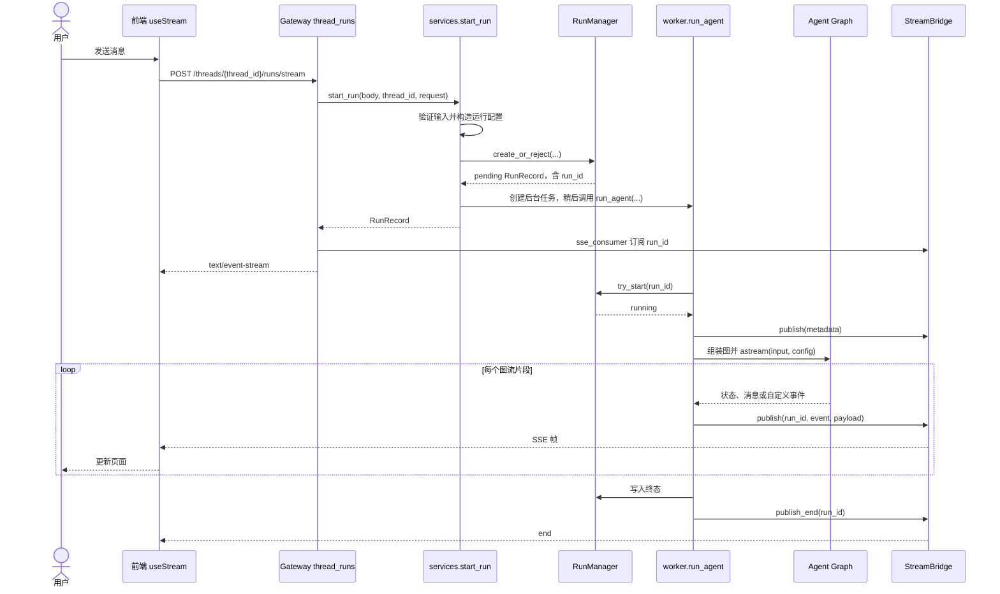
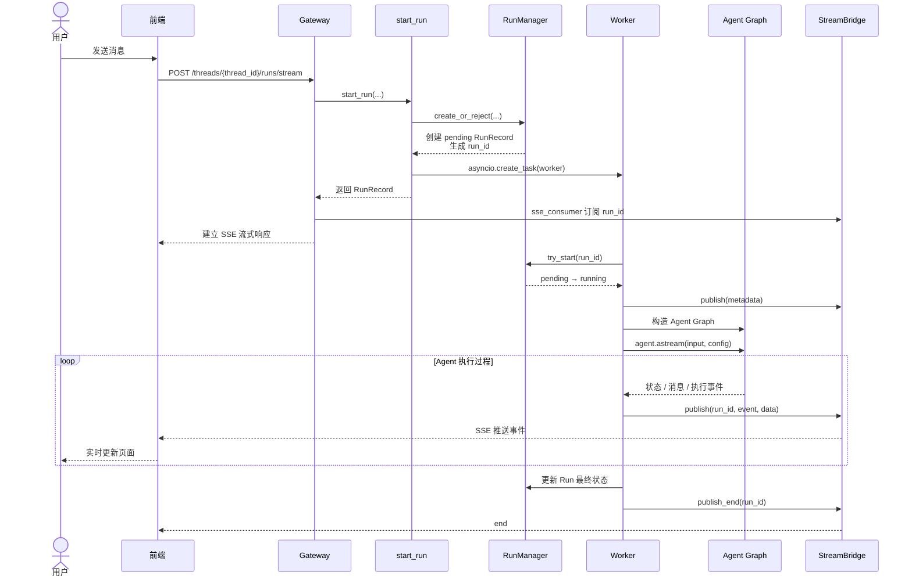

# 第 6 课：追踪一次完整请求

第 5 课解释了最小 Agent 如何在模型与工具之间循环。本课回答另一个问题：**用户在 DeerFlow 网页发送一条消息后，谁创建并执行这次 Run，过程又怎样回到页面？**

本课位于主线的“用户输入 → Gateway 创建 Run → Runtime 执行 Agent Graph → Event/SSE 回传 → Run 结束”一段。读完应能画出这条链，指出每一段的输入、输出和负责者。预计核心阅读约 35～45 分钟。

这里的 **Thread** 是会话标识，**Run** 是一次执行；**SSE**（服务器发送事件）是在一条 HTTP 响应上连续发送事件帧。第 7 课再细分 Thread、Run、Checkpoint 与 Event 的数据模型；第 9 课讲图的组装细节；第 21～24 课讲状态机、重连与并发。本课只追踪正常的一次网页流式请求，并指出当前链路上必要的失败边界。

## 1. 先看全程：一条消息经过哪里

以用户在已有会话中输入“计算 15 × 4”为例。下图是**调用关系示意**，不是逐行源码。图中的 `thread_id` 和 `run_id` 分别标识会话与本次执行，不能互换。



前端经过 Nginx 的 `/api/langgraph/*` 入口时，Nginx 将路径改写为 Gateway 原生的 `/api/*` 路由。因此，浏览器看到的请求前缀可能与 `thread_runs.py` 定义的路由前缀不同；它们进入的是同一条 Gateway 链。依据：`docker/nginx/nginx.conf` 的 `/api/langgraph/` rewrite，以及 `backend/app/gateway/routers/thread_runs.py::stream_run`。

## 2. 前端交出什么，Gateway 接住什么

> 前端通过 `thread.submit` 把当前 `thread_id` 和新增消息提交给 Gateway；
>
> Gateway 的 `/runs/stream` 不直接执行 Agent，而是先通过 `start_run` 创建一次 Run，再通过 SSE 订阅这次 Run 的执行事件，所以“创建执行”和“观察执行”在架构上是分离的。
>
> 返回给前端的是一条 **SSE 流式响应 `StreamingResponse`**，后续会持续推送这次 Run 的 `metadata`、内容事件以及最终的 `end`。

前端 `frontend/src/core/threads/hooks.ts` 使用 LangGraph SDK 的 `useStream<AgentThreadState>` 管理会话流。普通发送路径把 `buildThreadSubmitMessages(...)` 构造的 `messages` 作为图输入，调用 `thread.submit({ messages: ... }, { threadId, ... })`；选定的 `threadId` 指向已有会话，客户端还可提供配置与上下文。编辑后重新生成走另一条 `thread.submit(prepared.input, ...)` 路径，本课不展开。前端也会先显示乐观消息，所以“页面上已出现提问”本身不证明后端已接受 Run。

Gateway 的创建并流式返回入口是 `backend/app/gateway/routers/thread_runs.py::stream_run`。它要求创建 Run 的权限和已有 Thread，随后调用 `start_run(...)`。最小源码证据是：

```python
record = await start_run(body, thread_id, request, ...)
return StreamingResponse(
    sse_consumer(bridge, record, request, run_mgr, ...),
    media_type="text/event-stream",
    headers={"Content-Location": f"/api/threads/{thread_id}/runs/{record.run_id}", ...},
)
```

片段摘自 `stream_run`，省略了与本课无关的参数和检查。这里有两个不同结果：`record` 代表**已准入的一次执行**，`StreamingResponse` 代表**观察这次执行的连接**。`Content-Location` 给客户端该 Run 的资源地址。相邻的 `create_run` 路由只创建后台 Run 并立即返回记录；`/runs/stream` 同时创建并订阅。两种入口都交给同一个 `start_run`。

## 3. `start_run` 如何把 HTTP 请求交给后台任务

> HTTP 请求负责把这次执行登记成一个 Run，然后立刻把真正的 Agent 执行丢给后台 `asyncio` 任务。
> 第三节讲的是：后端先把这次 Agent 执行登记成一个 `pending Run`，生成 `run_id`，然后把真正的 `run_agent(...)` 挂成后台任务；HTTP 创建链路不等待 Agent 跑完，而是继续返回 SSE 流式响应。前端随后通过这次 Run 对应的 SSE 流持续接收执行事件，观察执行过程。

`backend/app/gateway/services.py::start_run` 是本课最关键的交接点。它先校验 `thread_id`、元数据和模型选择，检查 Thread 访问权，把传来的消息转换成 LangChain 消息，并构造含 `thread_id` 的运行配置。这里的 `normalize_input` 还会清理外部调用方不得伪造的内部消息标记。具体权限策略和配置优先级不是本课重点；当前要记住：**用户请求不能直接作为已获信任的图状态进入 Agent。**

准入后的关键顺序如下，来自 `start_run`：

```python
record = await run_mgr.create_or_reject(thread_id, body.assistant_id, ...)
if record.idempotency_reused:
    return record
worker = run_after_metadata(record)
record.task = asyncio.create_task(worker)
return record
```

中间省略了 Thread 锁、Checkpoint 准备与请求一致性检查。`create_or_reject` 由 `RunManager` 负责准入并创建 `pending` 的 `RunRecord`；已有相同幂等请求会复用原 Run，不再挂第二个 Worker。新 Run 的 `run_after_metadata` 最终 `await run_agent(...)`。`asyncio.create_task` 使 Agent 执行脱离创建请求的等待路径；路由可以开始返回 SSE，而 Worker 继续执行。`RunRecord.task` 只是本进程中的任务引用，不能拿它代替持久的 Run 记录。

这一交接存在一个重要顺序约束：源码注释明确要求**持久准入与挂载后台任务之间不能插入 `await`**。否则请求可能在“Run 已创建、Worker 尚未挂载”的间隙被取消，留下无法正常推进的执行。`RunManager` 负责准入及状态，Gateway 负责把 HTTP 请求变成受控的后台运行；二者各守一段边界。

你可以按 4 步理解。

1. `create_or_reject(...)`

先由 `RunManager` 做准入：

```
HTTP 请求
   ↓
创建一个 RunRecord
   ↓
status = pending
   ↓
生成 run_id
```

也就是说，这一步以后：

> **系统已经正式承认“有这么一次执行”。**

但此时 Agent 还没真正开始跑。

------

1. `worker = run_after_metadata(record)`

这里准备一个后台协程，后面这个协程最终会调用：

```
run_agent(...)
```

也就是：

> **真正执行 Agent 的代码已经准备好了，但还没开始调度执行。**

------

1. `asyncio.create_task(worker)`

这是最关键的一步。

它的含义可以理解成：

> **把 `worker` 注册给 asyncio 事件循环，让它在后台独立执行。**

所以当前 HTTP 请求不需要：

```
等 Agent 跑完
→ 再返回
```

而是变成：

```
创建 Run
→ 挂上后台任务
→ HTTP 这边继续往下返回
          │
          └── 后台 worker 同时继续跑
```

因此：

```
asyncio.create_task(worker)
```

就是 **HTTP 请求和 Agent 执行真正分开的那个点**。

------

1. `return record`

`start_run` 最后返回的不是 Agent 的结果，而是：

```
RunRecord
```

里面会有类似：

```
run_id
thread_id
status = pending
...
```

然后上一层 `/runs/stream` 拿到这个 `record`，就可以用这个 `run_id` 去订阅后面的 SSE 事件。

所以整条链是：

```
HTTP 请求
   ↓
start_run
   ↓
校验 / 整理输入
   ↓
RunManager.create_or_reject
   ↓
创建 pending Run + run_id
   ↓
asyncio.create_task(worker)
   ├──────────────→ 后台 run_agent(...)
   │
   ↓
return RunRecord
   ↓
HTTP 路由开始建立 SSE
```

[Python 异步相关的知识](.\Notes\lesson-06-python-asyncio)

### 为什么非得这么做？

因为 Agent 可能跑几秒、几十秒甚至更久。

如果写成：

```
result = await run_agent(...)
return result
```

那整个 HTTP 创建请求就会一直卡在那里。

DeerFlow 选择的是：

> **==“创建任务”和“执行任务”分离==。**

HTTP 请求只负责：

> “我要启动一次 Run。”

后台 Worker 负责：

> “我真正把这次 Run 执行完。”

前端再通过 SSE：

> “我持续看这次 Run 跑到哪了。”

------

还有一个这一节里很重要、但容易忽略的工程细节：

```
record = await run_mgr.create_or_reject(...)
...
record.task = asyncio.create_task(worker)
```

**这两步之间不能再插一个 `await`。**

因为如果：

```
Run 已经持久化为 pending
↓
await 某个东西
↓
请求此时被取消
```

就可能出现：

```
数据库里：
Run = pending

但是：
worker 根本没创建
```

这个 Run 就“孤儿”了——系统认为它存在，但没人执行它。

所以源码特别强调：

> **一旦 Run 成功准入，就要立刻把后台任务挂上去，中间不能再让出执行权。**

你现在这一节其实掌握三句话就够了：

> `create_or_reject` 创建并准入一个 `pending Run`；`asyncio.create_task` 把真正的 `run_agent` 放到后台执行；`start_run` 自己很快返回 `RunRecord`，让 HTTP 层可以去建立 SSE，而不用等 Agent 执行结束。

其中最核心的一句就是：

> **`asyncio.create_task` 是 HTTP 请求和后台 Agent 执行的分界点。**

前面 `start_run` 只是把任务挂到后台；那这个后台 Worker 到底什么时候才算“真正开始跑 Agent Graph”？就是接下啦的内容。

## 4. Worker 何时真正进入 Agent Graph

> [!IMPORTANT]
>
> 后台任务启动之后，==Worker 主要负责 Agent Graph 的构造和执行==。
>
> 它首先会检查这次运行是否仍然允许启动，如果可以，就把运行状态从“等待执行”切换为“正在执行”，并发布本次运行的基本信息。
>
> 之后 Worker 会通过图工厂构造出真正的 Agent Graph，再调用 LangGraph 的流式执行接口来驱动整个图运行。
>
> 在图执行过程中，模型调用、工具调用以及状态变化会不断产生执行事件，Worker 会把这些事件发布到 StreamBridge，再由 SSE 流式返回给前端，从而让前端能够==实时展示== Agent 的执行过程。

> 不是 `worker` 一启动就立刻进 Graph，而是先做启动检查，确认这个 Run 还能执行，再构造 Agent Graph，最后调用 `agent.astream(...)` 时，才真正进入 LangGraph 的执行过程。
>
> 粗略理解 worker 是“后台任务”这个执行载体，`run_agent` 是 worker 里面真正干 Agent 执行工作的核心函数:
>
> ```
> async def worker():
>     await run_agent(...)
> ```

`backend/packages/harness/deerflow/runtime/runs/worker.py::run_agent` 不是一开始就调用模型。

它先进行可取消的准备工作，并通过 `run_manager.try_start(run_id)` 把尚未取消的 `pending` Run 切换为 `running`；若启动门禁未通过，就不构造 Agent。

之后它向 StreamBridge 发布含 `run_id`、`thread_id` 的 `metadata`，安装运行上下文，调用 `agent_factory` 取得 Agent Graph，再调用 `agent.astream(...)`。

`services.py::resolve_agent_factory` 返回 `assemble_lead_agent`。它产出的图来自 `backend/packages/harness/deerflow/agents/lead_agent/agent.py`；图内的模型、工具和中间件怎样组装是第 9、10 课的内容。

本课只需要看清边界：**==Gateway 选定图工厂并准备输入，Worker 构造并驱动图，LangChain/LangGraph 执行图内循环==。**

Worker 中两段短证据说明执行与事件发布的关系：

```python
agent = _agent_graph(await run_assembly(agent_factory, **agent_factory_kwargs))
stream = agent.astream(input_payload, config=stream_config, stream_mode=single_mode)
async for chunk in stream:
    await bridge.publish(run_id, sse_event, serialize(chunk, mode=single_mode))
```

片段分别摘自 `run_agent` 和其内部 `_stream_once` 的单模式分支。多模式请求走 `_publish_stream_item`，但仍是“读取图片段 → 转成事件 → 发布到 Bridge”的关系。模型输出、工具调用及状态更新由图内机制产生；Worker 负责驱动流并交付可订阅事件。Checkpoint 与图状态的关系此处只需知道：Worker 将 Checkpointer 绑定到图，图执行期间使用对应的 `thread_id`；它并不把 SSE 当作持久状态。

### 1. Worker 先拿到这个 Run，但还没跑 Graph

前面：

```
asyncio.create_task(worker)
```

只是让后台 Worker 开始有机会被调度。

Worker 进入 `run_agent(...)` 后，首先不是：

```
agent.astream(...)
```

而是先做一些准备工作，然后：

```
run_manager.try_start(run_id)
```

它会尝试把：

```
pending
↓
running
```

如果这个 Run 已经被取消，或者不允许启动：

```
try_start 失败
↓
直接不进入 Agent Graph
```

所以：

> **`try_start` 是 Agent 真正启动前的最后一道门禁。** 

------

### 2. 启动成功后，先告诉外界：“这个 Run 开始了”

接下来 Worker 会先往 `StreamBridge` 发布一个：

```
metadata
```

里面有：

```
run_id
thread_id
```

可以粗略理解成：

> “这次 Run 已经正式启动了，下面我要开始产生执行事件。”

这也是为什么前端可以先知道：

```
我现在观察的是哪一次 Run
```

然后 Worker 才继续往下。

------

### 3. Worker 通过 `agent_factory` 构造 Agent Graph

这里有一个重要边界。

Worker 自己并不知道：

```
Graph 有哪些节点
有哪些工具
模型是什么
节点之间怎么连
```

这些不是 `run_agent` 负责的。

它会调用：

```
agent_factory
```

而这里最终对应的是：

```
assemble_lead_agent
```

得到真正可执行的 Agent Graph。

所以职责可以这样分：

```
Gateway
负责：我这次要跑哪个 Agent

Worker
负责：把这个 Agent 构造出来并驱动执行

Agent Graph
负责：具体怎么进行模型调用、工具调用、状态流转
```

这个分层挺重要。

------

### 4. 真正“进入 Graph”的关键点是 `agent.astream(...)`

最关键代码是：

```
agent = _agent_graph(await run_assembly(...))

stream = agent.astream(
    input_payload,
    config=stream_config,
    stream_mode=single_mode
)

async for chunk in stream:
    await bridge.publish(
        run_id,
        sse_event,
        serialize(chunk, ...)
    )
```

这里真正开始执行 Graph 的，是：

```
agent.astream(...)
```

你可以把它理解成：

> **“用这次请求的输入和配置，开始跑这个 LangGraph，并且把执行过程中产生的结果一个个流式吐出来。”**

比如 Graph 内部可能发生：

```
LLM 节点执行
↓
产生 tool_call
↓
Tool 节点执行
↓
更新 State
↓
再回到 LLM
↓
产生最终回答
```

这些过程中产生的：

```
状态更新
消息
自定义事件
```

都会被 `astream` 逐个返回成 `chunk`。

------

### Worker 做的事情，其实非常像“搬运工”

你可以这样理解：

```
Agent Graph
    ↓
产生 chunk
    ↓
Worker 读取 chunk
    ↓
bridge.publish(...)
    ↓
StreamBridge
    ↓
SSE
    ↓
前端
```

所以 Worker **不负责决定 Agent 下一步干什么**。

比如：

```
该不该调用工具？
调用哪个工具？
State 怎么更新？
下一个节点是谁？
```

这些是：

> **LangGraph / Agent Graph 内部机制决定的。**

Worker 只是：

> **负责启动 Graph，并不断把 Graph 产生的事件送出去。**

这点文档说得很明确：

> 模型输出、工具调用和状态更新由图内产生；Worker 负责驱动流，并把这些事件交给 StreamBridge。 

------

还有一个你之前刚学过的东西：**Checkpointer**。

这一节只要求你知道：

```
Worker
↓
给 Graph 绑定 Checkpointer
↓
Graph 执行时带着 thread_id
↓
LangGraph 可以读写这个 thread 对应的 checkpoint
```

也就是说：

> **Checkpoint 属于 Graph 执行状态的持久化机制，而 SSE 只是把执行过程给前端看。**

千万不要把：

```
SSE 事件
```

理解成：

```
Checkpoint / 持久状态
```

它们不是一回事。lesson-06-trace-a-complete-request.mdMD

------

所以这一节你真正需要掌握 3 件事：

1. **Worker 不是一启动就进 Graph。**

先：

```
pending
↓
try_start
↓
running
```

通过启动门禁才继续。

1. **真正开始执行 Agent Graph 的标志是：**

```
agent.astream(...)
```

1. **Worker 不负责 Agent 决策。**

它的职责主要是：

```
构造 Graph
→ 启动 Graph
→ 读取 Graph 流式输出
→ 发布给 StreamBridge
```

你可以把第 4 节压缩成一句面试话术：

> **后台 Worker 启动后，先通过 `try_start` 将 Run 从 `pending` 切到 `running`，然后通过 `agent_factory` 构造 Agent Graph，并调用 `agent.astream` 真正开始执行；执行过程中产生的状态、消息和事件由 Worker 读取后发布到 StreamBridge。**


## 5. StreamBridge 如何把生产者与浏览器隔开

> 它是什么
>
> **流式事件桥接器**，或者更口语一点：**事件桥梁**。
>
> 面试里我更建议你直接说：
>
> > **StreamBridge 是 Worker 和前端 SSE 之间的事件桥梁，Worker 把执行事件发布到这里，SSE 消费端再从这里订阅并推送给前端。**
>
> 之所以加 StreamBridge，是为了把 Agent 执行和 SSE 网络连接解耦。Worker 只负责发布运行事件，SSE 层负责订阅并推送给前端，这样执行逻辑不依赖浏览器连接，也更方便处理断线、重连和多订阅者。Worker 完全不需要担心：
>
> - 浏览器现在还连不连着
>
> - SSE 怎么编码
>
> - HTTP 响应怎么维护
>
> - 谁在订阅这个 Run，有多少个订阅

`backend/packages/harness/deerflow/runtime/stream_bridge/base.py::StreamBridge` 定义 `publish(run_id, event, data)`、`subscribe(run_id, ...)` 和 `publish_end(run_id)`。Worker 是生产者；`services.py::sse_consumer` 是消费者。Bridge 按 `run_id` 关联两边，使 Worker 不必持有浏览器连接，也使路由不必直接运行图。

`sse_consumer` 从 Bridge 读取条目，使用 `format_sse` 写成 `event:`、`data:`、可选 `id:` 加空行的帧。它遇到结束哨兵时发 `end`。在前端，SDK 的 `useStream` 接收这些帧并更新会话状态；`hooks.ts` 的 `onCreated` 使用返回的 `thread_id`、`run_id` 标记正在运行的会话。页面更新属于前端投影，不能据此推断 Run 已成功结束。

正常路径上，Worker 设定 Run 终态，最终调用 `bridge.publish_end(run_id)`；异常路径会把 Run 标为错误并尝试发布 `error`，最后也走结束发布。**`end` 表示这条流结束，并不单独证明任务成功。** 想判断执行结果，应看 Run 状态及其错误信息。网络断开时是否取消由创建请求的 `on_disconnect` 决定；观察者订阅的断开不会替创建者取消 Run。更完整的状态与断线恢复留到第 21～23 课。

这一节其实是在回答：

> **Worker 产生了执行事件以后，为什么不是直接发给浏览器？StreamBridge 到底在中间做了什么？**

核心链路就是：

```
Agent Graph
   ↓
Worker
   ↓ publish(run_id, event, data)
StreamBridge
   ↓ subscribe(run_id)
sse_consumer
   ↓ 格式化成 SSE
浏览器
```

文档里把两边定义得很清楚：**Worker 是生产者，`sse_consumer` 是消费者，StreamBridge 按 `run_id` 把它们关联起来。** 

### 1. Worker 只负责“生产事件”

比如 Agent Graph 执行过程中产生：

```
metadata
模型输出 chunk
工具调用信息
状态变化
error
```

Worker 不去管 HTTP，也不管浏览器，而只是：

```
await bridge.publish(run_id, event, data)
```

意思就是：

> “`run_id=123` 这次执行又产生了一个事件，帮我放出去。”

所以 Worker 甚至不用知道：

> “现在到底有没有浏览器在看？”

------

### 2. SSE Consumer 专门负责“消费事件”

另一边，Gateway 已经建立了一条 SSE 流式响应。

`sse_consumer` 会：

```
订阅 run_id=123
↓
不断从 StreamBridge 读取事件
↓
把事件格式化成 SSE 帧
↓
通过 HTTP 响应发送给浏览器
```

SSE 最终大致是这种形式：

```
event: metadata
data: ...

event: messages
data: ...

event: ...
data: ...
```

所以 `sse_consumer` 的职责是：

> **把内部事件转换成浏览器能接收的 SSE 数据。** 

------

### 3. `run_id` 很重要

因为系统可能同时有很多 Run：

```
run_001
run_002
run_003
```

StreamBridge 不能把事件串台。

所以它是按照：

```
publish(run_id, ...)
subscribe(run_id, ...)
```

来对应的。

比如：

```
Worker A → publish(run_001)
Worker B → publish(run_002)

浏览器 A → subscribe(run_001)
浏览器 B → subscribe(run_002)
```

因此 `run_id` 在这里可以理解成：

> **事件流的频道标识。**

------

### 4. `publish_end` 又是什么？

当 Worker 执行完之后，会调用：

```
bridge.publish_end(run_id)
```

告诉 Bridge：

> “这个 Run 不会再有新的事件了。”

`sse_consumer` 读到这个结束信号之后，就会向前端发送：

```
end
```

然后这条 SSE 流可以结束。lesson-06-trace-a-complete-request.mdMD

但这里有一个很重要的点：

> **`end` 只代表事件流结束，不代表 Agent 一定成功。**

因为：

```
成功执行完
→ end

执行报错
→ error
→ end
```

两种情况都有 `end`。

所以真正判断执行是否成功，要看：

```
Run 的最终状态
+
错误信息
```

而不是只看有没有 `end`。

------

### 5. 这一层设计最大的价值是什么？

就是你刚才问的“为什么要桥梁”。

没有 StreamBridge：

```
Worker
↓
直接操作浏览器 SSE 连接
```

Worker 就必须同时关心：

```
Agent 怎么执行
HTTP 连接还在不在
SSE 怎么编码
浏览器断线怎么办
```

有了 StreamBridge：

```
Worker：
我只生产事件

StreamBridge：
我负责连接生产者和消费者

sse_consumer：
我负责网络传输
```

所以职责被彻底拆开。

这也是为什么：

> **浏览器连接和 Agent Run 本身不是同一个生命周期。**

文档中特别指出：观察者的订阅连接断开，并不等价于这个 Run 被取消。

------

你这一节真正要掌握的，我觉得就 4 句话：

1. **Worker 是生产者，负责把执行事件发布到 StreamBridge。**
2. **`sse_consumer` 是消费者，负责从 StreamBridge 订阅事件并转成 SSE 发给前端。**
3. **StreamBridge 通过 `run_id` 把某次 Run 的生产者和消费者对应起来。**
4. **`end` 只表示流结束，不代表 Run 一定成功。**

面试里可以压成一句：

> **StreamBridge 位于 Worker 和 SSE 连接之间，Worker 只负责按 `run_id` 发布执行事件，SSE 消费端负责订阅并推送给前端，从而把 Agent 执行和浏览器连接解耦。**

## 6. 用三处证据防止误读

1. `backend/app/gateway/routers/thread_runs.py::stream_run` 同时出现 `start_run` 与 `sse_consumer`，证明创建与观察在同一路由汇合，但职责不同。
2. `backend/app/gateway/services.py::start_run` 中的 `create_or_reject`、`asyncio.create_task(worker)`，证明准入先于后台执行；`backend/packages/harness/deerflow/runtime/runs/manager.py::try_start` 证明 Worker 还有启动门禁。
3. `backend/packages/harness/deerflow/runtime/runs/worker.py::run_agent` 中的 `agent.astream`、`bridge.publish`、`bridge.publish_end`，结合 `services.py::sse_consumer`，证明图流片段经过 Bridge 才成为浏览器可读的 SSE。

这些关系也由当前测试分别约束：`backend/tests/test_gateway_services.py::test_start_run_uses_normalized_input_without_command` 检查传给 Worker 的普通输入经过规范化；同文件的 `test_run_agent_invalid_stream_mode_finalizes_run_before_graph_invocation` 检查图尚未执行时也要收束失败 Run；`backend/tests/test_stream_bridge.py::test_publish_end_without_history_yields_end_immediately` 检查 Bridge 的结束信号可被订阅者观察。测试只覆盖各自的断言，不等于一次真实浏览器请求的端到端证明。

## 7. 课程产出：自己画一次请求时序图

以本课图为底稿，另存 `learn/outputs/lesson-06-request-sequence.md`。图中至少标出前端提交、Gateway 路由、`start_run`、`RunManager.create_or_reject`、后台 `run_agent`、`agent.astream`、`StreamBridge.publish/subscribe`、`sse_consumer` 和 `end`。在图旁用三句话分别回答：

- 哪一步产生 `run_id`，哪一步把 Run 从 `pending` 推进到 `running`？
- 为什么 HTTP 流断开与 Agent 执行结束不是同一件事？
- 仅看到 `end`，还需要查询什么才能判断任务成功？

**可选验证**：按 `thread_runs.py` → `services.py` → `worker.py` 阅读本课列出的符号，对照源码修正自己的图。若已运行本地服务，可用浏览器 Network 面板观察一次 `/runs/stream` 的 `Content-Location` 和 `metadata`、内容事件、`end`；具体事件组合取决于请求的流模式，不要求每次都出现同一组事件。此验证用于核对时序，不是理解正文的前提。

### DeerFlow 一次完整请求时序



#### 1. 哪一步产生 `run_id`，哪一步把 Run 从 `pending` 推进到 `running`？

`run_id` 在 `RunManager.create_or_reject(...)` 创建 `RunRecord` 时产生，此时 Run 的状态为 `pending`。

后台 Worker 真正开始执行时，会调用 `RunManager.try_start(run_id)`。如果这次 Run 仍然允许启动，就把状态从 `pending` 切换为 `running`。

因此：

```
create_or_reject
→ 创建 Run
→ pending
→

Worker 启动
→ try_start
→ running
```

#### 2. 为什么 HTTP 流断开与 Agent 执行结束不是同一件事？

因为 Agent 的执行和浏览器的 SSE 连接是解耦的。

`start_run` 创建 Run 后，会通过 `asyncio.create_task(...)` 把 Worker 作为后台任务执行。Worker 不直接持有浏览器连接，而是把执行事件发布到 `StreamBridge`。

另一边，`sse_consumer` 只是 StreamBridge 的一个消费者，它负责把事件通过 SSE 推送给浏览器。

因此：

```
Worker / Agent Run
        ↓
StreamBridge
        ↓
SSE Consumer
        ↓
浏览器
```

浏览器的 SSE 连接只是“观察一次 Run 的通道”，并不是 Run 本身。

所以 SSE 连接断开，并不天然代表后台 Agent 已经执行结束；Run 是否继续执行，需要由 Run 自身的状态和取消逻辑决定。

#### 3. 仅看到 `end`，还需要查询什么才能判断任务成功？

还需要查看 **Run 的最终状态以及错误信息**。

`end` 只表示：

> 这条事件流已经结束，不会再继续发送新的事件。

但事件流既可能因为任务成功结束，也可能因为任务发生异常后结束。

例如：

```
成功：
running
→ completed
→ end
```

也可能：

```
失败：
running
→ error / failed
→ end
```

因此不能仅根据 SSE 中是否出现 `end` 判断任务成功，而应该检查对应 `run_id` 的最终 Run 状态以及错误信息。

## 总结

一次完整请求可以概括为：

```
前端提交消息
→ Gateway 接收请求
→ start_run 创建 Run
→ RunManager 生成 pending Run
→ Worker 后台启动
→ try_start 切换为 running
→ 构造并执行 Agent Graph
→ Worker 将事件发布到 StreamBridge
→ SSE Consumer 推送给前端
→ Worker 写入最终 Run 状态
→ 发布 end
```

其中最重要的设计是：

**Run 的执行与浏览器的 SSE 连接是两个不同的生命周期。**

Worker 负责执行 Agent，StreamBridge 负责传递事件，SSE 负责让前端观察执行过程。

## 面试验收

30 秒讲述应包含：前端提交消息，Gateway 校验并准入 Run，后台 Worker 启动并驱动 Agent Graph，图事件经 StreamBridge 转成 SSE 回到页面，Run 的终态与流结束分别处理。进一步追问时，能用上文三处源码证据解释“创建和观察为何分开”“为什么先准入后挂任务”“为什么 `end` 不等于成功”。

下一课沿用同一条请求，拆开 Thread、Run、Checkpoint、Event 四个对象，回答它们各自保存什么，以及为什么不能合并。
