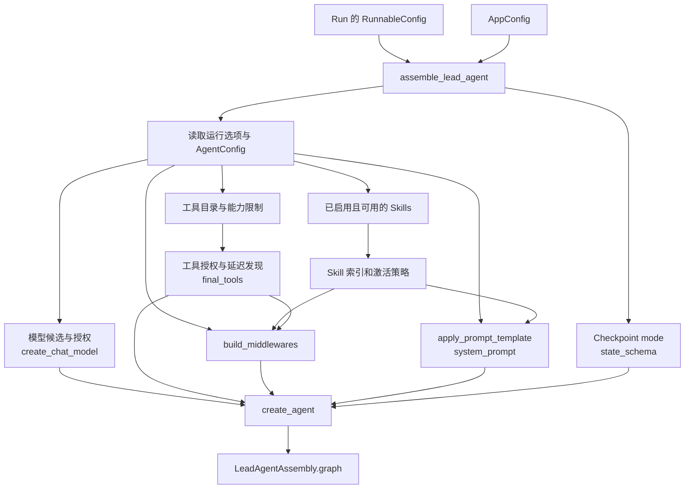

# 第 9 课：Lead Agent 的组装过程

> [!WARNING]
>
> 学习前建议先看最后的总结掌握整体的视角。

第 8 课说明了图运行时怎样合并 `ThreadState`。本课往前走一步，回答：**一次 Run 开始执行前，DeerFlow 怎样把配置和运行选项变成可执行的 Lead Agent Graph？** 本课位于“Gateway 创建 Run → Runtime 组装 Model、Prompt、Tool 和 Middleware → 图开始执行”这一段。核心阅读约 35～45 分钟。

前置知识是第 5 课的 Agent Loop、第 6 课的请求链和第 8 课的状态类型。必须掌握构造顺序、模型选择优先级、配置与实际能力的区别，以及传给 `create_agent()` 的五类输入。中间件钩子和执行顺序留到第 10 课；工具、Skill、Sub-agent 的内部机制分别留到第 11、13、16 课。

> Lead Agent 你可以先把它理解成：
>
> **DeerFlow 里负责“接住用户请求，并主导这次任务执行”的主 Agent。**

这里的 `Lead` 就是“主导、带头”的意思。它不是某种 LangGraph 官方概念，而是 DeerFlow 自己这套系统里的角色命名。

在 DeerFlow 里，一次 Run 开始前，系统会先组装这个 Lead Agent：给它选好 **模型、工具、Middleware、System Prompt、State Schema**，然后得到一个真正可执行的 Agent Graph。

你可以把它想成一个项目经理：

```
用户
 ↓
Lead Agent
 ├─ 自己调用模型思考
 ├─ 自己调用工具
 ├─ 使用 Skill
 └─ 必要时把任务委派给 Sub-agent
```

所以它和 **Sub-agent** 的区别很直观：

- **Lead Agent**：主 Agent，直接负责整次任务
- **Sub-agent**：被 Lead Agent 委派出去处理某个子任务的 Agent

文档里也能看到这个关系：Lead Agent 的组装过程中会读取 `allowed_subagents`，决定它能看到、能委派哪些 Sub-agent；而且“允许哪些 Sub-agent”和“是否真的开启委派”是两件事。

**第 9 课讲的是：一次 Agent Run 真正开始执行之前，DeerFlow 怎么把“配置”组装成一个可执行的 Lead Agent Graph。** 

它承接前面的几节课。第 5 课你学了 Agent Loop，第 6 课看了请求链，第 8 课看了 `ThreadState` 怎么定义和合并；但这些知识还缺一个关键环节：

> **Run 已经创建了，状态也知道怎么存了，那真正执行前，这个 Agent 到底是怎么“造出来”的？**

第 9 课就是回答这个问题。

主流程其实非常清楚：

```
Run 配置
   ↓
assemble_lead_agent
   ↓
解析运行配置 / AgentConfig
   ↓
选择模型
筛选 Skill
组装 Tool
生成 Middleware
生成 System Prompt
确定 State Schema
   ↓
create_agent(...)
   ↓
得到可执行 Agent Graph
```

源码中的最小调用链也是这个结构：`assemble_lead_agent()` → `_assemble_lead_agent()` → 准备模型、技能、工具、中间件、Prompt → `create_agent(...)` → `LeadAgentAssembly(graph, descriptor)`。

你学习这一课时，我建议不要陷进很多配置字段里，抓住 **3 个核心问题** 就行。

第一，**Agent 的能力是怎么确定的？**

比如这次 Run 用哪个模型、能看到哪些 Skill、能调用哪些 Tool、允许不允许委派给 Sub-agent，这些都不是模型自己决定的，而是在==构图阶段根据运行配置和 Agent 配置确定==。文档里专门讲了 `tool_groups`、`skills`、`allowed_subagents` 这些能力边界。

第二，**Agent 的运行行为是怎么装进去的？**

除了 Tool 和 Prompt，还有 Middleware。DeerFlow 会构造一个有序的 Middleware 列表，用来提供摘要、计划、记忆、Skill 激活、动态上下文、委派限制等能力。第 9 课只讲“它们怎么被装进去”，真正“它们什么时候执行、执行顺序为什么重要”留到第 10 课。

第三，也是这节最重要的最终结论：

**DeerFlow 最终向 LangChain 的 `create_agent()` 交付五样东西：**

```
Model
Tools
Middleware
System Prompt
State Schema
```

对应源码就是：

```
create_agent(
    model=...,
    tools=final_tools,
    middleware=...,
    system_prompt=system_prompt,
    state_schema=...
)
```

这五项共同决定了“这个 Agent 是谁、能做什么、运行时会经过什么逻辑、拿什么上下文工作、状态怎么保存”。

所以你可以把第 9 课抽象成一个很重要的 Agent 工程概念：

> **Agent Assembly / Agent 组装层。**
>
> 它位于“请求/Run 管理”和“Agent Runtime 执行”之间，负责把配置转换成真正可以执行的 Agent Graph。

如果画到我们之前整个 DeerFlow 主链里，大概就是：

```
用户请求
  ↓
Gateway
  ↓
创建 Run
  ↓
Worker
  ↓
【第 9 课：组装 Agent Graph】
  ↓
LangGraph / Agent Runtime 开始执行
  ↓
模型调用 / Tool 调用
  ↓
Checkpoint / Event / SSE
```

所以这节课其实很关键，因为从这里开始，你看到的不再只是 LangGraph 的概念，而是 **一个真实 Agent 系统如何把“配置化能力”变成运行时 Agent**。下一课第 10 课再继续深入这里组装出来的 Middleware 到底怎么介入执行。

#### 复习一下主流程

请求接入层 ---> Run 控制层 ---> 执行调度层 ---> 组装层、执行层

SSE 不在纵向分层里面，可以理解成横向的事件通道。agent - streambridge - sse - 前端

##### 1. 用户提交请求后，先创建一个 Run

> DeerFlow 先把一次 Agent 执行抽象成 Run，这样系统才能独立记录、管理、取消和追踪这次执行；创建时它只是 `pending`，真正执行由后面的 Worker 负责。

用户在前端发送一条消息，本质上是请求 DeerFlow **执行一次 Agent**。

但一次 Agent 执行可能持续几十秒甚至更久，中间还会调用模型、工具、Sub-agent。所以系统不能把它仅仅看成“一个普通函数调用”，而是把这次执行单独抽象成一个对象：

```
Run = 一次 Agent 执行任务
```

所以请求进入 Gateway 后，`start_run()` 会先让 `RunManager` 创建一个 `RunRecord`：

```
用户请求
   ↓
Gateway
   ↓
start_run()
   ↓
RunManager.create_or_reject()
   ↓
RunRecord
status = pending
```

为什么先创建 Run？

因为从这一刻开始，系统需要能够单独管理这次执行：

```
这次执行是谁？
→ run_id

属于哪个会话？
→ thread_id

现在进行到哪了？
→ pending / running / success / error

用户要取消哪一次执行？
→ run_id

后面 SSE 的事件属于哪一次执行？
→ run_id
```

所以 **Run 不是 Worker，也不是 Agent Graph。**

它更像一张“任务单”：

> “用户提交了一次 Agent 任务，这个任务编号是 X，目前状态是 pending。”

Run 创建成功以后，**真正干活的人还没有开始执行 Agent**。

下一步才是：

```
Run 创建完成
   ↓
给这个 Run 挂一个后台 Worker
```

这就是下一个闭环。
##### 2. Run 创建以后，启动后台 Worker

上一环停在这里：

```
RunRecord
status = pending
```

这时候只是**登记了一次任务**，还没人真正执行它。

所以 `start_run()` 接下来会做一件关键的事：

```
record.task = asyncio.create_task(worker)
```

意思是：

> **把“执行这个 Run”包装成一个后台异步任务，让它自己继续跑。**
>
> 这里如果是 Java 可以考虑用线程池，还是虚拟线程，还没有深入思考这里

于是系统里开始出现两条分开的路径：

```
HTTP 请求这条路                 后台执行这条路

创建 Run
   ↓
启动 Worker  ───────────────→  Worker 开始运行
   ↓                              ↓
可以返回 HTTP                    真正执行 Agent
```

为什么要这么拆？

因为一次 Agent 运行可能很慢：

```
调用 LLM
调用 Tool
跑 Sub-agent
等待外部服务
……
```

如果 HTTP 接口自己一直负责执行这些逻辑，那么：

> **HTTP 请求的生命周期 = Agent 执行生命周期**

两者会死死绑在一起。

DeerFlow 不这么做。

它让 Gateway 只负责：

> **“我已经成功接收并创建了这次任务。”**

真正耗时的执行交给后台 Worker。

所以这里的职责非常清楚：

```
Run
= 这次任务的记录

Worker
= 真正负责执行这次任务的人
```

然后 Worker 开始工作时，还不会直接执行 Agent。

它首先会调用：

```
try_start(run_id)
```

把 Run 从：

```
pending
   ↓
running
```

只有成功进入 `running`，后面才会继续组装和执行 Agent。

所以这个闭环最后可以记成一句话：

> **Run 创建只是“登记任务”；随后 DeerFlow 给这个 Run 挂一个后台 Worker，由 Worker 独立执行任务，因此 HTTP 请求不需要承担整个 Agent 的执行过程。**

下一个闭环就正好是：

**既然 Agent 在后台跑，那前端为什么还能实时看到它一点点输出？**

这时候才进入 **StreamBridge + SSE**。

##### 3. Worker 在后台跑，前端通过 SSE 实时看到输出

> **既然 Worker 已经和 HTTP 请求分开了，那 Worker 产生的输出怎么回到前端？**

DeerFlow 中间加了一个 **StreamBridge**。

整体关系是：

```
Worker
  ↓ publish
StreamBridge
  ↓ subscribe
SSE Consumer
  ↓
前端
```

Worker 做什么？

Worker 执行 Agent 时，会不断得到新的运行结果。

比如：

```
模型开始输出
工具调用
新的消息
状态更新
任务结束
```

Worker 不直接操作 HTTP 连接，而是统一：

```
await bridge.publish(run_id, event, data)
```

意思就是：

> “这个 `run_id` 又产生了一个新事件，放到 StreamBridge 里。”

------

HTTP 这一边做什么？

前端调用的是流式接口：

```
POST /threads/{thread_id}/runs/stream
```

Run 创建完成后，接口会返回一个：

```
StreamingResponse
```

它内部运行 `sse_consumer()`。

`sse_consumer()` 做的事情非常简单：

```
async for entry in bridge.subscribe(run_id):
    yield SSE
```

也就是：

> 一直订阅这个 Run 在 StreamBridge 里的新事件，有一个就往前端推一个。

------

所以整个闭环就是：

```
            后台执行

Worker
  ↓
产生一个 Agent 事件
  ↓
publish(run_id, event)
  ↓
StreamBridge
  ↓
subscribe(run_id)
  ↓
sse_consumer
  ↓
SSE
  ↓
前端实时显示
```

为什么不让 Worker 直接发给前端？

因为这样就会重新把：

```
Worker 生命周期
```

和：

```
HTTP / SSE 连接生命周期
```

绑在一起。

用了 StreamBridge 后，两边只需要各管自己的事情：

```
Worker
只负责：产生事件

SSE Consumer
只负责：把事件发给前端

StreamBridge
负责：把两边接起来
```

所以你现在可以记一句：

> **DeerFlow 把 Agent 执行和流式响应解耦：Worker 把运行事件发布到 StreamBridge，SSE Consumer 再订阅这些事件并推送给前端。**

这个闭环到这里就完整了。

下一个最自然的问题就是：

**Run 创建并启动 Worker 之后，Worker 真正开始执行 Agent 前，还要做什么？**
这就会接到 `try_start → running → 组装 Lead Agent`。

## 从 Run 走到构图入口

Gateway 的正常路径使用 `backend/app/gateway/services.py` 中的 Agent 工厂，选择 `assemble_lead_agent`；Worker 在 `backend/packages/harness/deerflow/runtime/runs/worker.py::run_agent` 中取得构图结果，再用 `_agent_graph` 解出图来执行。

另一路 LangGraph Server 入口由 `backend/langgraph.json` 指向 `deerflow.agents:make_lead_agent`，最终也进入 Lead Agent 工厂，但只返回图。以下只沿 Gateway 的主路径讲组装，避免把接入方式和构造步骤混为一谈。

在 `backend/packages/harness/deerflow/agents/lead_agent/agent.py` 中，最小调用关系是：

```text
assemble_lead_agent(config)
  → 取得 AppConfig，固定 Checkpoint 通道模式
  → _assemble_lead_agent(config, app_config)
      → 解析运行选项和 Custom Agent 配置
      → 选模型、技能与工具
      → build_middlewares(...)、apply_prompt_template(...)
      → create_agent(model, tools, middleware, system_prompt, state_schema)
      → LeadAgentAssembly(graph, descriptor)
```

`assemble_lead_agent()` 返回的是 `LeadAgentAssembly`；其中 `graph` 是 LangChain 编译的 Agent 图，`descriptor` 是有装配观察者时生成的说明对象，普通执行不能依赖它一定存在。`make_lead_agent()` 只是调用前者并返回 `.graph`。这解释了为什么读 `create_agent()` 一行之前，必须先看工厂准备了哪些输入。

***

这一部分其实只回答一个问题：

**一次 Run 已经创建好了之后，DeerFlow 是怎么走到“真正开始构造 Agent Graph”这一步的？**

文档这里刻意先把“接入入口”和“构图逻辑”分开。因为 ==DeerFlow 有不止一种入口，但最后都会汇合到同一个 Lead Agent 工厂==。你可以把主链路先记成：

```
Gateway 创建 Run
    ↓
Worker 开始处理 Run
    ↓
调用 assemble_lead_agent(config)
    ↓
内部调用 _assemble_lead_agent(...)
    ↓
准备模型、工具、中间件、Prompt、State Schema
    ↓
create_agent(...)
    ↓
得到可执行的 Agent Graph
```

这里最关键的是：**Run 本身不是 Agent Graph。**

==Run 更像是“这一次执行任务”的实例，里面带着本次执行需要的配置==，比如：

```
这次用哪个 model
agent_name 是什么
是否开启 thinking
是否允许 subagent
当前 user_id 是谁
其他 runtime option
```

然后 Worker 拿着这些 Run 对应的配置，去调用：

```
assemble_lead_agent(config)
```

也就是说：

> ==Run 解决的是“这一次要执行什么配置”==。

而 `assemble_lead_agent()` 解决的是：

> “==根据这些配置，这一次到底要造出一个什么样的 Agent==。”

这两个层次不要混在一起。

------

### `assemble_lead_agent()` 到底干什么？

它是 **Lead Agent 的总装入口**。

文档给出的最小调用关系是：

```
assemble_lead_agent(config)
  → 取得 AppConfig
  → 固定 Checkpoint 通道模式
  → _assemble_lead_agent(config, app_config)
      → 解析运行选项和 Custom Agent 配置
      → 选模型、技能与工具
      → 构造 Middleware 和 Prompt
      → create_agent(...)
      → LeadAgentAssembly(graph, descriptor)
```

你可以把它理解成工厂里的“总装车间”。

前面的 Run 只是给了一张订单：

> 我要一个这样的 Agent。

`assemble_lead_agent()` 才开始真正组装。

------

这里又分两层。

第一层：

```
assemble_lead_agent(...)
```

主要负责一些比较外围、稳定的准备工作，比如：

- 拿全局 `AppConfig`
- 确定 Checkpoint / State 使用哪种模式
- 然后把工作交给 `_assemble_lead_agent(...)`

第二层：

```
_assemble_lead_agent(...)
```

这个才是**真正的大头**。

它会一步步算出最终：

```
model
tools
middlewares
system_prompt
state_schema
```

然后：

```
create_agent(
    model=...,
    tools=...,
    middleware=...,
    system_prompt=...,
    state_schema=...
)
```

这才真正得到 LangChain/LangGraph 能执行的 Agent Graph。

------

### 那 Worker 拿到的是什么？

这里也有一个很容易混淆的点。

`assemble_lead_agent()` 不是单纯返回 Graph，而是返回：

```
LeadAgentAssembly
```

里面至少有：

```
graph
descriptor
```

`graph` 才是真正执行的 Agent Graph。

`descriptor` 更偏向装配过程的说明/观察信息，而且文档明确说普通执行不能依赖它一定存在。

所以 Gateway 主链可以粗略理解成：

```
Run
↓
Worker
↓
assemble_lead_agent(config)
↓
LeadAgentAssembly
↓
取出 .graph
↓
执行 Graph
```

------

还有一个 `make_lead_agent()`，你暂时不用把它想复杂。

它基本就是：

```
return assemble_lead_agent(...).graph
```

为什么有它？

因为 DeerFlow 还有另一种接入方式：LangGraph Server。文档说 `backend/langgraph.json` 会指向 `deerflow.agents:make_lead_agent`。这个入口只需要 Graph，所以就直接返回 `.graph`。

于是：

```
Gateway 路径
Run → Worker → assemble_lead_agent → LeadAgentAssembly → graph

LangGraph Server 路径
make_lead_agent → assemble_lead_agent → graph
```

**入口不同，但最终构图逻辑是同一套。**

------

你这一小节真正应该记住的，其实只有这个闭环：

> **Run 只是描述“一次执行”；Worker 真正开始执行前，会把 Run 的配置交给 `assemble_lead_agent()`。这个工厂再经过 `_assemble_lead_agent()`，把模型、工具、中间件、Prompt 和 State Schema 准备好，最后调用 `create_agent()` 构造成可执行 Graph。**

所以从架构分层上看：

```
Run 层
负责“一次执行是什么”

↓

Agent Assembly 层
负责“这一次执行需要什么 Agent”

↓

LangGraph / Agent Graph 层
负责“这个 Agent 接下来具体怎么跑”
```

这个分层非常重要。你后面看到 `_assemble_lead_agent()` 一大坨代码，就不会觉得它和 Run、Worker、LangGraph 全混在一起了。

## 第一步：解析具体的模型和预制模型配置

> [!WARNING]
>
> 第一步更准确地说，是“解析并确定这次 Run 最终采用的 Agent 配置和模型配置”，还没有真正完成 Agent 的组装。

`_get_runtime_config()` 先复制 `config.configurable`，再合入字典形式的 `config.context`；同名字段以 `context` 为准。这是工厂读取运行选项的规则，**不代表客户端可任意设置内部上下文字段**。工厂随后校验 `agent_name`，为命名 Agent 调用 `load_agent_config(agent_name, user_id=...)`。没有名称时走默认 Lead Agent；`is_bootstrap` 则走创建 Agent 所用的专用分支，本课以普通分支为主。

模型名的关键代码可压缩为以下两步（摘自 `agent.py::_assemble_lead_agent`）：

```python
requested_model_name = cfg.get("model_name") or cfg.get("model")
agent_model_name = agent_config.model if agent_config and agent_config.model else None
model_name = _resolve_model_name(requested_model_name or agent_model_name, app_config=resolved_app_config)
model_name = _authorize_model_name(model_name, context=cfg, app_config=resolved_app_config)
```

因此，**候选模型**按“本次运行指定 → Custom Agent 的 `model` → 全局模型列表第一项”决定；`model_name` 与旧键 `model` 同时存在时，前者优先。`_resolve_model_name()` 对未配置的名字记录警告并回退到全局第一项；模型列表为空则报错。之后 `_authorize_model_name()` 在启用模型授权时检查 `model:use`，被拒绝时尝试第一个获准模型。所以“请求指定了 A”不保证最终使用 A。`backend/tests/test_lead_agent_model_resolution.py::test_resolve_model_name_falls_back_to_default` 和 `::test_resolve_model_name_raises_when_no_models_configured` 固定了前两个边界。

模型名之外，`thinking_enabled` 和 `reasoning_effort` 使用 `agent.py::_resolve_runtime_option`：**请求明确给出（包括 `False`）→ Agent 默认值 → 运行默认值**。若选中的模型不支持 thinking，工厂会把它关掉。Custom Agent 的 `model_settings` 还可把 `temperature`、`max_tokens` 作为 `model_overrides` 传给 `create_chat_model()`；这不是改变模型选择优先级。对应证据是 `test_lead_agent_model_resolution.py::test_resolve_runtime_option_precedence`、`::test_make_lead_agent_applies_agent_model_settings` 与 `::test_make_lead_agent_disables_thinking_when_model_does_not_support_it`。

***

### 简述 看这里就够了

这一步的核心不是“组装 Agent”，而是：

> **把“本次 Run 的临时要求、Custom Agent 的默认配置、系统全局默认”三层信息合并，算出这次运行真正生效的 Agent 和模型参数。** 

为什么要有这一步？因为 DeerFlow 允许预先定义不同用途的 Custom Agent，同时每次 Run 又可以临时覆盖部分配置，而系统本身还有全局默认值。

比如：

```
全局 AppConfig
→ 默认模型是 GPT-5

Custom Agent
→ research-agent 默认模型是 Claude
→ 默认开启 thinking

本次 Run
→ 指定用 Gemini
→ reasoning_effort = high
```

这三层配置可能同时存在，所以在真正构图之前，DeerFlow 必须先解决：

> **这次到底听谁的？**

------

首先，它会读取本次 Run 的运行参数，整理成统一的 `cfg`。

这里的 `configurable/context → cfg` 只是兼容不同参数入口的实现细节。真正重要的是 `cfg` 里承载的是：

```
agent_name
model_name
thinking_enabled
reasoning_effort
is_plan_mode
subagent_enabled
...
```

也就是：

> **“这一次 Run 想怎么运行”。**

------

接着，它会根据：

```
agent_name
```

判断这次是跑默认 Lead Agent，还是某个预先配置好的 Custom Agent。

如果是 Custom Agent，就加载它的 `AgentConfig`。

所以到这里，系统手上已经有三类配置：

```
cfg
= 本次 Run 的临时要求

AgentConfig
= 这个 Custom Agent 预设的默认配置

AppConfig
= 整个系统的全局配置
```

这就是第一步真正的背景。

------

然后开始解析最重要的东西：**模型。**

模型选择遵循：

```
本次 Run 指定
>
Custom Agent 默认
>
全局默认模型
```

例如：

```
Run 指定 Gemini
Agent 默认 Claude
系统默认 GPT
```

优先先取：

```
Gemini
```

但这里还没结束。

DeerFlow 还会检查：

```
这个模型是否真的配置存在？
当前用户是否有权限使用？
```

所以：

> **请求指定的模型，只是候选模型；真正生效的模型还要经过有效性和权限校验。** 

------

模型确定后，还要解析：

```
thinking_enabled
reasoning_effort
temperature
max_tokens
```

这些不是在决定“用哪个模型”，而是在决定：

> **这个模型这次要以什么方式运行。**

例如：

```
thinking_enabled = true
reasoning_effort = high
```

但如果最终选中的模型根本不支持 thinking，DeerFlow 会把 thinking 关闭。

所以这里还有一个很重要的设计思想：

> **配置表达的是用户或 Agent 的期望，最终生效结果还要受真实模型能力约束。** lesson-09-lead-agent-assembly.mdMD

------

因此第一步结束以后，DeerFlow 得到的不是 Agent Graph，而是一组已经确定好的“有效运行配置”：

```
这次跑哪个 Agent
最终用哪个模型
thinking 是否开启
reasoning_effort 是多少
其他模型参数是什么
```

然后第二步才继续问：

> **这个 Agent 允许拥有哪些能力？**

所以前两步可以这样连起来：

```
第一步：
确定“这次是谁、用什么模型、模型怎么跑”

↓

第二步：
确定“这个 Agent 最多允许拥有哪些 Tool / Skill / Sub-agent”
```

如果只记一句话：

> **第一步就是把 Run 配置、Custom Agent 默认和全局配置做优先级解析与校验，得到这次 Run 最终生效的 Agent 和模型配置，为后续能力选择和构图提供确定输入。**

***

这一部分其实可以拆成 **4 个很小的闭环**。它回答的是：

> **Run 的配置进来以后，DeerFlow 怎么确定“这次到底用哪个 Agent、哪个模型、哪些运行参数”？**

文档里的核心入口还是 `_assemble_lead_agent()`。它先把本次运行时配置整理出来，再结合 Custom Agent 配置，最后确定真正要创建的模型。

这一部分的核心其实只有一句话：

> **在真正开始“组装 Agent”之前，先确定这一次 Run 到底要用哪个 Agent、哪个模型，以及这个模型要以什么运行参数工作。**

你刚才会迷失，是因为==文档一上来讲 `cfg`、`configurable/context`，这些其实只是**取参数的细节**，不是主线==。

真正主线只有三步：

```
这次跑哪个 Agent？
→ agent_name
→ 默认 Lead Agent / 某个 Custom Agent

这个 Agent 这次用哪个模型？
→ Run 指定
→ 否则 Custom Agent 默认
→ 否则全局默认
→ 再检查模型是否存在、是否有权限

这个模型这次怎么跑？
→ thinking_enabled
→ reasoning_effort
→ temperature / max_tokens 等
```

文档这一节的代码，本质上就在做这三件事。

你可以把它想成：

```
Run 请求
   ↓
“我要 research-agent，
这次用 Claude，
开 high reasoning”
   ↓
解析阶段
   ↓
得到最终确定结果：

Agent = research-agent
Model = Claude
Thinking = true
Reasoning = high
   ↓
后面才开始组装 Tool / Skill / Middleware / Prompt
```

所以这一步其实不是在“构图”，而是在做：

> **构图之前的配置解析和决策。**

最值得记的是这三层配置关系：

```
cfg
= 本次 Run 临时要求

AgentConfig
= Custom Agent 自己的默认配置

AppConfig
= 整个 DeerFlow 的全局配置
```

然后 DeerFlow 要把三层配置合成一个**最终有效配置**。

例如模型选择就是：

```
本次 Run 指定
>
Custom Agent 默认
>
全局默认
```

但选完还要经过“模型存在性”和“权限”检查，所以最终模型不一定等于请求里写的模型。

### 1. 先把本次 Run 的配置整理成一个统一的 `cfg`

> ==**这里不重要，只要知道不同方式加载的配置最后会被统一整理成一个 cfg，无关紧要的细节**==
>
> `configurable` 是 **旧式的 Run 自定义运行参数入口**，`context` 是 **LangGraph 提供的运行时上下文入口**；第一步统一成 `cfg`，就是为了**屏蔽参数来自哪个入口，后面的 Agent 组装逻辑只从一个统一配置里读取本次 Run 的模型、Agent、Plan、Sub-agent 等运行选项**。

DeerFlow 先调用 `_get_runtime_config()`。

它会读取两部分：

```
config.configurable
config.context
```

然后合并成一个统一的运行配置：

```
configurable
    +
context
    ↓
cfg
```

如果两个地方有同名字段：

```
context 优先
```

也就是大概：

```
cfg = copy(config.configurable)
cfg.update(config.context)
```

所以后面的代码不需要一直区分：

> 这个字段到底来自 `configurable` 还是 `context`？

统一读：

```
cfg.get(...)
```

就可以了。

不过文档特意提醒了一句：

> 这只是**工厂内部合并配置的规则**，不代表客户端可以随便往 `context` 填内部字段。

这个边界先知道就行。

### cfg 里面到底有什么配置？

**`configurable/context` 怎么合并不是重点，真正重要的是：最终这个 `cfg` 到底控制了这次 Agent 的哪些运行行为。**

从当前 DeerFlow 的 `_assemble_lead_agent()` 源码看，可以把 `cfg` 理解成：

> **一次 Run 的“运行参数表”。**

最核心的是下面这些字段。

| 字段                       | 作用                                               | 你现在要不要重点记 |
| -------------------------- | -------------------------------------------------- | ------------------ |
| `model_name` / `model`     | ==本次 Run 想使用哪个模型==                        | **重点**           |
| `agent_name`               | 本次运行哪个 Custom Agent；没有就是默认 Lead Agent | **重点**           |
| `thinking_enabled`         | 是否开启模型 thinking                              | 重点               |
| `reasoning_effort`         | reasoning 强度                                     | 次重点             |
| `is_plan_mode`             | 是否启用 Todo / Plan 能力                          | 重点               |
| `subagent_enabled`         | 本次 Run 是否允许 Lead Agent 委派 Sub-agent        | **重点**           |
| `max_concurrent_subagents` | 最多同时运行多少 Sub-agent                         | 次重点             |
| `max_total_subagents`      | 整个 Run 最多创建多少 Sub-agent                    | 次重点             |
| `user_id` 等身份上下文     | 用于加载用户自己的 Agent、Skill，以及做权限判断    | 知道即可           |
| `non_interactive`          | 是否非交互运行，例如不能中途 `ask_clarification`   | 知道即可           |
| `is_bootstrap`             | 是否走创建 Custom Agent 时的特殊 Bootstrap Agent   | 暂时忽略           |

> 模型思考、思考强度本质上是模型本身的能力。
>
> 可以把它理解成 **“模型在输出最终答案之前，是否先花一段额外计算做内部推理”**。
>
> 所谓“显式/扩展推理能力”，不是说模型突然多了一个 Agent 模块，而是推理模型在一次生成里，会先使用一部分额外的 **reasoning tokens / inference compute** 去分析问题，再生成给你的最终答案。
>
> 比如一道复杂题，普通生成更像：
>
> ```
> 输入 → 直接预测最终回答 → 输出
> ```
>
> 推理模式更像：
>
> ```
> 输入
>  ↓
> 内部推理计算
>  ↓
> 继续检查/修正
>  ↓
> 最终回答
> ```
>
> 这里的“内部推理”通常不会原样展示给用户；有些 API 会返回一个简化的 reasoning summary，但这和模型完整的内部推理过程不是一回事。==DeepSeek 里看到的那种一段一段“先分析、再怀疑、再修正”的文本，**可以把它看成内部推理的一种非常直观的形态**==。
>
> 例如：
>
> ```
> low
> 问题 → 少量推理 → 回答
> 
> medium
> 问题 → 更多推理、检查 → 回答
> 
> high
> 问题 → 更长的推理、尝试更多路径、更多自检 → 回答
> ```
>
> 它带来的区别通常是三个方面：
>
> - **复杂问题能力**：预算越高，数学、代码、复杂规划、多约束问题通常越有机会做好。
> - **延迟**：思考得越多，首字输出和整体响应通常越慢。
> - **成本/token**：额外推理本身也会消耗计算资源和 token，因此往往更贵。
>
> 但有个很重要的点：
>
> > `high` 并不是“模型智商提升一个档次”，而是**同一个模型获得更多 inference-time compute（推理时计算量）**。
>
> [为什么 LLM 会推理](.\Notes\lesson-09-how-llm-think.md)

文档这一节主要就在处理其中的模型、Agent 和运行选项。

你可以假想一次 Run 的 `cfg` 最终长这样：

```
cfg = {
    "user_id": "u123",

    "agent_name": "research-agent",

    "model_name": "claude-sonnet",
    "thinking_enabled": True,
    "reasoning_effort": "high",

    "is_plan_mode": True,

    "subagent_enabled": True,
    "max_concurrent_subagents": 3,
    "max_total_subagents": 10,

    "non_interactive": False,
}
```

然后 `_assemble_lead_agent()` 基本就在问：

```
这次运行哪个 Agent？
→ agent_name

用哪个模型？
→ model_name

模型怎么运行？
→ thinking_enabled
→ reasoning_effort

要不要 Plan？
→ is_plan_mode

能不能委派？
→ subagent_enabled
→ max_concurrent_subagents
→ max_total_subagents

当前是谁？
→ user_id / 身份上下文
```

然后这些配置开始影响后面的**构图**。

比如：

```
model_name
    ↓
选择 Model
    ↓
create_chat_model(...)
is_plan_mode = true
    ↓
加入 TodoMiddleware
subagent_enabled = true
    ↓
加入委派相关 Tool / Middleware / Prompt
agent_name = research-agent
    ↓
load_agent_config(...)
    ↓
得到这个 Custom Agent 自己的
model / skills / tool_groups / allowed_subagents ...
```

所以现在你可以建立一个非常重要的区分：

```
cfg
= 这一次 Run 临时想怎么运行

AgentConfig
= 这个 Custom Agent 预先保存的配置

AppConfig
= 整个 DeerFlow 服务的全局配置
```

举个例子就特别清楚：

```
AppConfig:
系统支持 GPT-5、Claude、Gemini

AgentConfig:
research-agent 默认使用 Claude
允许 research skill

cfg:
这一次 Run 指定使用 GPT-5
开启 plan mode
允许 subagent
```

然后组装阶段把这三层东西综合起来：

```
全局能力 AppConfig
        +
Agent 默认 AgentConfig
        +
本次请求 cfg
        ↓
最终 Agent Graph
```

这其实才是第 9 课的核心。

而且你后面马上会看到很多所谓的“优先级”，本质都是在解决：

> **全局默认、Agent 默认、本次 Run 临时配置同时存在时，到底听谁的？**

例如模型就是：

```
cfg 本次指定
>
AgentConfig 默认
>
AppConfig 全局默认
```

文档明确给出的模型解析也是这条链路。lesson-09-lead-agent-assembly.mdMD

所以我建议你不要记 `_get_runtime_config()`，把它当成一行胶水代码就行。

真正记住：

> **`cfg` 是本次 Run 的运行级配置，主要控制模型、thinking、plan mode、Sub-agent、Custom Agent 和用户上下文；后面的 Agent Assembly 就是把这些运行配置，再结合 AgentConfig 和 AppConfig，翻译成最终的模型、工具、中间件、Prompt 和 State Schema。**

这条主干比 `configurable/context` 重要得多。

### 2. 再判断：这是默认 Lead Agent，还是某个 Custom Agent？

然后会看：

```
agent_name
```

如果没有 `agent_name`：

```
使用默认 Lead Agent
```

如果有：

```
agent_name = "xxx"
        ↓
load_agent_config(agent_name, user_id=...)
        ↓
得到 AgentConfig
```

也就是加载这个用户定义的 Custom Agent 配置。

你可以把 Custom Agent 理解成：

> **给默认 Lead Agent 预先保存了一套配置模板。**
>
> 可以理解成预制好的 Agent，已经规定好了默认模型、可以用的 skills 和工具以及具体的一些参数配置。

比如这个 Agent 可能提前定义好了：

```
model = Claude
skills = [...]
tool_groups = [...]
model_settings = {...}
```

于是这里其实有两层配置：

```
本次 Run 临时传入的配置
+
Custom Agent 自己保存的默认配置
```

后面就要解决一个关键问题：

> **如果两边都写了 model，到底听谁的？**

这就进入第三个闭环。

------

### 3. 模型选择：Run > Custom Agent > 全局默认

这是这一节最重要的地方。

核心代码文档已经抽出来了：

```
requested_model_name = cfg.get("model_name") or cfg.get("model")

agent_model_name = (
    agent_config.model
    if agent_config and agent_config.model
    else None
)

model_name = _resolve_model_name(
    requested_model_name or agent_model_name,
    app_config=resolved_app_config
)
```

先不用看代码，直接看优先级：

```
本次 Run 指定模型
    ↓ 没有
Custom Agent 配置模型
    ↓ 没有
全局模型列表第一个
```

例如全局配置：

```
models:
1. gpt-5
2. claude-sonnet
```

Custom Agent 配了：

```
model = claude-sonnet
```

本次请求又写：

```
model_name = gpt-5
```

最终先选择：

```
gpt-5
```

因为：

```
Run > Custom Agent > Global Default
```

这是最值得记的一条。

------

这里还有一个小兼容问题：

```
cfg.get("model_name") or cfg.get("model")
```

说明 DeerFlow 同时认：

```
model_name
model
```

但如果两个都有：

```
model_name 优先
```

文档把它叫作旧键 `model` 的兼容。

------

### 4. “选中了模型”还不等于“最终一定能用这个模型”

这又是一个很重要的边界。

前面只是：

```
candidate model
```

也就是**候选模型**。

接下来还有两步：

```
_resolve_model_name(...)
↓
_authorize_model_name(...)
```

先说 `_resolve_model_name()`。

假设请求写了：

```
model_name = abc-model
```

但全局配置根本没有这个模型。

DeerFlow不会一定直接使用它，而是会：

```
记录 warning
↓
fallback 到全局模型列表第一个
```

如果全局模型列表连一个模型都没有：

```
直接报错
```

文档里还点名了测试覆盖这个边界。

所以：

```
请求模型
≠
最终模型
```

------

然后还有 `_authorize_model_name()`。

如果系统启用了模型权限控制，它会检查类似：

```
model:use
```

你是否有权限使用这个模型。

比如：

```
请求 GPT-5
↓
GPT-5 配置存在
↓
但当前用户没权限
↓
尝试选择第一个有权限的模型
```

于是完整链路应该理解成：

```
Run 指定
   ↓
Custom Agent 默认
   ↓
全局默认
   ↓
模型是否存在？
   ↓
模型是否有权限？
   ↓
最终模型
```

这比简单记一句“Run 指定哪个模型就用哪个”准确得多。

------

### 最后还有一类：不是“选哪个模型”，而是“怎么使用这个模型”

比如：

```
thinking_enabled
reasoning_effort
```

它们走的是 `_resolve_runtime_option()`。

优先级稍微不同：

```
本次请求明确指定
    ↓
Custom Agent 默认
    ↓
运行时默认
```

这里有一个非常重要的小细节：

```
thinking_enabled = False
```

这个 `False` 也算“明确指定”。

不能写成这种逻辑：

```
request_value or agent_default
```

因为 `False` 会被当成空值。

所以这里必须区分：

```
没传

和

明确传 False
```

这是运行配置里很典型的工程细节。

而且即使用户要求：

```
thinking_enabled = true
```

如果最终选择的模型本身：

```
不支持 thinking
```

DeerFlow 还是会把它关闭。

所以又一次说明：

> **配置表达的是“请求”，最终能力还要受模型本身能力约束。**

------

此外，Custom Agent 里的：

```
model_settings
```

还可以设置：

```
temperature
max_tokens
```

这些会作为：

```
model_overrides
```

传给：

```
create_chat_model()
```

但它们只是改变：

> **这个模型怎么创建、怎么生成。**

不会改变前面的：

```
Run > Custom Agent > 全局默认
```

模型选择优先级。

------

你把这一整节压成一条主线，就是其实就是解析这一次 Run 的配置。具体的细节如下，但是不要求详细掌握：

```
Run 配置进入
↓
合并 configurable + context
↓
确定是否有 Custom Agent
↓
Run 模型 > Custom Agent 模型 > 全局默认
↓
检查模型是否存在
↓
检查当前用户是否有权限
↓
解析 thinking / reasoning 等运行参数
↓
create_chat_model(...)
```

最核心的一句话可以说成：

> **DeerFlow 不会直接拿请求里的 model 就创建模型，而是先把 Run 配置和 Custom Agent 配置合并，再按照“本次请求、Agent 默认、全局默认”的优先级解析候选模型，之后还要经过模型存在性和权限校验，最后再结合 thinking、reasoning effort、temperature 等运行参数创建真正的模型实例。**

这一闭环掌握以后，下一部分“工具和 Skill 能力边界”就很好接了。

## 第二步：划定可用能力，再组装工具与技能

Custom Agent 配置见 `backend/packages/harness/deerflow/config/agents_config.py::AgentConfig`。本课只看三种能力边界：

| 配置 | 装配时的实际作用 | 不应误解为 |
| --- | --- | --- |
| `tool_groups` | 传给 `get_available_tools(groups=...)`，筛选 `config.yaml` 中声明的工具 | 对所有内置、MCP 工具的完整白名单 |
| `skills` | `None` 接受所有已启用 Skill；`[]` 不接受任何 Skill；名单只保留匹配者 | 构图时就加载并执行所有 Skill 正文 |
| `allowed_subagents` | `None` 使用可用的全部类型；`[]` 禁止委派；名单限制可见及可执行类型 | 只靠 Prompt 约束委派 |

`backend/packages/harness/deerflow/tools/tools.py::get_available_tools` 先按 `groups` 筛选配置工具，再加入符合条件的内置、MCP 等工具，并按工具名去重。因此只设置 `tool_groups`，不能推出最终 `tools` 只剩这些组。普通 Lead Agent 随后可能加入 `update_agent`（仅命名 Agent 且非受限 Webhook 渠道）、`describe_skill`、记忆和任务连续性工具；非交互运行会移除 `ask_clarification`。所有候选工具经 `apply_tool_authorization()` 过滤，再由 `assemble_deferred_tools()` 处理延迟发现的 MCP 工具，才成为 `final_tools`。`backend/tests/test_lead_agent_skills.py::test_make_lead_agent_custom_skill_allowlist_does_not_activate_tool_policy` 也证明：仅配置 Skill 名单，不会在构图时把普通工具全局过滤掉。

Skill 名单经 `agent.py::_available_skill_names`、`_load_enabled_available_skills` 得到已启用且本 Agent 可用的 Skill。`build_skill_search_setup()` 决定是否提供延迟发现用的 `describe_skill`；`apply_prompt_template()` 把技能索引或元数据放进基础提示，而不是默认嵌入每份 `SKILL.md` 全文。显式 `/skill-name` 激活与读取 Skill 文件后的工具策略，由构图时加入的 `SkillActivationMiddleware`、`SkillToolPolicyMiddleware` 在运行中处理。这里要记住：**可发现、已激活、可执行某个工具是三个不同判断**，具体激活规则留到第 13 课。

委派也有双重边界。`agent.py::_assemble_lead_agent` 令 `subagent_enabled = requested_subagent_enabled and allowed_subagents != []`；即使请求打开委派，空名单仍会关闭它。非空名单会传给提示构造，`backend/packages/harness/deerflow/tools/builtins/task_tool.py::task_tool` 执行时还按运行元数据中的 `allowed_subagents` 核对类型。`test_lead_agent_model_resolution.py::test_empty_allowed_subagents_disables_requested_delegation` 验证了空名单不能被请求开关放宽。名单并不自动开启委派：请求开关仍需打开。

***

第二步的核心不是“组装”，而是：

> **根据 AgentConfig 和本次 Run 的配置，把“系统里所有能力”裁剪成“这个 Agent 这次允许拥有的能力集合”。** 

这个设计主要解决三个问题。

第一，**系统能力很多，但不是每个 Agent 都应该全量拥有。**

DeerFlow 支持预先配置不同用途的 Custom Agent。

比如你可以定义一个 `research-agent`，希望它专门做研究任务，而不是让它继承系统里所有能力。因此 `AgentConfig` 可以提前规定：

```
research-agent
├─ tool_groups：允许哪些类别的配置工具
├─ skills：允许使用哪些 Skill
└─ allowed_subagents：允许委派给哪些 Sub-agent
```

所以这三个配置本质上都是：

> **给一个特定用途的 Agent 预先规定能力边界。**

第二步首先就是读取这些配置，确定：

> **这个 Agent 最多允许拥有哪些能力。**

所以 DeerFlow 分别用：

- `tool_groups`：限制配置型工具范围
- `skills`：限制可发现、可使用的 Skill
- `allowed_subagents`：限制可委派的 Sub-agent 类型

本质上都是在做 **能力边界控制**。

第二，**“配置允许”不等于“最终可用”。**
工具还要经过系统补充、权限过滤、延迟发现等处理，最后才得到 `final_tools`。所以这是一个逐层收敛的过程：

```
系统全部能力
↓
Agent 配置限制
↓
运行时规则补充 / 裁剪
↓
权限过滤
↓
final_tools
```

这避免把“Agent 配置”误认为最终权限边界。

> **什么是运行时补充**？
>
> 比如 `tool_groups` 限制了配置文件里的工具后，DeerFlow 还会加入一些系统自身需要的工具。
>
> 这里我之前说“系统补充”太模糊了。准确来说，是：
>
> > **工具本来就有多个来源，不只有 `tool_groups` 管理的那一类。**
>
> 源码里的 `get_available_tools()` 大致是在收集：
>
> ```
> config.yaml 中配置的工具
>         ↑ tool_groups 会筛这一部分
> 
> + DeerFlow 内置工具
> 
> + MCP 工具
> 
> + 根据条件加入的工具
>   例如：
>   - Sub-agent 工具
>   - 图片工具
>   - 上传文件工具
>   ...
> ```
>
> Lead Agent 后面还可能再加入：
>
> ```
> describe_skill
> memory 工具
> update_agent
> task continuity 工具
> ...
> ```
>
> 所以这里没有什么神秘的“运行时补充”。
>
> 就是：
>
> > **构图的时候，把不同来源的工具收集起来，形成这个 Agent 的工具全集候选。**

第三，**能力“可用”与能力“已激活”是分开的。**
尤其是 Skill：构图阶段只是确定这个 Agent 能发现哪些 Skill，不会把所有 `SKILL.md` 全部加载；真正激活 Skill、应用它的工具策略，是运行时 Middleware 做的。

工具早就在 `final_tools` 这个能力上限里，只是先隐藏 Schema，需要时再把它“提升”为当前模型可见工具。

**`final_tools` 是构图阶段确定的。**

你可以把它理解为：

> **注册进这个 Agent Graph 的工具全集 / 能力上限。**

一旦：

```
create_agent(
    tools=final_tools,
    ...
)
```

这个 Graph 所拥有的工具集合基本就已经确定了。

运行过程中并不是不断修改：

```
final_tools
```

而是在这个集合之上控制：

> **当前这一轮模型到底能看到其中哪些工具。**

这是两个完全不同的概念：

```
final_tools
= Graph 注册了哪些工具

当前模型可见 tools
= 这次模型调用实际暴露哪些 Tool Schema
```

所以第二步最值得记的设计思想是：

> Custom Agent 先通过配置定义静态的“能力上限”；构图时根据这个上限收集并注册工具，形成 `final_tools`。运行过程中不再重新组装 Agent，而是通过 Skill 激活、Deferred Tool 等机制，在这个能力上限内部动态控制当前模型可见和可使用的能力。

这才是这一部分的核心。

## 第三步：构造提示和中间件，交给 `create_agent()`

`agent.py::build_middlewares` 先取得 Lead Agent 的基础运行中间件，再按配置加入动态上下文、Skill 激活与工具策略、摘要、计划、标题、记忆、图像、委派限额等组件，最后合入扩展贡献。此处重点是**组装结果是一个有序列表**，而非每个钩子的执行细节；顺序为什么影响行为在第 10 课分析。`apply_prompt_template()` 同时使用 Agent 的 `SOUL.md`、Skill 索引、延迟工具提示和允许的 Sub-agent 信息生成 `system_prompt`。当前日期与记忆等随轮次变化的内容由 `DynamicContextMiddleware` 处理，不要求每次改写基础提示。

普通分支最后调用的是（参数名与仓库一致，模型表达式略去）：

```python
graph = create_agent(
    model=create_chat_model(...),
    tools=final_tools,
    middleware=normalize_middleware_state_schemas(middlewares, mode),
    system_prompt=system_prompt,
    state_schema=get_thread_state_schema(mode),
)
```

这五项分别决定使用哪个模型实例、可供图路由的工具、运行钩子链、基础系统提示和状态类型。`mode` 决定第 8 课讲过的 `ThreadState` 或 `DeltaThreadState`；`normalize_middleware_state_schemas()` 使中间件的状态声明与该模式匹配。`create_agent()` 是 LangChain 提供的图构造器；模型、工具目录、提示、中间件列表和状态选择是 DeerFlow 组装的。模型提供商负责实际生成模型响应。此处返回的是**可执行图**，尚不能从“图构造成功”推出一次 Run 的工具调用、任务成功或最终状态。

***

==第三步终于进入真正的“总装”阶段了==。

前两步已经把关键输入准备好了：

```
第一步
→ 最终 Agent / Model / thinking 等配置

第二步
→ final_tools / 可用 Skills / Sub-agent 边界
```

第三步做的事情是：

> **把“Agent 应该怎么运行”的剩余结构补齐，然后把所有组件一起交给 `create_agent()`，生成真正可执行的 Agent Graph。** 

这里主要补三样东西。

第一样是 **Middleware 链**。模型和 Tool 只是能力本身，但一个真正运行的 Agent 还需要很多横切逻辑，比如：什么时候压缩上下文、什么时候加载 Skill、怎么处理工具异常、怎么限制 Sub-agent、怎么记录 token、怎么生成标题等。DeerFlow 用 `build_middlewares()` 把这些运行规则组织成一个**有顺序的 Middleware 列表**。这一层的核心设计是：不要把所有运行逻辑硬塞进 Agent 主循环，而是拆成独立 Middleware，在模型调用、工具调用前后插入行为。

第二样是 **System Prompt**。`apply_prompt_template()` 会根据这个 Agent 当前已经确定的信息，生成基础提示词，比如 Agent 的 `SOUL.md`、可用 Skill 的索引、Deferred Tool 提示、允许的 Sub-agent 信息等。这里有个重要设计：**基础 Prompt 尽量保持静态**；当前日期、Memory 等每轮可能变化的内容，不直接不断重建 System Prompt，而是交给 `DynamicContextMiddleware` 动态注入。

第三样是 **State Schema**。Agent Graph 运行时必须知道 State 长什么样、哪些字段怎么合并。这里根据前面确定的 Checkpoint mode，选择：

```
ThreadState
或
DeltaThreadState
```

并通过 `normalize_middleware_state_schemas()`，让 Middleware 自己声明的状态结构和整个 Graph 的状态模式保持一致。

然后所有东西终于齐了：

```
create_agent(
    model=...,
    tools=final_tools,
    middleware=...,
    system_prompt=...,
    state_schema=...
)
```

这五项分别回答：

```
model
→ 谁负责推理

tools
→ Agent 能调用什么能力

middleware
→ Agent 运行过程中要经过哪些规则和处理

system_prompt
→ Agent 的基础行为与能力说明是什么

state_schema
→ Agent 运行状态如何组织和更新
```

这一步才是真正把前面准备好的零件拼成完整 Agent。

所以第三步最核心的设计思想可以概括为：

> **前两步负责“算清楚要什么”，第三步负责“把运行结构补齐并真正成图”：用 Middleware 承载横切运行逻辑，用 Prompt 定义基础行为，用 State Schema 定义状态模型，最后和 Model、Tools 一起交给 `create_agent()`，生成可执行的 Agent Graph。**

如果把三步连起来，就是：

```
第一步：确定配置
第二步：确定能力边界
第三步：补齐运行结构，并 create_agent 成图
```

***

### 我的一些疑问

1. DeerFlow 用 `build_middlewares()` 把这些运行规则组织成一个**有顺序的 Middleware 列表**。  能说详细一点吗？什么时候调用的这个东西？调用之后具体怎么样？（详细不等于冗长，请注意，注意核心精炼）
2. **System Prompt**  是每次都重新构造吗？为什么不写在 Agent State 里面呢？
3. 具体是怎么 create 的呢？构建出来的东西是什么样的？

### 1. `build_middlewares()` 什么时候调用？调用以后发生什么？

它是在 **第二步已经得到 `final_tools` 之后、`create_agent()` 之前**调用的。

源码主链就是：

```
final_tools 已确定
↓
build_middlewares(...)
↓
得到 middlewares: 有顺序的 Middleware 实例列表

apply_prompt_template(...)
↓
得到 system_prompt

create_agent(
    model,
    final_tools,
    middlewares,
    system_prompt,
    state_schema
)
```

所以 `build_middlewares()` 本身**不是在执行 Middleware**，而是在构图前：

> **根据本次 Run 的配置，决定这张 Agent Graph 要安装哪些 Middleware，并按顺序实例化出来。**

例如 `is_plan_mode=true` 才会装 Todo Middleware；模型支持视觉才装图片相关 Middleware；除此之外还会装 Skill 激活、摘要、动态上下文、Sub-agent 限流等。

调用完得到的本质类似：

```
middlewares = [
    DynamicContextMiddleware(...),
    SkillActivationMiddleware(...),
    SkillToolPolicyMiddleware(...),
    SummarizationMiddleware(...),
    TodoMiddleware(...),
    ...
]
```

然后这份列表被传给 `create_agent()`。

**真正到了 Graph 执行阶段，Middleware 才开始工作。**

LangChain 的 `create_agent()` 会把 Middleware 的 hook 接进 Agent Loop。例如一个 Middleware 可以声明：

```
before_agent

before_model
wrap_model_call
after_model

wrap_tool_call

after_agent
```

于是以后真正执行 Graph 时：

```
一次 Run 开始
↓
Middleware 的 before_agent

↓
准备调用 LLM
Middleware 的 before_model / wrap_model_call
↓
Model

↓
Model 返回
Middleware 的 after_model

↓ 如果产生 tool_call
Middleware 的 wrap_tool_call
↓
Tool

↓
重新回到 Model

...

↓ Agent 结束
after_agent
```

也就是说：

> **`build_middlewares()` 是“安装拦截器”，`create_agent()` 把这些拦截器真正编进 Agent Loop，Graph 运行时它们才介入模型调用和工具调用。**

这也是为什么 Middleware 的**顺序很重要**。LangChain 本身就把 Middleware 定义为对 Agent 主循环各阶段进行拦截和修改的机制。[LangChain 参考文档](https://reference.langchain.com/python/langchain/agents/middleware/types/AgentMiddleware?utm_source=chatgpt.com)

这部分文档目前只要求你理解“它是一个有序列表”，具体 hook 顺序第 10 课才展开。

------

### 2. System Prompt 是每次都重新构造吗？为什么不放 State？

这里要区分两个“每次”。

**每次重新构造 Agent Graph 时，会执行一次 `apply_prompt_template()`，生成这张 Graph 的基础 `system_prompt`。**

也就是：

```
assemble_lead_agent()
↓
apply_prompt_template(...)
↓
system_prompt
↓
create_agent(system_prompt=...)
```

但 **Graph 内部每执行一次 Model → Tool → Model 循环，并不会重新跑一次 `apply_prompt_template()`。**

所以它更像：

```
Agent 构建时确定的基础 Prompt
```

而不是：

```
Agent State 中不断变化的数据
```

为什么不放 State？

因为两者职责不同：

```
System Prompt
= “这个 Agent 是什么、应该怎么行为”
= Agent 的定义 / 运行规则

State
= “这个 Agent 当前运行到哪、已经发生了什么”
= messages / todos / artifacts / summary ...
```

例如：

```
“你是一个 research agent”
“有哪些 Skill 可以发现”
“允许哪些 Sub-agent”
“Deferred Tool 怎么使用”
```

这些属于 Agent **结构定义**，没必要随着每个节点不断 checkpoint。

相反：

```
用户说了什么
模型回答了什么
工具返回了什么
todos 变成什么
```

这些才属于 State。

而 DeerFlow 还进一步做了一个很重要的优化：

> **尽量让基础 System Prompt 保持静态。**

例如“今天是 2026-09-18”“这个用户的 Memory 是什么”显然会变化。DeerFlow 没把这些直接塞进基础 Prompt 每次重建，而是让 `DynamicContextMiddleware` 在运行时注入 `<system-reminder>`。

原因之一就是源码明确写的：**让 System Prompt 尽量静态，以提高 LLM prefix cache 的复用率。**

所以：

```
相对静态内容
→ system_prompt
→ 构图时生成

动态内容
→ Middleware
→ 运行时注入

运行过程数据
→ State
→ 随节点更新、Checkpoint
```

这三个层次最好分开理解。文档也明确强调了这个设计。

------

### 3. `create_agent()` 具体怎么 create？最后得到什么？

DeerFlow 最后实际调用：

```
graph = create_agent(
    model=create_chat_model(...),
    tools=final_tools,
    middleware=normalize_middleware_state_schemas(...),
    system_prompt=system_prompt,
    state_schema=get_thread_state_schema(mode),
)
```

这五项可以理解成给 LangChain 的五种“零件”：

```
Model
→ 大脑

Tools
→ 可以采取哪些动作

Middleware
→ Agent Loop 各阶段插入哪些运行规则

System Prompt
→ 基础行为定义

State Schema
→ 整个循环共享和更新什么状态
```

然后 **LangChain `create_agent()` 帮你生成一个已经编译好的 LangGraph StateGraph**。当前官方 API 的返回类型就是 `CompiledStateGraph`。[LangChain 参考文档](https://reference.langchain.com/python/langchain/agents/factory/create_agent?utm_source=chatgpt.com)

你不要把它想成生成了一个普通：

```
Agent(...)
```

对象。

更贴近真实情况的是，它帮你造出了这样一张可执行状态图：

```
              ┌───────────────┐
              │     Model     │
              └───────┬───────┘
                      │
             AIMessage 有 tool_call？
                 /          \
               有            没有
               ↓              ↓
          ┌─────────┐        END
          │  Tools  │
          └────┬────┘
               │
               └────────→ Model
```

这是最基础的 Agent Loop。LangChain 官方对 `create_agent()` 的定义也是：**构造一张让模型和工具循环执行，直到满足停止条件的 Agent Graph**。模型节点产生 `tool_calls` 时进入 Tool 节点，工具结果作为 `ToolMessage` 写回消息，再回到模型节点；没有 Tool Call 时结束。[LangChain 参考文档](https://reference.langchain.com/python/langchain/agents/factory/create_agent?utm_source=chatgpt.com)

DeerFlow 在这个基础图上又加入了：

```
State Schema
Middleware hooks
System Prompt
Tool 集合
```

所以实际更像：

```
                    ThreadState
                        │
                        ▼
               Middleware hooks
                        │
                        ▼
                ┌─────────────┐
                │    Model    │
                └──────┬──────┘
                       │
              是否调用 Tool？
                 /          \
                是           否
                ↓             ↓
        Middleware hooks     END
                ↓
             Tools
                ↓
        Middleware hooks
                │
                └──────────→ Model
```

注意这张图是**帮助理解的抽象图**，不是我在声称 DeerFlow 最终 Graph 只有这些物理节点；Middleware 具体怎样被 LangChain 编进图，由 `create_agent()` 实现。

所以整个第三步最核心的闭环其实是：

> **DeerFlow 自己不手写 Model → Tool → Model 的 Agent Loop。它负责准备 Model、Tools、Middleware、Prompt、State Schema，然后交给 LangChain `create_agent()`；LangChain 根据这些零件生成一个可执行的 `CompiledStateGraph`。Worker 后面执行的，就是这张 Graph。** lesson-09-lead-agent-assembly.mdMD

这也是第 5 课讲 LangChain/LangGraph 的意义真正落地的地方：**DeerFlow 负责“配置和工程能力”，LangChain/LangGraph 负责把这些东西变成可执行 Agent Loop。**

## 从配置到 Agent Graph 的构造图

下面的图是本课产出的底稿。箭头表示**组装依赖**，不是一次模型调用的执行时序；读者可复制到 `learn/outputs/lesson-09-agent-assembly.md`，用自己的话标注两个分支选择和最终五项输入。



**可选代码验证**：依次读 `agent.py::_assemble_lead_agent` 的普通分支、`tools.py::get_available_tools`、`prompt.py::apply_prompt_template`，分别核对“最终五项从哪里来”“`tool_groups` 究竟筛选哪一层”“提示里放的是 Skill 正文还是索引”。正文已给出结论，打开这些文件的收益是练习在源码中复核，而不是理解课程的前提。若想验证测试，可运行 `backend/tests/test_lead_agent_model_resolution.py` 与 `backend/tests/test_lead_agent_skills.py` 中上文点名的测试；本课不要求启动真实模型。

面试验收：能在 2～3 分钟内沿构造图讲清“配置如何变成图”；能说明请求模型、Custom Agent 模型和全局默认模型的优先级，以及授权可能改变最终模型；能解释 `tool_groups`、`skills`、`allowed_subagents` 各限制什么；能准确说出 `create_agent()` 接收的五项输入。下一课只深入本课交出的中间件列表，分析它在模型调用与工具调用前后怎样发挥作用。

> 一次 Run 开始前，DeerFlow 先读取本次 Run 的配置，并结合 Custom Agent 的预设和全局 `AppConfig`，确定“这次跑哪个 Agent、最终用哪个模型、thinking/reasoning 等参数怎么取”；接着读取这个 Agent 的能力配置，确定它这次允许使用哪些 Tool、Skill 和 Sub-agent，并经过工具收集、权限过滤等步骤得到 `final_tools` 和能力边界；随后根据前面已经确定的配置与能力，构造基础 `system_prompt` 和 Middleware 列表，同时选定对应的 `state_schema`；到这里 DeerFlow 自己该准备的东西就全部准备完了，最后把 `model + tools + middleware + system_prompt + state_schema` 五项交给 LangChain 的 `create_agent()`，由它生成可执行的 Agent Graph，Worker 再拿这张图真正开始执行这次 Run。
>
> 第二步会确定 `final_tools`，它表示这个 Agent Graph 可以访问的完整工具集合，也就是工具能力上限；==但 `final_tools` 不等于模型每一轮真正看到的 Tool Schema==，运行时还可以通过 Skill 策略、Deferred Tool Filter 等 Middleware，在这个集合内部动态控制当前可见、可调用的工具。


**关于工厂**

DeerFlow 在 Runtime 和 Agent 构造之间加了一层 Agent Factory。Worker 不关心 Graph 的具体构造过程，只把运行配置交给 Factory；Factory 负责解析配置、准备 Model、Tools、Middleware、Prompt 和 State Schema，再通过 LangChain `create_agent()` 生成可执行 Graph。这样把“运行调度”和“Agent 构造”解耦了。

```
Worker
    ↓
Agent Factory
    ↓
组装 Model / Tool / Middleware / Prompt / State
    ↓
create_agent()
    ↓
Graph
    ↓
Worker 执行 Graph
```

